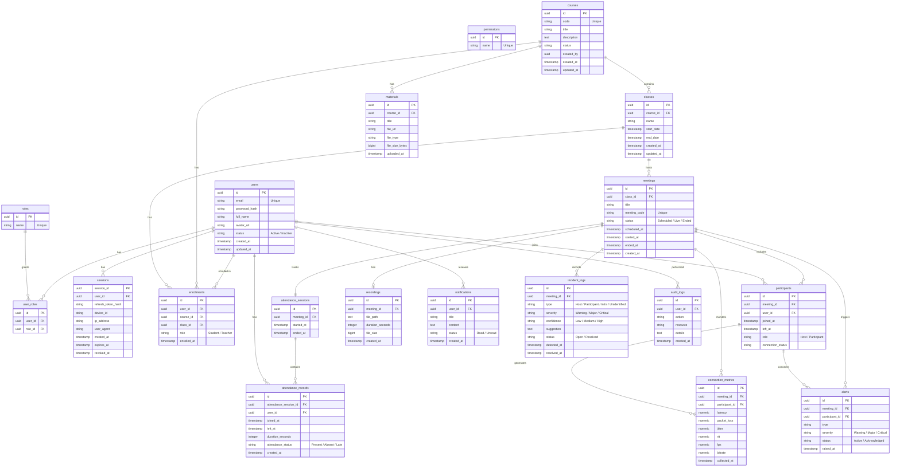

# 02. Data Model ERD (Sơ đồ quan hệ thực thể)

> **Mục đích:** Đặc tả sơ đồ quan hệ thực thể (ERD) chi tiết cho cơ sở dữ liệu hệ thống mới (**Zoom Education Platform**), mô tả rõ cấu trúc các thực thể dữ liệu và mối quan hệ giữa chúng.
> **Tham chiếu:** [07-database-design.md](file:///c:/Git%20cua%20tui/education-platform/Tai_Lieu/Technical%20Design%20Document%20(TDD)/07-database-design.md) · [14-traceability-matrix.md](file:///c:/Git%20cua%20tui/education-platform/Tai_Lieu/Technical%20Design%20Document%20(TDD)/14-traceability-matrix.md) · [11-security-design.md](file:///c:/Git%20cua%20tui/education-platform/Tai_Lieu/Technical%20Design%20Document%20(TDD)/11-security-design.md)

---

## 2.1. Sơ đồ quan hệ thực thể (ERD Diagram)
Dưới đây là sơ đồ ERD toàn diện của hệ thống biểu diễn bằng cú pháp Mermaid, đồng bộ 100% với danh mục bảng trong ma trận truy vết (RTM) và cấu trúc thiết kế dịch vụ:

---

## 2.2. Đặc tả các mối quan hệ (Relationships)

### Phân hệ Bảo mật & RBAC (Auth & Security):
* **User và Session (1 - N):** Một người dùng (`users`) có thể có nhiều phiên đăng nhập (`sessions`) đồng thời trên nhiều thiết bị.
* **RBAC thông qua User_Roles & Roles (M - N):**
  * Một người dùng (`users`) được gán nhiều vai trò (`roles`) thông qua bảng liên kết `user_roles`.
  * Vai trò xác định danh mục quyền hạn (`permissions`) của người dùng trên toàn hệ thống.
* **User và Audit Log (1 - N):** Mọi hành động nhạy cảm hoặc thay đổi trạng thái của người dùng (`users`) được ghi nhận chi tiết tại nhật ký hệ thống `audit_logs`.

### Phân hệ Đào tạo & Tài liệu (LMS & Document Core):
* **Course và Class (1 - N):** Một khóa học (`courses`) có thể tổ chức thành nhiều lớp học (`classes`) thực tế.
* **Course và Material (1 - N):** Một khóa học (`courses`) chứa nhiều tài nguyên tài liệu học tập (`materials`) được chia sẻ cho học viên.
* **User, Course, Class thông qua Enrollment (M - N):** Liên kết thành viên tham gia giảng dạy hoặc học tập trong các lớp.

### Phân hệ WebRTC Meeting & Điểm danh:
* **Class và Meeting (1 - N):** Lớp học tổ chức nhiều buổi học (`meetings`) trực tuyến.
* **Meeting và Participant (1 - N):** Ghi nhận lịch sử người dùng (`users`) kết nối vào phòng (`participants`).
* **Meeting và AttendanceSession (1 - 1):** Mỗi buổi học tương ứng với một phiên điểm danh. Phiên này chứa các chi tiết thời lượng và kết quả điểm danh học viên (`attendance_records`).

### Phân hệ Giám sát Telemetry & Chẩn đoán sự cố:
* **Meeting và ConnectionMetric (1 - N):** Telemetry đo lường chất lượng kết nối của học viên gửi định kỳ về cơ sở dữ liệu `connection_metrics`.
* **Meeting và Alert (1 - N):** Hệ thống tự động kích hoạt cảnh báo chất lượng mạng (`alerts`) nếu các thông số telemetry vượt ngưỡng.
* **Meeting và Incident_Log (1 - N):** Bộ máy luật (Rule Engine) phân tích cảnh báo và ghi lại nhật ký sự cố mạng (`incident_logs`) kèm giải pháp khắc phục.
* **Meeting và Recording (1 - 0..1):** Lưu trữ thông tin bản ghi hình buổi học (`recordings`).
