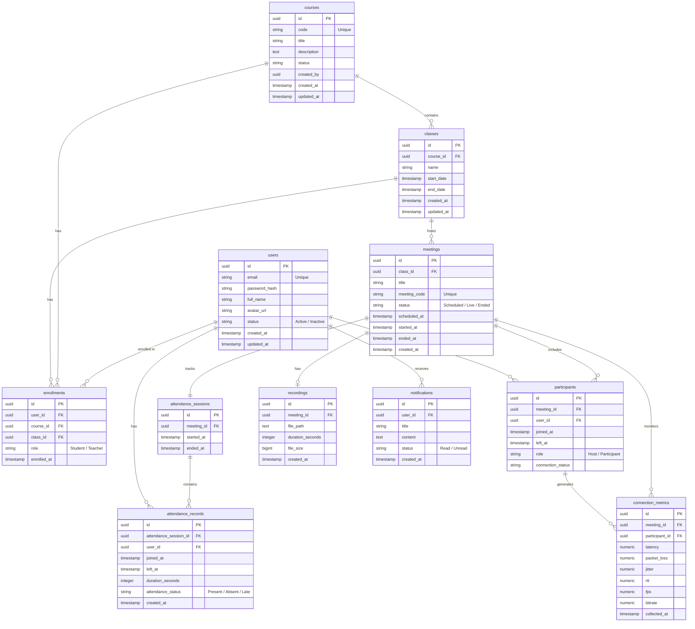

# 02. Data Model ERD (Sơ đồ quan hệ thực thể)

> **Mục đích:** Đặc tả sơ đồ quan hệ thực thể (ERD) chi tiết cho cơ sở dữ liệu hệ thống mới (**Zoom Education Platform**), mô tả rõ cấu trúc các thực thể dữ liệu và mối quan hệ giữa chúng.
> **Tham chiếu:** [07-database-design.md](file:///c:/Git%20cua%20tui/education-platform/Tai_Lieu/Technical%20Design%20Document%20(TDD)/07-database-design.md)

---

## 2.1. Sơ đồ quan hệ thực thể (ERD Diagram)
Dưới đây là sơ đồ ERD toàn diện của hệ thống biểu diễn bằng cú pháp Mermaid:

---

## 2.2. Đặc tả các mối quan hệ (Relationships)

### Phân hệ Đào tạo & Lớp học (LMS Core):
* **Course và Class (1 - N):** Một khóa học (`courses`) có thể tổ chức thành nhiều lớp học (`classes`) khác nhau, mỗi lớp học bắt buộc thuộc về một khóa học xác định.
* **User, Course, Class thông qua Enrollment (M - N):** 
  * Học viên và Giáo viên được liên kết với Lớp và Khóa thông qua bảng trung gian `enrollments`.
  * Một tài khoản (`users`) có thể đăng ký học/dạy ở nhiều lớp học.

### Phân hệ WebRTC Meeting & Điểm danh:
* **Class và Meeting (1 - N):** Một lớp học (`classes`) tổ chức nhiều buổi học/phòng họp trực tuyến (`meetings`) theo lịch trình giảng dạy.
* **Meeting và Participant (1 - N):** Mỗi phòng học (`meetings`) ghi lại lịch sử ra vào phòng của nhiều thành viên (`participants`).
* **Meeting và AttendanceSession (1 - 1):** Mỗi buổi học được giám sát bởi một phiên điểm danh (`attendance_sessions`). Phiên điểm danh này chứa nhiều bản ghi điểm danh học viên (`attendance_records`).
* **User và AttendanceRecord (1 - N):** Một học viên có nhiều bản ghi điểm danh qua các buổi học khác nhau.

### Phân hệ Telemetry & Media:
* **Meeting và Recording (1 - 0..1):** Một buổi học có thể ghi hình hoặc không. Nếu có ghi hình, nó sẽ được liên kết với một bản ghi file duy nhất (`recordings`).
* **Participant và ConnectionMetric (1 - N):** Suốt thời gian tham gia lớp, mỗi thành viên gửi telemetry đo chất lượng kết nối mạng (`connection_metrics`) định kỳ mỗi 5 giây về hệ thống.
