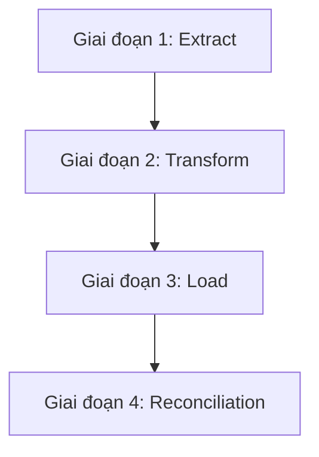

# 03. Data Migration Strategy (Chiến lược di chuyển dữ liệu)

> **Mục đích:** Hướng dẫn chiến lược thực hiện chuyển đổi dữ liệu (ETL), kịch bản đối soát dữ liệu và phương án dự phòng (Rollback) khi xảy ra lỗi trong quá trình đưa hệ thống mới (**Zoom Education Platform**) vào vận hành.
> **Tham chiếu:** [01. Data Mapping Specification](file:///c:/Git%20cua%20tui/education-platform/Tai_Lieu/Data%20Mapping/01_Data_Mapping_Specification.md) · [README.md](file:///c:/Git%20cua%20tui/education-platform/Tai_Lieu/Data%20Mapping/README.md)

---

## 3.1. Các giai đoạn di chuyển dữ liệu (Migration Phases)

Tiến trình di trú dữ liệu được chia làm 4 giai đoạn chính để kiểm soát rủi ro:

### Giai đoạn 1: Trích xuất dữ liệu (Extract)
* Đọc dữ liệu từ cơ sở dữ liệu hệ thống cũ (MySQL/SQL Server).
* Thực hiện kết xuất (Dump) ra các tệp dữ liệu trung gian dạng JSON/CSV.
* Tạo bảng ánh xạ khóa tạm thời (`temp_id_mappings`) để lưu trữ cặp giá trị `(legacy_integer_id, new_uuid)`.

### Giai đoạn 2: Chuyển đổi và làm sạch (Transform)
* **Chuyển đổi khóa:** Đọc bảng `temp_id_mappings` để thay thế toàn bộ khóa ngoại cũ bằng `UUID` mới.
* **Làm sạch dữ liệu:** Loại bỏ các bản ghi trùng lặp, chuẩn hóa chuỗi và chuyển đổi kiểu dữ liệu (Timestamp, Boolean).
* **Mã hóa bảo mật:** Chuyển đổi cơ chế băm mật khẩu cũ sang chuẩn mã hóa mới (`bcrypt`/`Argon2`).

### Giai đoạn 3: Nạp vào hệ thống mới (Load)
* Thực hiện nạp dữ liệu (Bulk Insert) theo các lô nhỏ (Batches — khuyến nghị 1000 bản ghi/lô) để tránh quá tải hoặc khóa bảng.
* **Thứ tự nạp dữ liệu bắt buộc:**
  1. `users` (để có ID phân quyền và tạo lớp).
  2. `courses` và `materials`.
  3. `classes` và `schedules`.
  4. `meetings` và `participants`.
  5. `attendance_sessions` và `attendance_records`.

### Giai đoạn 4: Đối soát và nghiệm thu (Reconciliation)
* **Đối soát số lượng (Row Count Verification):** So sánh tổng số dòng của từng thực thể giữa nguồn và đích.
* **Đối soát dữ liệu (Data Integrity Check):** Đảm bảo không có bản ghi mồ côi (orphaned record) không có khóa ngoại hợp lệ.
* Xuất báo cáo kết quả đối soát dữ liệu (Migration Reconciliation Report) để Admin ký duyệt nghiệm thu.

---

## 3.2. Phương án dự phòng và kịch bản Rollback khi có sự cố

> [!WARNING]
> An toàn dữ liệu là ưu tiên hàng đầu. Tuyệt đối không thực hiện di trú dữ liệu trực tiếp trên Production mà không có bản backup.

### Sự cố 1: Lỗi nạp dữ liệu ở giữa chừng (Batch Failure/Timeout)
* **Nguyên nhân:** Mất kết nối mạng hoặc vi phạm ràng buộc dữ liệu (Constraint Violation) trong một batch.
* **Xử lý:**
  1. Mỗi tiến trình nạp (Batch Load) phải chạy trong một Database Transaction độc lập. Nếu lỗi, rollback toàn bộ transaction của batch đó.
  2. Ghi nhận vị trí (offset) của lô bị lỗi vào `migration_error_log` và tiếp tục chạy các lô tiếp theo hoặc tạm dừng để kỹ sư can thiệp.

### Sự cố 2: Hệ thống mới hoạt động không ổn định sau khi chuyển đổi (Post-migration Failure)
* **Xử lý:**
  1. **Khóa ghi hệ thống mới:** Chuyển hệ thống mới sang chế độ Read-only.
  2. **Backup dữ liệu phát sinh (nếu có):** Export toàn bộ dữ liệu mới phát sinh trong thời gian chạy thử ở hệ thống mới.
  3. **Khôi phục DNS:** Thay đổi cấu hình định tuyến (API Gateway/DNS) để hướng người dùng quay lại hệ thống cũ (đang được duy trì ở trạng thái Read-only trước đó).
  4. **Mở khóa ghi hệ thống cũ:** Chuyển hệ thống cũ về lại chế độ hoạt động bình thường (Read-write).

---

## 3.3. Quy trình cắt chuyển hệ thống (Cutover Plan)

Quy trình cắt chuyển (Go-live Window) được khuyến nghị thực hiện vào thời gian thấp điểm (ví dụ: từ 01:00 đến 04:00 sáng Chủ Nhật) theo các bước:

1. **Khóa ghi hệ thống cũ:** Bật thông báo bảo trì, chuyển DB hệ thống cũ sang chế độ Read-only.
2. **Sao lưu cuối cùng (Final Backup):** Tạo bản backup snapshot cuối cùng của Legacy DB.
3. **Chạy Migration:** Chạy tiến trình di trú dữ liệu delta (dữ liệu phát sinh mới nhất).
4. **Đối soát:** Thực hiện quy trình đối soát tự động, xuất báo cáo.
5. **Cấu hình Gateway:** Trỏ tên miền chính thức sang máy chủ hệ thống mới.
6. **Mở hệ thống mới:** Gỡ bỏ chế độ bảo trì trên hệ thống mới và cho phép người dùng đăng nhập sử dụng.
