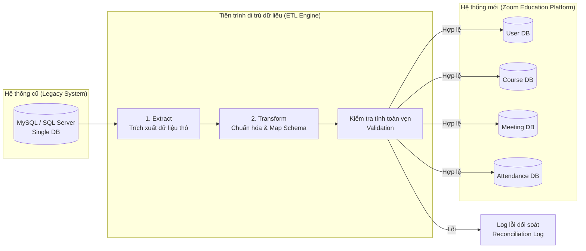

# Tổng quan Ánh xạ Dữ liệu Hệ thống (System Data Mapping Overview)

> **Mục đích:** Tài liệu này cung cấp cái nhìn tổng quan về kiến trúc chuyển đổi dữ liệu (ETL/Migration) và cấu trúc ánh xạ dữ liệu từ hệ thống giáo dục cũ (Legacy DB) sang cơ sở dữ liệu phân tán theo Microservices của hệ thống mới (**Zoom Education Platform**).
> **Tham chiếu:** [07-database-design.md](file:///c:/Git%20cua%20tui/education-platform/Tai_Lieu/Technical%20Design%20Document%20(TDD)/07-database-design.md) · [03_Data_Migration_Strategy.md](file:///c:/Git%20cua%20tui/education-platform/Tai_Lieu/Data%20Mapping/03_Data_Migration_Strategy.md)

---

## 1. Mục tiêu chuyển đổi dữ liệu (Migration Objectives)
* **Kế thừa dữ liệu:** Đảm bảo toàn bộ thông tin lịch sử học tập, người dùng (học viên, giáo viên, admin) và các lớp học từ hệ thống cũ được chuyển đổi đầy đủ sang hệ thống mới.
* **Chuẩn hóa dữ liệu:** Chuẩn hóa định dạng trường dữ liệu (ví dụ: chuyển đổi ID tự tăng sang `UUID`, chuẩn hóa định dạng thời gian `ISO 8601`, mã hóa mật khẩu theo thuật toán bảo mật mới).
* **Đảm bảo tính toàn vẹn:** Duy trì các mối quan hệ (Foreign Key Constraints) giữa các thực thể trong môi trường cơ sở dữ liệu phân tán (Database per Service).

---

## 2. Kiến trúc luồng di chuyển dữ liệu (Data Migration Pipeline)
Quy trình chuyển đổi dữ liệu được thực hiện qua một dịch vụ di trú chuyên biệt (Migration Service) theo mô hình **Extract - Transform - Load (ETL)**:

---

## 3. Các thực thể đích cốt lõi (Core Target Entities)
Dữ liệu từ hệ thống cũ sau khi biến đổi sẽ được phân bổ vào các cơ sở dữ liệu dịch vụ tương ứng dưới đây (tham chiếu thiết kế vật lý tại [07-database-design.md](file:///c:/Git%20cua%20tui/education-platform/Tai_Lieu/Technical%20Design%20Document%20(TDD)/07-database-design.md)):

| Dịch vụ đích (Target Service) | Bảng dữ liệu chính | Loại dữ liệu | Ghi chú di trú |
| :--- | :--- | :--- | :--- |
| **User Service** | `users` | Nghiệp vụ (Business) | Ánh xạ thông tin tài khoản, mã hóa lại mật khẩu |
| **Course Service** | `courses` | Nghiệp vụ (Business) | Danh mục khóa học và tài liệu học tập |
| **Class Service** | `classes`, `schedules` | Nghiệp vụ (Business) | Thông tin lớp học và lịch giảng dạy |
| **Meeting Service** | `meetings`, `participants` | Vận hành (Operational) | Lịch sử các phòng học trực tuyến đã diễn ra |
| **Attendance Service** | `attendance_sessions`, `attendance_records` | Vận hành (Operational) | Báo cáo chi tiết lịch sử điểm danh của học viên |

---

## 4. Nguyên tắc ánh xạ dữ liệu chung (General Data Mapping Rules)

> [!IMPORTANT]
> Mọi tiến trình ánh xạ dữ liệu phải tuân thủ nghiêm ngặt các quy tắc kỹ thuật sau:
> 1. **Khóa chính (Primary Key):** Toàn bộ trường ID tự tăng (Integer) ở hệ thống cũ phải được tạo mới thành định dạng `UUID (v4)` ở hệ thống mới để đảm bảo tính duy nhất trên môi trường phân tán.
> 2. **Thời gian (Timestamp):** Quy đổi tất cả các cột ngày giờ về múi giờ chuẩn UTC và lưu dưới dạng `TIMESTAMP WITH TIME ZONE`.
> 3. **Làm sạch chuỗi (String Cleansing):** Thực hiện loại bỏ khoảng trắng thừa (Trim) và chuẩn hóa chữ hoa/chữ thường đối với Email, Mã khóa học trước khi nạp vào DB mới.

---

## 5. Bản đồ chi tiết phân hệ tài liệu (Document Directory)
Để đi sâu vào chi tiết kỹ thuật của quá trình chuyển đổi dữ liệu, vui lòng tham khảo các tài liệu con sau:

* **[01. Data Mapping Specification](file:///c:/Git%20cua%20tui/education-platform/Tai_Lieu/Data%20Mapping/01_Data_Mapping_Specification.md):** 
  * Chi tiết bảng đối chiếu từng trường (Source Field $\to$ Target Field) và quy tắc biến đổi tương ứng cho các thực thể.
* **[02. Data Model ERD](file:///c:/Git%20cua%20tui/education-platform/Tai_Lieu/Data%20Mapping/02_Data_Model_ERD.md):** 
  * Bản vẽ sơ đồ quan hệ thực thể (ERD) trực quan của hệ thống cơ sở dữ liệu mới.
* **[03. Data Migration Strategy](file:///c:/Git%20cua%20tui/education-platform/Tai_Lieu/Data%20Mapping/03_Data_Migration_Strategy.md):** 
  * Kế hoạch triển khai di trú dữ liệu theo từng giai đoạn, các kịch bản rollback dự phòng và quy trình đối soát dữ liệu (Reconciliation).
