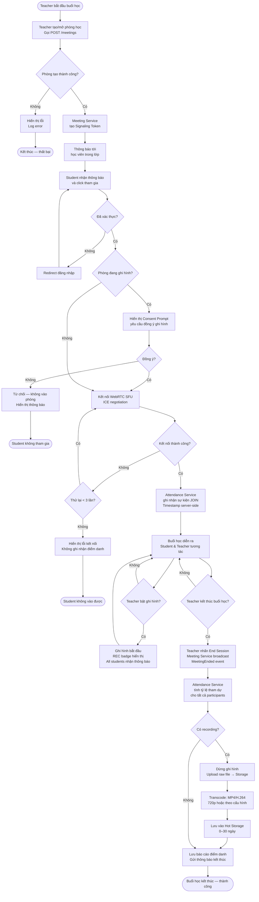
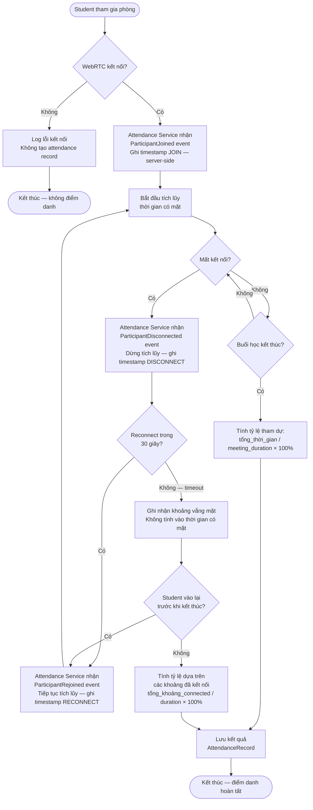
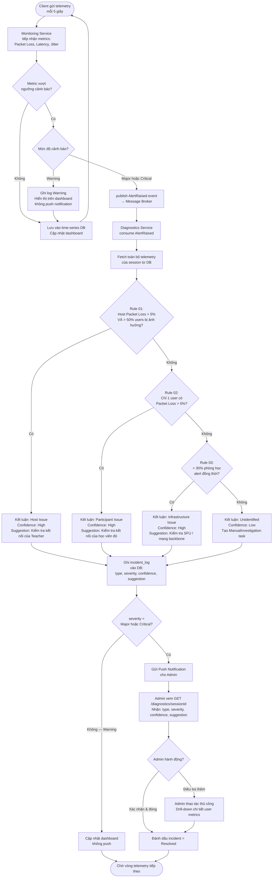

# 01. BPMN Workflows (Sơ đồ luồng nghiệp vụ)

> **Mục đích:** Trực quan hóa 3 luồng nghiệp vụ chính — đủ để DEV hiểu thứ tự xử lý, phân chia trách nhiệm client/server, và các nhánh xử lý lỗi.
> **Tham chiếu:** UC-MTG-001 · UC-MTG-002 · UC-ATT-001 · UC-NDX-001 · BRD 04, 06, 10

---

## BPMN-001: Vòng đời lớp học trực tuyến

**Mô tả:** Toàn bộ flow từ khi Teacher mở phòng học đến khi kết thúc, bao gồm điểm danh, ghi hình, và transcode recording.

**UC liên quan:** UC-MTG-001, UC-MTG-002, UC-ATT-001



---

## BPMN-002: Quy trình điểm danh tự động & Reconnect

**Mô tả:** Chi tiết server-side event ordering khi Student join, disconnect, và reconnect. Đây là luồng nhạy cảm nhất vì liên quan đến race condition và tính chính xác của dữ liệu điểm danh.

**UC liên quan:** UC-ATT-001  
**BRD tham chiếu:** 06_Diem_Danh.md §6.2–6.7



**Công thức tính điểm danh:**
```
attendance_rate = (Σ connected_intervals) / meeting_duration × 100

Ví dụ:
  Meeting: 60 phút
  Khoảng 1: 0–20 phút (JOIN → DISCONNECT) = 20 phút
  Khoảng 2: 25–60 phút (RECONNECT → LEAVE) = 35 phút
  → attendance_rate = (20 + 35) / 60 × 100 = 91.7%
```

---

## BPMN-003: Quy trình chẩn đoán sự cố mạng

**Mô tả:** Từ khi metric vượt ngưỡng đến khi Admin nhận được kết quả chẩn đoán, bao gồm Rule Engine và fallback.

**UC liên quan:** UC-MON-001, UC-NDX-001  
**BRD tham chiếu:** 07_Giam_Sat_Thoi_Gian_Thuc.md, 10_Chan_Doan_Su_Co.md


