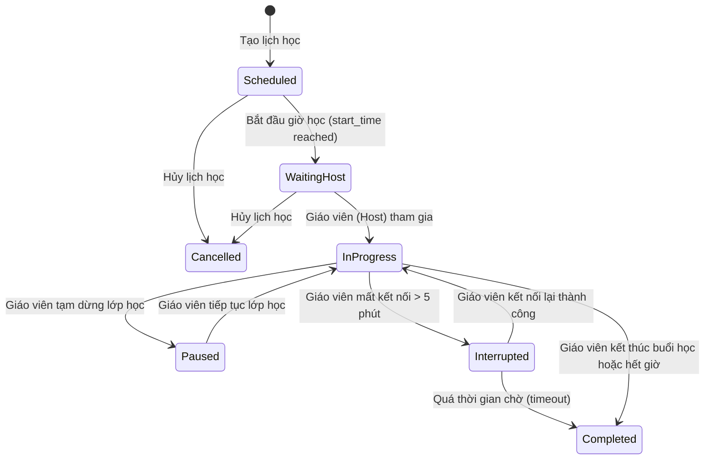

# 01. Functional Requirements (Yêu cầu chức năng)

## 1.1. Phạm vi tài liệu

Tài liệu này đặc tả toàn bộ yêu cầu chức năng của hệ thống **Zoom Education Platform** — nền tảng đào tạo trực tuyến tích hợp gồm 8 phân hệ chính: LMS, Học trực tuyến, Tài liệu, Điểm danh, Báo cáo, Giám sát thời gian thực, Telemetry, và Chẩn đoán sự cố.

## 1.2. Định nghĩa và viết tắt

| Ký hiệu | Ý nghĩa |
| :--- | :--- |
| FR | Functional Requirement |
| Admin | Quản trị hệ thống |
| Manager | Quản lý đào tạo |
| Teacher | Giáo viên |
| Student | Học viên |
| RBAC | Role-Based Access Control |
| SFU | Selective Forwarding Unit (loại Media Server) |
| PII | Personally Identifiable Information |

## 1.3. Độ ưu tiên

| Priority | Ý nghĩa |
| :--- | :--- |
| Must Have | Bắt buộc — thiếu thì hệ thống không vận hành được |
| Should Have | Quan trọng — cần có ở phiên bản đầu |
| Nice to Have | Mở rộng — có thể để phiên bản sau |

## 1.4. Tài liệu tham chiếu

| Tài liệu | Đường dẫn |
| :--- | :--- |
| BRD — Mục tiêu dự án | [01_Muc_Tieu_Du_An.md](../Business%20Requirement%20Document%20(BRD)/01_Tong_Quan/01_Muc_Tieu_Du_An.md) |
| BRD — Phân loại người dùng | [02_Phan_Loai_Nguoi_Dung.md](../Business%20Requirement%20Document%20(BRD)/01_Tong_Quan/02_Phan_Loai_Nguoi_Dung.md) |
| BRD — LMS | [03_LMS.md](../Business%20Requirement%20Document%20(BRD)/02_Phan_He_Nghiep_Vu/03_LMS.md) |
| BRD — Học trực tuyến | [04_Hoc_Truc_Tuyen.md](../Business%20Requirement%20Document%20(BRD)/02_Phan_He_Nghiep_Vu/04_Hoc_Truc_Tuyen.md) |
| BRD — Tài liệu | [05_Tai_Lieu.md](../Business%20Requirement%20Document%20(BRD)/02_Phan_He_Nghiep_Vu/05_Tai_Lieu.md) |
| BRD — Điểm danh | [06_Diem_Danh.md](../Business%20Requirement%20Document%20(BRD)/02_Phan_He_Nghiep_Vu/06_Diem_Danh.md) |
| BRD — Giám sát thời gian thực | [07_Giam_Sat_Thoi_Gian_Thuc.md](../Business%20Requirement%20Document%20(BRD)/03_Giam_Sat_Telemetry/07_Giam_Sat_Thoi_Gian_Thuc.md) |
| BRD — Telemetry | [08_Telemetry_Network_Analytics.md](../Business%20Requirement%20Document%20(BRD)/03_Giam_Sat_Telemetry/08_Telemetry_Network_Analytics.md) |
| BRD — Giám sát người dùng | [09_Giam_Sat_Nguoi_Dung.md](../Business%20Requirement%20Document%20(BRD)/03_Giam_Sat_Telemetry/09_Giam_Sat_Nguoi_Dung.md) |
| BRD — Chẩn đoán sự cố | [10_Chan_Doan_Su_Co.md](../Business%20Requirement%20Document%20(BRD)/03_Giam_Sat_Telemetry/10_Chan_Doan_Su_Co.md) |
| BRD — Báo cáo | [11_Bao_Cao_Xuat_Du_Lieu.md](../Business%20Requirement%20Document%20(BRD)/02_Phan_He_Nghiep_Vu/11_Bao_Cao_Xuat_Du_Lieu.md) |

## 1.5. Ma trận ánh xạ Yêu cầu chức năng và Phi chức năng (FR to NFR Mapping)

| Phân hệ chức năng (FR Area) | Yêu cầu phi chức năng (NFR Mapping) | Mô tả ràng buộc chất lượng |
| :--- | :--- | :--- |
| **Phân hệ Học trực tuyến (FR-MTG-*)** | [NFR-PERF-004](02_Non_Functional_Requirements.md#nfr-perf-004)   [NFR-SCAL-001](02_Non_Functional_Requirements.md#nfr-scal-001)   [NFR-SCAL-003](02_Non_Functional_Requirements.md#nfr-scal-003)   [NFR-SEC-004](02_Non_Functional_Requirements.md#nfr-sec-004)   [NFR-SEC-009](02_Non_Functional_Requirements.md#nfr-sec-009)   [NFR-AVAIL-005](02_Non_Functional_Requirements.md#nfr-avail-005)   [NFR-COMP-005](02_Non_Functional_Requirements.md#nfr-comp-005) | Khởi chạy phòng ≤ 5s (p95), hỗ trợ ≥ 100 lớp đồng thời (mỗi lớp ≥ 100 người). Mã hóa qua DTLS-SRTP, tự động kết nối lại khi mất mạng < 30s. Video ghi hình lưu tối đa 180 ngày, URL tải xuống hết hạn ≤ 15 phút. |
| **Phân hệ LMS & Tài liệu (FR-LMS-*, FR-DOC-*)** | [NFR-PERF-001](02_Non_Functional_Requirements.md#nfr-perf-001)   [NFR-PERF-006](02_Non_Functional_Requirements.md#nfr-perf-006)   [NFR-SCAL-005](02_Non_Functional_Requirements.md#nfr-scal-005)   [NFR-SEC-007](02_Non_Functional_Requirements.md#nfr-sec-007)   [NFR-SEC-008](02_Non_Functional_Requirements.md#nfr-sec-008)   [NFR-SEC-009](02_Non_Functional_Requirements.md#nfr-sec-009) | API CRUD phản hồi ≤ 500ms (p95), upload file ≤ 50MB xử lý ≤ 15s (video ≤ 2GB ≤ 10 phút). Object Storage hỗ trợ mở rộng ≥ 50 TB. Đảm bảo RBAC 100% endpoint, kiểm tra magic bytes file upload, download URL hết hạn ≤ 15 phút. |
| **Phân hệ Điểm danh (FR-ATT-*)** | [NFR-AVAIL-006](02_Non_Functional_Requirements.md#nfr-avail-006)   [NFR-AVAIL-008](02_Non_Functional_Requirements.md#nfr-avail-008)   [NFR-COMP-002](02_Non_Functional_Requirements.md#nfr-comp-002) | Không mất dữ liệu điểm danh khi service crash, sử dụng hàng đợi durable với replication factor ≥ 3. Lưu trữ audit logs/attendance tối thiểu 1 năm. |
| **Giám sát & Telemetry (FR-MON-*, FR-TEL-*)** | [NFR-PERF-002](02_Non_Functional_Requirements.md#nfr-perf-002)   [NFR-PERF-007](02_Non_Functional_Requirements.md#nfr-perf-007)   [NFR-PERF-009](02_Non_Functional_Requirements.md#nfr-perf-009)   [NFR-AVAIL-008](02_Non_Functional_Requirements.md#nfr-avail-008)   [NFR-COMP-001](02_Non_Functional_Requirements.md#nfr-comp-001) | API Telemetry phản hồi ≤ 200ms (p95), hiển thị cảnh báo ≤ 10s. Chịu tải ingestion ≥ 10k events/s với tỷ lệ ghi nhận thành công ≥ 99.99% qua message queue replication factor ≥ 3. Telemetry retention 90 ngày (raw) và 1 năm (aggregate). |
| **Phân hệ Báo cáo (FR-RPT-*)** | [NFR-PERF-003](02_Non_Functional_Requirements.md#nfr-perf-003)   [NFR-PERF-008](02_Non_Functional_Requirements.md#nfr-perf-008) | Truy vấn báo cáo ≤ 10k records ≤ 2s, xuất báo cáo Excel/CSV ≤ 10k records ≤ 30s (xử lý async background job). |
| **Trung tâm Thông báo (FR-NTF-*)** | [NFR-PERF-010](02_Non_Functional_Requirements.md#nfr-perf-010)   [NFR-AVAIL-008](02_Non_Functional_Requirements.md#nfr-avail-008)   [NFR-AVAIL-009](02_Non_Functional_Requirements.md#nfr-avail-009) | Thời gian truyền tải thông báo ≤ 5s (p95) đến in-app/SMTP. Hàng đợi lưu tin nhắn có replication factor ≥ 3, tỷ lệ gửi lại (retry) thông báo lỗi thành công ≥ 99%. |
| **Xác thực & Bảo mật (FR-AUTH-*, FR-USR-*)** | [NFR-SEC-001](02_Non_Functional_Requirements.md#nfr-sec-001)   [NFR-SEC-002](02_Non_Functional_Requirements.md#nfr-sec-002)   [NFR-SEC-003](02_Non_Functional_Requirements.md#nfr-sec-003)   [NFR-SEC-005](02_Non_Functional_Requirements.md#nfr-sec-005)   [NFR-SEC-006](02_Non_Functional_Requirements.md#nfr-sec-006)   [NFR-SEC-010](02_Non_Functional_Requirements.md#nfr-sec-010) | Access token hết hạn ≤ 1 giờ, mật khẩu hash bằng BCrypt (work factor ≥ 12), giao tiếp qua HTTPS/TLS 1.2+, Rate Limiting chống brute-force, quản lý bí mật qua Vault/KMS (không hardcode). |
| **Quản trị & Triển khai** | [NFR-MAINT-005](02_Non_Functional_Requirements.md#nfr-maint-005)   [NFR-COMP-004](02_Non_Functional_Requirements.md#nfr-comp-004) | Hỗ trợ khôi phục (rollback) phiên bản deploy lỗi về ổn định ≤ 10 phút. 100% database backups được mã hóa AES-256 trước khi lưu. |

---

## 2. Phân hệ LMS (Learning Management System)

### FR-LMS-001: Tạo khóa học mới

**Mô tả:** Hệ thống phải cho phép tạo khóa học mới với đầy đủ thông tin định danh và phân loại.

**Actors:** Admin (chính), Manager (phụ)

**Input:** Mã khóa học, tên khóa học, mô tả, danh mục, trạng thái hoạt động.

**Output:** Khóa học được tạo thành công, hiển thị trong danh sách khóa học.

**Business rules:**
- Mã khóa học phải duy nhất trong toàn hệ thống.
- Tên khóa học không được để trống.
- Trạng thái mặc định khi tạo mới là `Active`.

**Priority:** Must Have

**Tham chiếu BRD:** [03_LMS.md — Mục 3.2](../Business%20Requirement%20Document%20(BRD)/02_Phan_He_Nghiep_Vu/03_LMS.md)

---

### FR-LMS-002: Cập nhật thông tin khóa học

**Mô tả:** Hệ thống phải cho phép cập nhật thông tin của một khóa học đã tồn tại.

**Actors:** Admin (chính), Manager (phụ)

**Input:** Các trường cần cập nhật: tên, mô tả, danh mục, trạng thái.

**Output:** Thông tin khóa học được cập nhật. Lịch sử thay đổi được ghi lại.

**Business rules:**
- Mã khóa học không thể thay đổi sau khi tạo.
- Không thể cập nhật khóa học đã bị xóa.

**Priority:** Must Have

**Tham chiếu BRD:** [03_LMS.md — Mục 3.2](../Business%20Requirement%20Document%20(BRD)/02_Phan_He_Nghiep_Vu/03_LMS.md)

---

### FR-LMS-003: Kích hoạt / Ngừng hoạt động khóa học

**Mô tả:** Hệ thống phải cho phép Admin và Manager chuyển trạng thái khóa học giữa `Active` và `Inactive`.

**Actors:** Admin, Manager

**Input:** ID khóa học, trạng thái mới (Active / Inactive).

**Output:** Trạng thái khóa học được cập nhật. Các lớp học thuộc khóa học `Inactive` không thể tạo mới thêm.

**Business rules:**
- Không thể ngừng hoạt động khóa học đang có lớp học `In Progress`.
- Khi khóa học chuyển thành `Inactive`, các lớp học đang ở trạng thái `Scheduled` phải được xử lý thủ công.

**Priority:** Must Have

**Tham chiếu BRD:** [03_LMS.md — Mục 3.2](../Business%20Requirement%20Document%20(BRD)/02_Phan_He_Nghiep_Vu/03_LMS.md)

---

### FR-LMS-004: Tìm kiếm và lọc khóa học

**Mô tả:** Hệ thống phải cho phép tìm kiếm và lọc danh sách khóa học theo nhiều tiêu chí.

**Actors:** Admin, Manager, Teacher (xem), Student (xem khóa học được phân công)

**Input:** Từ khóa tìm kiếm (tên/mã), danh mục, trạng thái, phân trang (page, page size).

**Output:** Danh sách khóa học phù hợp điều kiện lọc, có phân trang.

**Business rules:**
- Student chỉ thấy khóa học của lớp mình đang tham gia.
- Teacher chỉ thấy khóa học của lớp mình được phân công.
- Admin và Manager thấy toàn bộ.

**Priority:** Must Have

**Tham chiếu BRD:** [03_LMS.md — Mục 3.2](../Business%20Requirement%20Document%20(BRD)/02_Phan_He_Nghiep_Vu/03_LMS.md)

---

### FR-LMS-005: Tạo lớp học mới

**Mô tả:** Hệ thống phải cho phép tạo lớp học mới liên kết với một khóa học xác định.

**Actors:** Admin (chính), Manager (phụ)

**Input:** Mã lớp học, tên lớp học, khóa học liên kết, giáo viên phụ trách.

**Output:** Lớp học được tạo với trạng thái `Active`. Giáo viên được phân công nhận thông báo.

**Business rules:**
- Mã lớp học phải duy nhất trong toàn hệ thống.
- Lớp học phải liên kết với một khóa học `Active`.
- Một lớp học phải có tối thiểu một giáo viên phụ trách.

**Priority:** Must Have

**Tham chiếu BRD:** [03_LMS.md — Mục 3.3](../Business%20Requirement%20Document%20(BRD)/02_Phan_He_Nghiep_Vu/03_LMS.md)

---

### FR-LMS-006: Quản lý giáo viên phụ trách lớp

**Mô tả:** Hệ thống phải cho phép gán hoặc thay thế giáo viên phụ trách lớp học.

**Actors:** Admin, Manager

**Input:** ID lớp học, ID giáo viên mới.

**Output:** Lớp học được cập nhật giáo viên phụ trách. Giáo viên mới và cũ đều nhận thông báo.

**Business rules:**
- Chỉ người dùng có vai trò Teacher mới có thể được gán làm giáo viên phụ trách.
- Không thể thay giáo viên khi lớp đang có buổi học `In Progress`.

**Priority:** Must Have

**Tham chiếu BRD:** [03_LMS.md — Mục 3.3](../Business%20Requirement%20Document%20(BRD)/02_Phan_He_Nghiep_Vu/03_LMS.md)

---

### FR-LMS-007: Quản lý danh sách học viên trong lớp

**Mô tả:** Hệ thống phải cho phép thêm hoặc xóa học viên khỏi lớp học.

**Actors:** Admin (chính), Manager (phụ), Teacher (xem danh sách)

**Input:** ID lớp học, danh sách ID học viên cần thêm hoặc xóa.

**Output:** Danh sách học viên của lớp được cập nhật.

**Business rules:**
- Chỉ người dùng có vai trò Student mới có thể được thêm vào lớp.
- Không thể xóa học viên nếu lớp đang có buổi học `In Progress`.
- Học viên bị xóa khỏi lớp sẽ mất quyền truy cập tài liệu và bài giảng của lớp đó.

**Priority:** Must Have

**Tham chiếu BRD:** [03_LMS.md — Mục 3.3](../Business%20Requirement%20Document%20(BRD)/02_Phan_He_Nghiep_Vu/03_LMS.md)

---

### FR-LMS-008: Tạo lịch học cho lớp

**Mô tả:** Hệ thống phải cho phép tạo lịch học (buổi học) cho một lớp học, liên kết trực tiếp với phiên học trực tuyến.

**Actors:** Admin, Manager, Teacher (trong phạm vi lớp được phân công)

**Input:** ID lớp học, ngày học, giờ bắt đầu, giờ kết thúc.

**Output:** Lịch học được tạo với trạng thái `Scheduled`. Phòng học trực tuyến được tạo tự động. Giáo viên và học viên nhận thông báo.

**Business rules:**
- Giờ kết thúc phải sau giờ bắt đầu.
- Không thể tạo lịch học trùng thời gian với lịch học khác của cùng lớp.
- Phòng học trực tuyến được tạo tự động khi lịch học được tạo.

**Priority:** Must Have

**Tham chiếu BRD:** [03_LMS.md — Mục 3.4](../Business%20Requirement%20Document%20(BRD)/02_Phan_He_Nghiep_Vu/03_LMS.md)

---

### FR-LMS-009: Chỉnh sửa và hủy lịch học

**Mô tả:** Hệ thống phải cho phép chỉnh sửa thông tin lịch học hoặc hủy một buổi học đã lên kế hoạch.

**Actors:** Admin, Manager, Teacher (trong phạm vi lớp được phân công)

**Input:** ID lịch học, thông tin cập nhật (ngày/giờ) hoặc hành động hủy.

**Output:** Lịch học được cập nhật hoặc chuyển trạng thái `Cancelled`. Tất cả người liên quan nhận thông báo.

**Business rules:**
- Không thể chỉnh sửa lịch học đã ở trạng thái `Completed` hoặc `In Progress`.
- Hủy lịch học cần ghi rõ lý do hủy.

**Priority:** Must Have

**Tham chiếu BRD:** [03_LMS.md — Mục 3.4](../Business%20Requirement%20Document%20(BRD)/02_Phan_He_Nghiep_Vu/03_LMS.md)

---

## 3. Phân hệ Học trực tuyến (Online Learning Platform)

### 3.1. Vòng đời phiên học (Session Lifecycle State Machine)

Để đảm bảo tính nhất quán của dữ liệu điểm danh, giám sát thời gian thực và ghi hình, vòng đời của một phiên học trực tuyến phải tuân thủ nghiêm ngặt mô hình trạng thái (State Machine) dưới đây.

#### Sơ đồ chuyển trạng thái (State Diagram)

#### Mô tả các điều kiện chuyển trạng thái (State Transitions & Triggers)

| Trạng thái nguồn | Trạng thái đích | Sự kiện / Điều kiện kích hoạt (Trigger) |
| :--- | :--- | :--- |
| **Scheduled** (Đã lên lịch) | **WaitingHost** (Chờ giáo viên) | Thời gian bắt đầu buổi học được chạm tới (`start_time` reached). |
| **Scheduled** (Đã lên lịch) | **Cancelled** (Đã hủy) | Lịch học bị hủy trước giờ học bởi Admin, Manager hoặc Giáo viên phụ trách. |
| **WaitingHost** (Chờ giáo viên) | **InProgress** (Đang học) | Giáo viên (Host) kết nối thành công vào phòng học trực tuyến. |
| **WaitingHost** (Chờ giáo viên) | **Cancelled** (Đã hủy) | Buổi học bị hủy do quá giờ bắt đầu 30 phút mà giáo viên vẫn chưa vào phòng. |
| **InProgress** (Đang học) | **Paused** (Tạm dừng) | Giáo viên chủ động kích hoạt tính năng tạm dừng (ví dụ: nghỉ giải lao). Học viên tạm thời bị khóa mic/camera. |
| **Paused** (Tạm dừng) | **InProgress** (Đang học) | Giáo viên chủ động tiếp tục buổi học. |
| **InProgress** (Đang học) | **Interrupted** (Gián đoạn) | Hệ thống phát hiện giáo viên bị mất kết nối (WebRTC/SignalR) liên tục quá 5 phút. Học viên nhận thông báo chờ. |
| **Interrupted** (Gián đoạn) | **InProgress** (Đang học) | Giáo viên kết nối lại (reconnect) thành công vào phòng học trong vòng thời gian chờ. |
| **Interrupted** (Gián đoạn) | **Completed** (Hoàn thành) | Giáo viên không thể kết nối lại sau 15 phút gián đoạn. Hệ thống tự động đóng phòng học và kết thúc buổi học. |
| **InProgress** (Đang học) | **Completed** (Hoàn thành) | Giáo viên chủ động nhấn nút "Kết thúc buổi học" hoặc buổi học đạt đến giới hạn thời gian tối đa (`end_time` + 15 phút buffer). |

---

### FR-MTG-001: Tham gia phòng học trực tuyến

**Mô tả:** Hệ thống phải cho phép giáo viên và học viên tham gia phòng học trực tuyến được liên kết với lịch học.

**Actors:** Teacher, Student, Admin, Manager (quan sát)

**Input:** ID buổi học, thiết bị có camera/microphone (tùy chọn).

**Output:** Người dùng được kết nối vào phòng học. Sự kiện `JOIN` được ghi nhận trong attendance log.

**Business rules:**
- Chỉ người dùng thuộc lớp học mới có thể tham gia phòng học đó.
- Giáo viên có thể tham gia trước giờ học tối đa 15 phút để chuẩn bị.
- Student chỉ có thể tham gia sau khi Giáo viên đã vào phòng (có thể cấu hình).

**Priority:** Must Have

**Tham chiếu BRD:** [04_Hoc_Truc_Tuyen.md — Mục 4.2](../Business%20Requirement%20Document%20(BRD)/02_Phan_He_Nghiep_Vu/04_Hoc_Truc_Tuyen.md)

---

### FR-MTG-002: Rời phòng học

**Mô tả:** Hệ thống phải cho phép người dùng chủ động rời phòng học và cập nhật danh sách người tham gia.

**Actors:** Teacher, Student, Admin, Manager

**Input:** Hành động rời phòng của người dùng.

**Output:** Người dùng bị ngắt kết nối WebRTC. Sự kiện `LEAVE` được ghi nhận. Danh sách participant được cập nhật cho tất cả người còn lại.

**Business rules:**
- Khi Giáo viên rời phòng, hệ thống hỏi xác nhận "Kết thúc buổi học?" hay "Tạm rời?".
- Nếu Giáo viên chọn "Kết thúc buổi học", tất cả kết nối trong phòng bị đóng và buổi học chuyển trạng thái `Completed`.

**Priority:** Must Have

**Tham chiếu BRD:** [04_Hoc_Truc_Tuyen.md — Mục 4.2](../Business%20Requirement%20Document%20(BRD)/02_Phan_He_Nghiep_Vu/04_Hoc_Truc_Tuyen.md)

---

### FR-MTG-003: Tự động reconnect khi mất kết nối

**Mô tả:** Hệ thống phải tự động phát hiện mất kết nối và cố gắng kết nối lại mà không cần người dùng thao tác thủ công.

**Actors:** Teacher, Student (hành động diễn ra tự động)

**Input:** Sự kiện mất kết nối WebRTC/network.

**Output:** Client hiển thị trạng thái "Đang kết nối lại...". Sau khi kết nối lại thành công, hệ thống tiếp tục phiên học. Sự kiện `DISCONNECT` và `RECONNECT` được ghi vào attendance log.

**Business rules:**
- Hệ thống thử reconnect tối đa 3 lần trong vòng 30 giây.
- Nếu không reconnect được sau 30 giây, hiển thị thông báo lỗi và cho phép người dùng thử lại thủ công.
- Khoảng thời gian mất kết nối không được tính vào thời gian tham gia thực tế (điểm danh).

**Priority:** Must Have

**Tham chiếu BRD:** [06_Diem_Danh.md — Mục 6.2](../Business%20Requirement%20Document%20(BRD)/02_Phan_He_Nghiep_Vu/06_Diem_Danh.md)

---

### FR-MTG-004: Bật / Tắt camera

**Mô tả:** Hệ thống phải cho phép người dùng bật hoặc tắt camera trong quá trình học. Trạng thái camera phải được đồng bộ cho tất cả người tham gia.

**Actors:** Teacher, Student

**Input:** Hành động toggle camera.

**Output:** Luồng video của người dùng được bật/tắt. Biểu tượng trạng thái camera cập nhật trên giao diện tất cả người tham gia.

**Business rules:**
- Giáo viên có thể tắt camera của học viên.
- Học viên không thể bật lại camera sau khi bị giáo viên tắt, trừ khi được giáo viên cho phép lại.

**Priority:** Must Have

**Tham chiếu BRD:** [04_Hoc_Truc_Tuyen.md — Mục 4.3](../Business%20Requirement%20Document%20(BRD)/02_Phan_He_Nghiep_Vu/04_Hoc_Truc_Tuyen.md)

---

### FR-MTG-005: Bật / Tắt microphone

**Mô tả:** Hệ thống phải cho phép người dùng bật hoặc tắt microphone. Giáo viên có quyền quản lý microphone của học viên.

**Actors:** Teacher (quản lý toàn lớp), Student (bật/tắt cá nhân trong phạm vi cho phép)

**Input:** Hành động toggle microphone của người dùng hoặc lệnh tắt từ giáo viên.

**Output:** Luồng audio được bật/tắt. Biểu tượng microphone cập nhật trên giao diện tất cả người tham gia.

**Business rules:**
- Giáo viên có thể tắt microphone của một hoặc tất cả học viên cùng lúc ("Mute all").
- Khi bị mute bởi giáo viên, học viên cần được giáo viên unmute hoặc dùng tính năng "Raise Hand" để xin phát biểu.

**Priority:** Must Have

**Tham chiếu BRD:** [04_Hoc_Truc_Tuyen.md — Mục 4.3](../Business%20Requirement%20Document%20(BRD)/02_Phan_He_Nghiep_Vu/04_Hoc_Truc_Tuyen.md)

---

### FR-MTG-006: Chia sẻ màn hình

**Mô tả:** Hệ thống phải cho phép người dùng được cấp quyền chia sẻ màn hình, cửa sổ ứng dụng hoặc tab trình duyệt.

**Actors:** Teacher (mặc định), Student (khi được cấp quyền bởi Teacher)

**Input:** Hành động bắt đầu chia sẻ màn hình, lựa chọn phạm vi chia sẻ (toàn màn hình / cửa sổ / tab).

**Output:** Luồng video màn hình được chia sẻ đến tất cả người trong phòng.

**Business rules:**
- Chỉ một người được chia sẻ màn hình tại một thời điểm.
- Giáo viên có thể dừng chia sẻ màn hình của học viên.
- Giáo viên có thể chuyển quyền chia sẻ màn hình cho học viên và thu lại.

**Priority:** Must Have

**Tham chiếu BRD:** [04_Hoc_Truc_Tuyen.md — Mục 4.4](../Business%20Requirement%20Document%20(BRD)/02_Phan_He_Nghiep_Vu/04_Hoc_Truc_Tuyen.md)

---

### FR-MTG-007: Chat trong lớp học

**Mô tả:** Hệ thống phải cung cấp khả năng nhắn tin công khai (toàn lớp) và riêng tư trong phòng học trực tuyến.

**Actors:** Teacher, Student, Admin, Manager

**Input:** Nội dung tin nhắn (text, emoji, file đính kèm).

**Output:** Tin nhắn hiển thị tức thì cho người nhận (realtime).

**Business rules:**
- Chat công khai: tất cả người trong phòng đều thấy.
- Chat riêng tư: chỉ người gửi và người nhận thấy. Giáo viên không thấy chat riêng giữa các học viên (trừ Admin).
- File đính kèm trong chat phải qua kiểm tra định dạng như upload tài liệu thông thường.
- Lịch sử chat của buổi học được lưu lại và có thể xem lại sau buổi học.

**Priority:** Must Have

**Tham chiếu BRD:** [04_Hoc_Truc_Tuyen.md — Mục 4.5](../Business%20Requirement%20Document%20(BRD)/02_Phan_He_Nghiep_Vu/04_Hoc_Truc_Tuyen.md)

---

### FR-MTG-008: Quản lý phát biểu (Raise Hand)

**Mô tả:** Hệ thống phải cho phép học viên đăng ký phát biểu và giáo viên điều phối danh sách.

**Actors:** Student (đăng ký), Teacher (xử lý)

**Input:**
- Student: Hành động "Giơ tay" hoặc "Hủy giơ tay".
- Teacher: Chấp nhận hoặc từ chối yêu cầu phát biểu.

**Output:** Danh sách yêu cầu phát biểu được cập nhật realtime. Khi chấp nhận, microphone học viên được bật tự động.

**Business rules:**
- Danh sách "Raise Hand" hiển thị theo thứ tự thời gian giơ tay (FIFO).
- Khi giáo viên chấp nhận, microphone học viên được bật. Khi hết lượt, giáo viên tắt microphone lại.
- Học viên chỉ có một lượt giơ tay tại một thời điểm.

**Priority:** Should Have

**Tham chiếu BRD:** [04_Hoc_Truc_Tuyen.md — Mục 4.6](../Business%20Requirement%20Document%20(BRD)/02_Phan_He_Nghiep_Vu/04_Hoc_Truc_Tuyen.md)

---

### FR-MTG-009: Chia nhóm thảo luận (Breakout Room)

**Mô tả:** Hệ thống phải cho phép giáo viên chia lớp học thành nhiều nhóm nhỏ để thảo luận riêng.

**Actors:** Teacher (tạo/quản lý nhóm), Student (tham gia nhóm được phân công)

**Input:** Số nhóm, phân bổ học viên (tự động random hoặc thủ công).

**Output:** Các phòng nhóm được tạo. Học viên được chuyển vào phòng nhóm tương ứng.

**Business rules:**
- Tối đa 20 nhóm trong một buổi học.
- Giáo viên ở phòng chính có thể di chuyển vào bất kỳ phòng nhóm nào để quan sát.
- Khi giáo viên kết thúc breakout, tất cả học viên tự động quay về phòng chính.
- Điểm danh tiếp tục được tính trong thời gian học viên ở phòng nhóm.

**Priority:** Should Have

**Tham chiếu BRD:** [04_Hoc_Truc_Tuyen.md — Mục 4.7](../Business%20Requirement%20Document%20(BRD)/02_Phan_He_Nghiep_Vu/04_Hoc_Truc_Tuyen.md)

---

### FR-MTG-010: Ghi hình buổi học

**Mô tả:** Hệ thống phải cho phép ghi lại toàn bộ nội dung buổi học và lưu trữ để xem lại.

**Actors:** Teacher (bắt đầu/dừng ghi hình)

**Input:** Lệnh bắt đầu hoặc dừng ghi hình từ giáo viên.

**Output:** File ghi hình được lưu vào Object Storage. Metadata ghi hình (thời lượng, kích thước, URL) được lưu liên kết với buổi học.

**Business rules:**
- Khi bắt đầu ghi hình, tất cả người tham gia được thông báo trực quan (indicator "REC" trên giao diện).
- Bản ghi được lưu tự động khi buổi học kết thúc, kể cả khi giáo viên quên bấm dừng.
- Quyền truy cập bản ghi được kế thừa từ quyền truy cập lớp học (chỉ học viên của lớp đó mới xem được, trừ khi Admin cấp quyền thêm).
- **Giới hạn dung lượng bản ghi (Storage Quota):** Dung lượng tối đa cho mỗi phiên ghi hình mặc định là 10 GB (có thể cấu hình). Hệ thống tự động gửi cảnh báo trên giao diện của Giáo viên khi bản ghi đạt 90% dung lượng giới hạn.
- **Quy trình xử lý và Transcoding:** Hệ thống tự động mã hóa (transcode) bản ghi gốc sang định dạng MP4 H.264 (các cấu hình phân giải 720p và 360p) sau khi buổi học kết thúc để tối ưu hóa băng thông phát lại.
- **Vòng đời lưu trữ bản ghi (Storage Lifecycle):**
  - *Từ 0–30 ngày (Active/Hot Storage):* Lưu trữ trên phân vùng có hiệu năng truy cập cao phục vụ nhu cầu xem lại tức thì.
  - *Từ 31–180 ngày (Archived/Cold Storage):* Chuyển dịch tự động sang phân vùng lưu trữ chi phí thấp.
  - *Sau 180 ngày (Deleted):* Bản ghi tự động bị xóa vĩnh viễn khỏi hệ thống (ngoại trừ các bản ghi được Admin đánh dấu giữ lại đặc biệt).
- **Playback Access Log:** Mọi hành động phát lại (playback) bản ghi phải được ghi nhận chi tiết vào audit log hệ thống (gồm timestamp, user_id, ip_address, và thời lượng phát).

**Priority:** Must Have

**Tham chiếu BRD:** [04_Hoc_Truc_Tuyen.md — Mục 4.8](../Business%20Requirement%20Document%20(BRD)/02_Phan_He_Nghiep_Vu/04_Hoc_Truc_Tuyen.md)

---

## 4. Phân hệ Tài liệu (Document Management)

### FR-DOC-001: Upload tài liệu học tập

**Mô tả:** Hệ thống phải cho phép upload tài liệu học tập và liên kết với khóa học, lớp học hoặc buổi học.

**Actors:** Teacher (chính), Admin, Manager (phụ)

**Input:** File tài liệu, metadata (tên, mô tả), liên kết (khóa học / lớp học / buổi học).

**Output:** Tài liệu được lưu trên Object Storage. Metadata lưu vào database. Thumbnail được tạo tự động (với PDF, hình ảnh, video).

**Business rules:**
- Định dạng được phép: PDF, DOCX, XLSX, PPTX, JPG, JPEG, PNG, MP4.
- Giới hạn kích thước: PDF ≤ 100 MB, Office ≤ 50 MB, Hình ảnh ≤ 20 MB, Video ≤ 2 GB.
- Validation phải kiểm tra MIME type thực sự (magic bytes), không chỉ phần mở rộng.
- Teacher chỉ upload được tài liệu liên kết với lớp học mình phụ trách.

**Priority:** Must Have

**Tham chiếu BRD:** [05_Tai_Lieu.md — Mục 5.3, 5.4](../Business%20Requirement%20Document%20(BRD)/02_Phan_He_Nghiep_Vu/05_Tai_Lieu.md)

---

### FR-DOC-002: Download tài liệu

**Mô tả:** Hệ thống phải cho phép người dùng được cấp quyền tải xuống tài liệu.

**Actors:** Student (tài liệu lớp mình), Teacher, Admin, Manager

**Input:** ID tài liệu.

**Output:** Presigned URL có thời hạn (≤ 15 phút) được tạo và trả về client. Client tải file trực tiếp từ Object Storage.

**Business rules:**
- Chỉ người dùng có quyền truy cập tài liệu mới nhận được Presigned URL.
- URL tải xuống hết hạn sau 15 phút — không thể chia sẻ URL để người khác tải.
- Hành động download được ghi vào audit log.

**Priority:** Must Have

**Tham chiếu BRD:** [05_Tai_Lieu.md — Mục 5.3](../Business%20Requirement%20Document%20(BRD)/02_Phan_He_Nghiep_Vu/05_Tai_Lieu.md)

---

### FR-DOC-003: Tìm kiếm tài liệu

**Mô tả:** Hệ thống phải cho phép tìm kiếm tài liệu theo tên, loại, phạm vi liên kết.

**Actors:** Teacher, Student, Admin, Manager

**Input:** Từ khóa (tên tài liệu), bộ lọc (loại file, khóa học, lớp học, buổi học).

**Output:** Danh sách tài liệu phù hợp, có phân trang. Chỉ hiển thị tài liệu người dùng có quyền truy cập.

**Business rules:**
- Student chỉ thấy tài liệu của lớp học mình đang tham gia.
- Teacher chỉ thấy tài liệu của lớp mình phụ trách và tài liệu mình upload.

**Priority:** Must Have

**Tham chiếu BRD:** [05_Tai_Lieu.md — Mục 5.3](../Business%20Requirement%20Document%20(BRD)/02_Phan_He_Nghiep_Vu/05_Tai_Lieu.md)

---

### FR-DOC-004: Quản lý quyền truy cập tài liệu

**Mô tả:** Hệ thống phải cho phép cấp hoặc thu hồi quyền truy cập tài liệu cho người dùng hoặc nhóm.

**Actors:** Admin, Manager, Teacher (trong phạm vi tài liệu mình tạo)

**Input:** ID tài liệu, đối tượng được cấp quyền (khóa học / lớp học / buổi học / nhóm người dùng), loại quyền (xem / tải).

**Output:** Quyền truy cập được cập nhật. Người được cấp quyền có thể xem/tải tài liệu ngay lập tức.

**Business rules:**
- Khi tài liệu liên kết với lớp học, tất cả học viên của lớp đó mặc định có quyền xem.
- Teacher không thể cấp quyền tài liệu của lớp cho người ngoài lớp — đây là quyền của Admin/Manager.
- **Quy tắc thu hồi quyền truy cập tài liệu:** Khi học viên bị xóa khỏi lớp học (hoặc khóa học), hệ thống phải tự động thu hồi ngay lập tức (revoke) quyền truy cập vào tất cả các tài liệu của lớp/khóa học đó.

**Priority:** Must Have

**Tham chiếu BRD:** [05_Tai_Lieu.md — Mục 5.5](../Business%20Requirement%20Document%20(BRD)/02_Phan_He_Nghiep_Vu/05_Tai_Lieu.md)

---

## 5. Phân hệ Điểm danh (Attendance Management)

### FR-ATT-001: Tự động ghi nhận sự kiện tham gia

**Mô tả:** Hệ thống phải tự động ghi nhận tất cả sự kiện tham gia/rời lớp của người dùng mà không cần giáo viên thao tác thủ công.

**Actors:** Hệ thống (tự động), Teacher, Student (trigger gián tiếp qua hành động tham gia/rời)

**Input:** Sự kiện kết nối WebRTC: JOIN, LEAVE, DISCONNECT, RECONNECT kèm timestamp.

**Output:** Bản ghi sự kiện được lưu vào attendance log với đầy đủ thông tin: user_id, session_id, event_type, timestamp.

**Business rules:**
- Timestamp phải chính xác đến giây.
- Toàn bộ sự kiện phải được ghi nhận — không bỏ sót kể cả khi user mất kết nối đột ngột.
- Dữ liệu attendance phải được persist trước khi xử lý analytics (event-first, then compute).
- **Quy tắc thứ tự sự kiện (Event Ordering Consistency):** Nhằm giải quyết tranh chấp dữ liệu (race conditions) do độ trễ truyền tin dẫn tới việc nhận lệch thứ tự sự kiện từ Client (ví dụ: `DISCONNECT` đến sau `RECONNECT` hay `LEAVE` đến trước `DISCONNECT`), hệ thống **bắt buộc định trình tự chuỗi sự kiện dựa vào server-side timestamp** và chỉ tin cậy thời gian ghi nhận trực tiếp tại Message Queue / Ingestion Service.

**Priority:** Must Have

**Tham chiếu BRD:** [06_Diem_Danh.md — Mục 6.2, 6.3](../Business%20Requirement%20Document%20(BRD)/02_Phan_He_Nghiep_Vu/06_Diem_Danh.md)

---

### FR-ATT-002: Tính tổng thời gian tham gia thực tế

**Mô tả:** Hệ thống phải tính tổng thời gian mỗi học viên thực sự duy trì kết nối trong buổi học, loại trừ các khoảng mất kết nối.

**Actors:** Hệ thống (tự động tính sau buổi học hoặc realtime)

**Input:** Toàn bộ attendance log của học viên trong một buổi học.

**Output:** Giá trị "Tổng thời gian tham gia thực tế" (đơn vị: phút/giây).

**Business rules:**
- Công thức: `Tổng thời gian tham gia = Σ (LEAVE/DISCONNECT timestamp - JOIN/RECONNECT timestamp)`.
- Thời gian mất kết nối (DISCONNECT → RECONNECT) không được tính.
- Nếu buổi học kết thúc mà người dùng vẫn đang kết nối (không có LEAVE), thời gian kết thúc buổi học được dùng làm thời điểm kết thúc.

**Priority:** Must Have

**Tham chiếu BRD:** [06_Diem_Danh.md — Mục 6.5](../Business%20Requirement%20Document%20(BRD)/02_Phan_He_Nghiep_Vu/06_Diem_Danh.md)

---

### FR-ATT-003: Tính tỷ lệ tham gia và đánh giá kết quả

**Mô tả:** Hệ thống phải tính tỷ lệ tham gia và tự động đánh giá Đạt / Không đạt dựa trên ngưỡng cấu hình.

**Actors:** Hệ thống (tự động)

**Input:** Tổng thời gian tham gia thực tế, tổng thời lượng buổi học, ngưỡng đánh giá (mặc định 80%).

**Output:** Tỷ lệ tham gia (%), trạng thái: `Đạt` hoặc `Không đạt`.

**Business rules:**
- Công thức: `Tỷ lệ (%) = (Thời gian tham gia thực tế / Tổng thời lượng buổi học) × 100`.
- Ngưỡng đánh giá phải có thể cấu hình theo từng lớp học hoặc toàn hệ thống.
- Mặc định: Đạt ≥ 80%, Không đạt < 80%.

**Priority:** Must Have

**Tham chiếu BRD:** [06_Diem_Danh.md — Mục 6.7, 6.8](../Business%20Requirement%20Document%20(BRD)/02_Phan_He_Nghiep_Vu/06_Diem_Danh.md)

---

### FR-ATT-004: Thống kê số lần mất kết nối

**Mô tả:** Hệ thống phải ghi nhận và thống kê số lần mất kết nối của từng học viên trong mỗi buổi học.

**Actors:** Hệ thống (tự động), Teacher, Manager, Admin (xem)

**Input:** Các sự kiện DISCONNECT trong attendance log.

**Output:** Số lần mất kết nối, tổng thời gian mất kết nối, thời gian kết nối dài nhất, thời gian kết nối trung bình.

**Business rules:**
- Mỗi cặp DISCONNECT → RECONNECT (hoặc DISCONNECT → kết thúc buổi học) được tính là 1 lần mất kết nối.
- Thông tin này được hiển thị realtime trên monitoring dashboard và lưu vào báo cáo sau buổi học.

**Priority:** Must Have

**Tham chiếu BRD:** [06_Diem_Danh.md — Mục 6.6](../Business%20Requirement%20Document%20(BRD)/02_Phan_He_Nghiep_Vu/06_Diem_Danh.md)

---

### FR-ATT-005: Xem lịch sử tham gia từng buổi học

**Mô tả:** Hệ thống phải cho phép xem toàn bộ lịch sử sự kiện của một học viên trong một buổi học.

**Actors:** Teacher (lớp mình), Manager, Admin

**Input:** ID buổi học, ID học viên.

**Output:** Danh sách sự kiện theo thứ tự thời gian: timestamp, event_type (JOIN/LEAVE/DISCONNECT/RECONNECT).

**Business rules:**
- Teacher chỉ xem được lịch sử của học viên trong lớp mình phụ trách.
- Dữ liệu lịch sử không được phép chỉnh sửa sau khi ghi nhận.

**Priority:** Must Have

**Tham chiếu BRD:** [06_Diem_Danh.md — Mục 6.4](../Business%20Requirement%20Document%20(BRD)/02_Phan_He_Nghiep_Vu/06_Diem_Danh.md)

---

### FR-ATT-006: Xuất báo cáo điểm danh

**Mô tả:** Hệ thống phải cho phép xuất báo cáo điểm danh theo nhiều phạm vi: buổi học, lớp học, khóa học, học viên.

**Actors:** Teacher (lớp mình), Manager, Admin

**Input:** Phạm vi báo cáo, định dạng xuất (Excel / CSV / PDF).

**Output:** File báo cáo điểm danh được tải xuống, gồm đầy đủ chỉ số: thời gian vào lớp, rời lớp, tổng thời gian tham gia, tỷ lệ tham gia, số lần mất kết nối, trạng thái Đạt/Không đạt.

**Business rules:**
- Teacher chỉ xuất được báo cáo lớp học mình phụ trách.
- Hành động xuất báo cáo được ghi vào audit log.

**Priority:** Must Have

**Tham chiếu BRD:** [06_Diem_Danh.md — Mục 6.9](../Business%20Requirement%20Document%20(BRD)/02_Phan_He_Nghiep_Vu/06_Diem_Danh.md)

---

## 6. Phân hệ Giám sát thời gian thực (Real-Time Monitoring)

### FR-MON-001: Dashboard tổng quan hệ thống

**Mô tả:** Hệ thống phải cung cấp dashboard tổng quan hiển thị tình trạng vận hành của toàn bộ nền tảng theo thời gian thực.

**Actors:** Admin, Manager

**Input:** Không (dashboard tự động cập nhật).

**Output:** Dashboard hiển thị: tổng số lớp học đang diễn ra, tổng số giáo viên/học viên trực tuyến, tổng số kết nối đang hoạt động, số người gặp sự cố kết nối, số lớp có cảnh báo chất lượng.

**Business rules:**
- Dashboard phải cập nhật dữ liệu ≤ 5 giây/lần.
- Manager chỉ thấy dữ liệu của các lớp học trong phạm vi quản lý của mình.

**Priority:** Must Have

**Tham chiếu BRD:** [07_Giam_Sat_Thoi_Gian_Thuc.md — Mục 7.2](../Business%20Requirement%20Document%20(BRD)/03_Giam_Sat_Telemetry/07_Giam_Sat_Thoi_Gian_Thuc.md)

---

### FR-MON-002: Giám sát chi tiết từng lớp học

**Mô tả:** Hệ thống phải cho phép xem chi tiết thông tin và trạng thái của một lớp học đang diễn ra.

**Actors:** Admin, Manager

**Input:** Chọn một lớp học từ dashboard.

**Output:** Thông tin lớp học: mã lớp, tên lớp, giáo viên phụ trách, số học viên, thời gian bắt đầu, thời lượng đã diễn ra, trạng thái (Scheduled / In Progress / Completed / Interrupted / Cancelled).

**Business rules:**
- Thời lượng đã diễn ra được cập nhật realtime (đếm tăng từng giây).
- Trạng thái `Interrupted` được tự động gán khi giáo viên mất kết nối quá 5 phút (có thể cấu hình).

**Priority:** Must Have

**Tham chiếu BRD:** [07_Giam_Sat_Thoi_Gian_Thuc.md — Mục 7.3](../Business%20Requirement%20Document%20(BRD)/03_Giam_Sat_Telemetry/07_Giam_Sat_Thoi_Gian_Thuc.md)

---

### FR-MON-003: Giám sát từng người tham gia trong lớp

**Mô tả:** Hệ thống phải cho phép xem chi tiết trạng thái kết nối và thông tin thiết bị của từng người tham gia.

**Actors:** Admin, Manager

**Input:** Chọn một người tham gia từ danh sách trong phòng học.

**Output:** Thông tin: họ tên, vai trò, trạng thái kết nối (Connected/Reconnecting/Disconnected), trạng thái camera/microphone, thời gian tham gia, số lần mất kết nối, loại thiết bị, hệ điều hành, trình duyệt, loại mạng.

**Business rules:**
- Thông tin cập nhật realtime ≤ 5 giây/lần.
- Địa chỉ IP công khai chỉ hiển thị với Admin và phải tuân theo chính sách bảo mật được phê duyệt.

**Priority:** Must Have

**Tham chiếu BRD:** [09_Giam_Sat_Nguoi_Dung.md](../Business%20Requirement%20Document%20(BRD)/03_Giam_Sat_Telemetry/09_Giam_Sat_Nguoi_Dung.md)

---

### FR-MON-004: Hiển thị chỉ số chất lượng kết nối realtime

**Mô tả:** Hệ thống phải hiển thị các chỉ số chất lượng kết nối của từng người tham gia được cập nhật theo thời gian thực.

**Actors:** Admin, Manager

**Input:** Dữ liệu telemetry từ phân hệ Telemetry.

**Output:** Hiển thị cho từng người: Latency (ms), Packet Loss (%), Jitter (ms), Bitrate (Kbps), FPS, đánh giá chất lượng tổng thể (Excellent/Good/Fair/Poor/Critical).

**Business rules:**
- Dữ liệu cập nhật mỗi 5 giây.
- Hiển thị màu sắc trực quan: Xanh (Excellent/Good), Vàng (Fair), Đỏ (Poor/Critical).

**Priority:** Must Have

**Tham chiếu BRD:** [07_Giam_Sat_Thoi_Gian_Thuc.md — Mục 7.5](../Business%20Requirement%20Document%20(BRD)/03_Giam_Sat_Telemetry/07_Giam_Sat_Thoi_Gian_Thuc.md)

---

### FR-MON-005: Tự động phát sinh cảnh báo chất lượng

**Mô tả:** Hệ thống phải tự động phát sinh cảnh báo và thông báo khi các chỉ số kết nối vượt ngưỡng.

**Actors:** Hệ thống (tự động), Admin, Manager (nhận cảnh báo)

**Input:** Dữ liệu telemetry realtime từ phân hệ Telemetry.

**Output:** Alert được hiển thị trên dashboard và ghi vào alert log. Có thể cấu hình gửi thêm qua email hoặc push notification.

**Business rules:**
- Ngưỡng cảnh báo mặc định (có thể cấu hình): Latency > 300 ms, Packet Loss > 5%, Jitter > 30 ms, số lần Disconnect vượt ngưỡng trong khoảng thời gian ngắn.
- Alert phải xuất hiện ≤ 10 giây sau khi phát hiện vượt ngưỡng.
- Alert tự động đóng khi chỉ số trở về dưới ngưỡng an toàn (auto-resolve).
- **Phân cấp độ nghiêm trọng của cảnh báo (Alert Severity Levels):** Cảnh báo phát sinh phải được phân chia thành 4 mức độ:
  - `INFO`: Các thay đổi trạng thái thông thường (ví dụ: chuyển đổi thiết bị kết nối).
  - `WARNING`: Chỉ số suy giảm nhẹ (ví dụ: Jitter tăng nhưng chưa ảnh hưởng lớn đến cuộc gọi).
  - `MAJOR`: Chỉ số vượt ngưỡng rõ rệt (ví dụ: Packet loss > 5% trong 3 sample liên tiếp, gây giật lag cục bộ).
  - `CRITICAL`: Mất kết nối hoàn toàn, hoặc chất lượng cuộc gọi bị hủy hoại nặng nề (ví dụ: mất kết nối Media Server, FPS < 5 kéo dài).
- **Vòng đời trạng thái cảnh báo (Alert States):** Mỗi cảnh báo khi phát sinh phải được quản lý thông qua 4 trạng thái:
  - `OPEN` (Mới tạo): Cảnh báo vừa được phát sinh và chưa có xử lý.
  - `ACKNOWLEDGED` (Đã ghi nhận): Quản trị viên đã xác nhận cảnh báo trên giao diện giám sát để tạm tắt thông báo nhắc nhở.
  - `RESOLVED` (Đã giải quyết): Sự cố tự phục hồi hoặc được giải quyết.
  - `SUPPRESSED` (Tạm ẩn): Cảnh báo bị tạm ẩn hoặc tắt thủ công do đang trong giai đoạn bảo trì.
- **Chống trùng lặp & Gộp cảnh báo (Alert Suppression/Grouping):** Trong vòng 5 phút, nếu một học viên hoặc một phòng học liên tiếp phát sinh các cảnh báo có cùng loại lỗi và cùng mức độ nghiêm trọng, hệ thống chỉ tạo 1 bản ghi alert duy nhất và tăng bộ đếm số lần trùng lặp (repeat count) thay vì spam nhiều dòng log/notification.
- **Quy trình leo thang cảnh báo (Escalation Chain):** Đối với các cảnh báo ở mức độ `CRITICAL` không được chuyển sang trạng thái `ACKNOWLEDGED` hoặc `RESOLVED` quá 5 phút, hệ thống tự động leo thang thông báo (escalate) đến Admin hoặc đội ngũ hỗ trợ kỹ thuật thông qua các kênh khẩn cấp như SMS, Slack, hoặc cuộc gọi tự động.

**Priority:** Must Have

**Tham chiếu BRD:** [07_Giam_Sat_Thoi_Gian_Thuc.md — Mục 7.7](../Business%20Requirement%20Document%20(BRD)/03_Giam_Sat_Telemetry/07_Giam_Sat_Thoi_Gian_Thuc.md)

---

## 7. Phân hệ Telemetry & Network Analytics

### FR-TEL-001: Thu thập dữ liệu telemetry từ WebRTC

**Mô tả:** Hệ thống phải liên tục thu thập dữ liệu chất lượng kết nối từ WebRTC Statistics API trong suốt buổi học.

**Actors:** Hệ thống (tự động thu thập từ client)

**Input:** WebRTC getStats() API trả về từ trình duyệt của người dùng.

**Output:** Bản ghi telemetry lưu vào database gồm: timestamp, user_id, session_id, latency, packet_loss, jitter, rtt, bitrate, fps, connection_status.

**Business rules:**
- Thu thập mỗi 5 giây cho dữ liệu realtime dashboard.
- Lưu trữ vào database mỗi 30 giây (aggregate hoặc sample).
- Client phải gửi telemetry ngay cả khi chất lượng kết nối tốt (để có baseline so sánh).

**Priority:** Must Have

**Tham chiếu BRD:** [08_Telemetry_Network_Analytics.md — Mục 8.4](../Business%20Requirement%20Document%20(BRD)/03_Giam_Sat_Telemetry/08_Telemetry_Network_Analytics.md)

---

### FR-TEL-002: Đánh giá chất lượng kết nối tự động

**Mô tả:** Hệ thống phải tự động phân loại chất lượng kết nối của từng người dùng theo 5 mức dựa trên tổ hợp các chỉ số.

**Actors:** Hệ thống (tự động)

**Input:** Latency, Packet Loss, Jitter của người dùng tại một thời điểm.

**Output:** Mức chất lượng: `Excellent`, `Good`, `Fair`, `Poor`, `Critical`.

**Business rules:**
- Ma trận đánh giá tham khảo (có thể cấu hình):
  - Excellent: Latency < 100 ms, Packet Loss < 1%, Jitter < 20 ms.
  - Good: Latency 100–200 ms, Packet Loss 1–3%, Jitter 20–30 ms.
  - Fair: Latency 200–300 ms, Packet Loss 3–5%, Jitter 30–50 ms.
  - Poor: Latency > 300 ms, Packet Loss > 5%, Jitter > 50 ms.
  - Critical: Mất kết nối hoàn toàn hoặc FPS < 5.
- Nếu nhiều chỉ số ở mức khác nhau, lấy mức thấp nhất làm kết quả đánh giá.

**Priority:** Must Have

**Tham chiếu BRD:** [08_Telemetry_Network_Analytics.md — Mục 8.5](../Business%20Requirement%20Document%20(BRD)/03_Giam_Sat_Telemetry/08_Telemetry_Network_Analytics.md)

---

## 8. Phân hệ Chẩn đoán sự cố (Network Diagnostics)

### FR-NDX-001: Phân tích nguyên nhân sự cố bằng Rule Engine

**Mô tả:** Hệ thống phải tự động phân tích dữ liệu telemetry và đưa ra kết luận sơ bộ về nguyên nhân sự cố kết nối theo tập luật được định nghĩa.

**Actors:** Hệ thống (tự động), Admin, Manager (xem kết quả)

**Input:** Dữ liệu telemetry realtime và attendance events của toàn bộ người tham gia trong một lớp học.

**Output:** Kết quả chẩn đoán: loại sự cố, nguồn gốc ảnh hưởng, mức độ (Minor/Moderate/Major/Critical), độ tin cậy (Low/Medium/High), thời gian xảy ra.

**Business rules:**
- Rule 01 (Host Issue): Nếu Host Packet Loss > 5% VÀ > 50% học viên bị ảnh hưởng → `Host Connection Issue`.
- Rule 02 (Participant Issue): Nếu chỉ một người có Packet Loss > 5% VÀ các thành viên còn lại bình thường → `Participant Connection Issue`.
- Rule 03 (Infrastructure Issue): Nếu > 30% lớp học đang hoạt động gặp cảnh báo trong cùng thời điểm → `Infrastructure Issue`.
- Rule 04 (SFU Overload): Nếu chỉ số CPU sử dụng của WebRTC Media Server (SFU) phụ trách phòng học > 85% VÀ tỷ lệ packet loss trung bình của tất cả các phòng trên server đó > 5% → `SFU Overload Issue`.
- Rule 05 (ISP Routing Issue): Nếu nhiều người dùng thuộc cùng một nhà mạng (ISP như Viettel, FPT, VNPT) gặp sự cố suy giảm chất lượng đồng thời trong khi các người dùng thuộc ISP khác trong phòng học vẫn bình thường → `ISP Routing Issue`.
- Rule 06 (Bandwidth Collapse): Nếu luồng video của người dùng có bitrate và FPS giảm sâu (FPS < 5) trong khi mức sử dụng CPU thiết bị vẫn bình thường (< 50%) → `User Bandwidth Congestion`.
- Rule 07 (TURN Fallback Failure): Nếu kết nối WebRTC timeout và không thu thập được bất kỳ relay candidate nào từ TURN Server → `TURN Firewall Block`.
- Rule 08 (Browser Incompatibility): Nếu kết nối WebRTC thất bại từ thiết bị chạy phiên bản trình duyệt ngoài Browser Support Matrix → `Browser Incompatibility`.
- **Quy tắc phân định độ ưu tiên chẩn đoán (Conflict Resolution Rules):** Khi nhiều luật cùng khớp đồng thời, kết quả chẩn đoán chính được xác định dựa theo thứ tự ưu tiên từ diện rộng đến diện hẹp: **Infrastructure > SFU > Host > ISP > Participant**. Luật có độ ưu tiên cao hơn sẽ phủ quyết các luật thấp hơn trong báo cáo sự cố.

**Priority:** Should Have

**Tham chiếu BRD:** [10_Chan_Doan_Su_Co.md — Mục 10.5](../Business%20Requirement%20Document%20(BRD)/03_Giam_Sat_Telemetry/10_Chan_Doan_Su_Co.md)

---

### FR-NDX-002: Gợi ý xử lý sự cố

**Mô tả:** Hệ thống phải hiển thị gợi ý xử lý phù hợp với từng loại sự cố được chẩn đoán.

**Actors:** Admin, Manager (xem gợi ý), Teacher (nhận hướng dẫn trực tiếp nếu sự cố liên quan đến họ)

**Input:** Kết quả chẩn đoán sự cố từ FR-NDX-001.

**Output:** Danh sách hành động gợi ý tương ứng với từng loại sự cố.

**Business rules:**
- Học viên gặp sự cố: Kiểm tra kết nối mạng, chuyển sang mạng dây, tắt ứng dụng dùng băng thông.
- Giáo viên gặp sự cố: Kiểm tra thiết bị ghi hình, đường truyền, giảm chất lượng video.
- Hạ tầng gặp sự cố: Kiểm tra Media Server, hạ tầng mạng, tài nguyên hệ thống.

**Priority:** Should Have

**Tham chiếu BRD:** [10_Chan_Doan_Su_Co.md — Mục 10.7](../Business%20Requirement%20Document%20(BRD)/03_Giam_Sat_Telemetry/10_Chan_Doan_Su_Co.md)

---

## 9. Phân hệ Báo cáo & Xuất dữ liệu (Reporting & Export)

### FR-RPT-001: Báo cáo học viên

**Mô tả:** Hệ thống phải cung cấp báo cáo chi tiết về quá trình tham gia học tập của từng học viên.

**Actors:** Teacher (lớp mình), Manager, Admin

**Input:** ID học viên, khoảng thời gian, phạm vi (khóa học / lớp học).

**Output:** Báo cáo gồm: thông tin cá nhân, tổng số buổi học, số buổi đã tham gia, số buổi vắng, tổng thời gian học thực tế, tỷ lệ tham gia, tổng số lần mất kết nối, tổng thời gian mất kết nối, chất lượng kết nối trung bình, kết quả điểm danh.

**Business rules:**
- Teacher chỉ xem báo cáo học viên trong lớp mình phụ trách.
- Student chỉ xem được báo cáo cá nhân của mình.

**Priority:** Must Have

**Tham chiếu BRD:** [11_Bao_Cao_Xuat_Du_Lieu.md — Mục 11.3](../Business%20Requirement%20Document%20(BRD)/02_Phan_He_Nghiep_Vu/11_Bao_Cao_Xuat_Du_Lieu.md)

---

### FR-RPT-002: Báo cáo lớp học

**Mô tả:** Hệ thống phải cung cấp báo cáo đánh giá hiệu quả vận hành của từng lớp học.

**Actors:** Teacher (lớp mình), Manager, Admin

**Input:** ID lớp học, khoảng thời gian.

**Output:** Báo cáo gồm: thông tin lớp, tổng số học viên, tỷ lệ tham gia trung bình, tỷ lệ hoàn thành, latency trung bình, packet loss trung bình, jitter trung bình, số lượng cảnh báo phát sinh, tổng số sự cố kết nối.

**Business rules:**
- Teacher chỉ được xem báo cáo của lớp học mình được phân công phụ trách.
- Admin và Manager được phép xem báo cáo của tất cả các lớp học.
- Số liệu latency/packet loss/jitter trung bình được tính dựa trên dữ liệu telemetry tổng hợp của tất cả học viên tham gia lớp học đó trong khoảng thời gian được chọn.

**Priority:** Must Have

**Tham chiếu BRD:** [11_Bao_Cao_Xuat_Du_Lieu.md — Mục 11.4](../Business%20Requirement%20Document%20(BRD)/02_Phan_He_Nghiep_Vu/11_Bao_Cao_Xuat_Du_Lieu.md)

---

### FR-RPT-003: Báo cáo khóa học

**Mô tả:** Hệ thống phải cung cấp báo cáo đánh giá hiệu quả triển khai của toàn bộ khóa học.

**Actors:** Manager, Admin

**Input:** ID khóa học, khoảng thời gian.

**Output:** Báo cáo gồm: số lượng lớp học, số học viên, tỷ lệ hoàn thành khóa học, tỷ lệ tham gia trung bình, tổng thời lượng đào tạo, chất lượng kết nối trung bình, tổng số sự cố.

**Business rules:**
- Chỉ Admin và Manager mới có quyền xem báo cáo khóa học.
- Tỷ lệ hoàn thành khóa học được tính dựa trên tỷ lệ học viên đạt yêu cầu điểm danh của tất cả các lớp thuộc khóa học đó.

**Priority:** Must Have

**Tham chiếu BRD:** [11_Bao_Cao_Xuat_Du_Lieu.md — Mục 11.5](../Business%20Requirement%20Document%20(BRD)/02_Phan_He_Nghiep_Vu/11_Bao_Cao_Xuat_Du_Lieu.md)

---

### FR-RPT-004: Báo cáo vận hành hệ thống

**Mô tả:** Hệ thống phải cung cấp báo cáo tổng hợp về tình trạng vận hành của toàn bộ nền tảng.

**Actors:** Admin

**Input:** Khoảng thời gian.

**Output:** Báo cáo gồm: tổng số lớp học, tổng số phiên học, tổng số người dùng hoạt động, tổng thời gian sử dụng, tổng số kết nối, tổng số cảnh báo chất lượng, tổng số sự cố hạ tầng.

**Business rules:**
- Chỉ Admin mới có quyền truy cập và xem báo cáo vận hành hệ thống.
- Dữ liệu được tổng hợp từ hệ thống log, telemetry và audit log trong toàn hệ thống.

**Priority:** Should Have

**Tham chiếu BRD:** [11_Bao_Cao_Xuat_Du_Lieu.md — Mục 11.6](../Business%20Requirement%20Document%20(BRD)/02_Phan_He_Nghiep_Vu/11_Bao_Cao_Xuat_Du_Lieu.md)

---

### FR-RPT-005: Bộ lọc và tùy chỉnh báo cáo

**Mô tả:** Hệ thống phải cho phép lọc dữ liệu báo cáo theo nhiều tiêu chí.

**Actors:** Teacher, Manager, Admin

**Input:** Bộ lọc: thời gian (ngày/tuần/tháng/năm/khoảng tùy chọn), đối tượng (khóa học/lớp học/giáo viên/học viên), trạng thái (hoàn thành/chưa hoàn thành/đạt/không đạt).

**Output:** Dữ liệu báo cáo được lọc theo tiêu chí đã chọn, có thể preview trên giao diện trước khi xuất.

**Business rules:**
- Bộ lọc chỉ hiển thị các đối tượng (khóa học, lớp học, giáo viên, học viên) mà người dùng có quyền truy cập dựa trên vai trò của họ.
- Khoảng thời gian lọc tùy chọn không được vượt quá 1 năm đối với dữ liệu telemetry chi tiết.

**Priority:** Must Have

**Tham chiếu BRD:** [11_Bao_Cao_Xuat_Du_Lieu.md — Mục 11.7](../Business%20Requirement%20Document%20(BRD)/02_Phan_He_Nghiep_Vu/11_Bao_Cao_Xuat_Du_Lieu.md)

---

### FR-RPT-006: Xuất báo cáo (Excel / CSV / PDF)

**Mô tả:** Hệ thống phải cho phép xuất báo cáo dưới các định dạng phổ biến.

**Actors:** Teacher, Manager, Admin

**Input:** Loại báo cáo, bộ lọc đã chọn, định dạng xuất (Excel / CSV / PDF).

**Output:** File báo cáo được tải xuống với định dạng đã chọn.

**Business rules:**
- Xuất file lớn (> 1.000 records) phải chạy background job — người dùng nhận thông báo khi file sẵn sàng tải.
- Hành động xuất báo cáo được ghi vào audit log.

**Priority:** Must Have

**Tham chiếu BRD:** [11_Bao_Cao_Xuat_Du_Lieu.md — Mục 11.2](../Business%20Requirement%20Document%20(BRD)/02_Phan_He_Nghiep_Vu/11_Bao_Cao_Xuat_Du_Lieu.md)

---

### FR-RPT-007: Lập lịch gửi báo cáo tự động

**Mô tả:** Hệ thống phải cho phép cấu hình gửi báo cáo tự động theo lịch định kỳ qua email.

**Actors:** Admin, Manager

**Input:** Loại báo cáo, bộ lọc, tần suất (hàng ngày / hàng tuần / hàng tháng), danh sách email nhận.

**Output:** Báo cáo được tạo và gửi qua email đúng lịch. Lịch sử gửi được lưu lại.

**Business rules:**
- Email nhận phải là người dùng có tài khoản trong hệ thống hoặc email ngoài được Admin phê duyệt.
- Báo cáo được generate vào đúng thời điểm lên lịch, không cache từ trước.

**Priority:** Should Have

**Tham chiếu BRD:** [11_Bao_Cao_Xuat_Du_Lieu.md — Mục 11.8](../Business%20Requirement%20Document%20(BRD)/02_Phan_He_Nghiep_Vu/11_Bao_Cao_Xuat_Du_Lieu.md)

---

## 10. Quản lý Người dùng & Phân quyền (RBAC)

### FR-USR-001: Tạo và quản lý tài khoản người dùng

**Mô tả:** Hệ thống phải cho phép Admin tạo, cập nhật và vô hiệu hóa tài khoản người dùng.

**Actors:** Admin

**Input:** Thông tin tài khoản: họ tên, email, vai trò (Admin / Manager / Teacher / Student), trạng thái.

**Output:** Tài khoản được tạo. Email kích hoạt được gửi đến người dùng mới.

**Business rules:**
- Email phải duy nhất trong hệ thống.
- Không thể xóa tài khoản có dữ liệu lịch sử — chỉ được phép vô hiệu hóa (deactivate).
- Admin không thể tự vô hiệu hóa tài khoản của chính mình.

**Priority:** Must Have

**Tham chiếu BRD:** [02_Phan_Loai_Nguoi_Dung.md — Mục 2.1](../Business%20Requirement%20Document%20(BRD)/01_Tong_Quan/02_Phan_Loai_Nguoi_Dung.md)

---

### FR-USR-002: Kiểm soát quyền truy cập theo vai trò (RBAC)

**Mô tả:** Hệ thống phải đảm bảo mỗi người dùng chỉ truy cập được các chức năng và dữ liệu phù hợp với vai trò của mình, tại mọi màn hình và API endpoint.

**Actors:** Tất cả vai trò

**Input:** Mọi request từ người dùng.

**Output:** Cho phép hoặc từ chối (HTTP 403) dựa trên vai trò.

**Business rules:**
- Ma trận phân quyền theo BRD (xem bảng tổng quan BRD Mục 2.5).
- Kiểm tra quyền phải thực hiện ở phía server — không được tin tưởng kiểm tra phía client.
- Data scoping: Teacher chỉ thao tác được dữ liệu lớp học được phân công. Student chỉ thao tác được dữ liệu cá nhân.
- **Quy tắc thừa kế quyền và xử lý khi xóa người dùng khỏi lớp:**
  - Khi một học viên bị xóa khỏi lớp học, hệ thống phải **thu hồi lập tức (revoke)** quyền truy cập các tài nguyên: tài liệu học tập, các bản ghi hình (recordings), lịch học tương lai, và các phiên học trực tuyến (live sessions) của lớp đó.
  - Hệ thống phải **bảo toàn (preserve)** các dữ liệu lịch sử liên quan: lịch sử điểm danh (attendance logs), nhật ký hành động (audit logs), các báo cáo học tập, kết quả đánh giá và điểm số trước đó để đảm bảo tính nhất quán của lịch sử đào tạo (historical reporting).

**Priority:** Must Have

**Tham chiếu BRD:** [02_Phan_Loai_Nguoi_Dung.md — Mục 2.5](../Business%20Requirement%20Document%20(BRD)/01_Tong_Quan/02_Phan_Loai_Nguoi_Dung.md)

---

### FR-USR-003: Audit Log cho hành động quan trọng

**Mô tả:** Hệ thống phải tự động ghi lại toàn bộ các hành động quan trọng vào audit log để phục vụ kiểm tra và truy vết.

**Actors:** Hệ thống (tự động ghi), Admin (xem log)

**Input:** Bất kỳ hành động quan trọng nào: đăng nhập/đăng xuất, thay đổi quyền, tạo/xóa user, upload/download tài liệu, tạo/hủy lớp học, xuất báo cáo.

**Output:** Bản ghi audit log gồm: timestamp, user_id, user_role, action_type, resource_id, resource_type, ip_address, kết quả (success/failed).

**Business rules:**
- Audit log không thể bị xóa hoặc sửa đổi bởi bất kỳ user nào kể cả Admin.
- Audit log phải được lưu trữ tối thiểu 1 năm.
- Admin có thể xem và tìm kiếm audit log, nhưng không thể chỉnh sửa.

**Priority:** Must Have

**Tham chiếu BRD:** SRS NFR-SEC-006, [02_Phan_Loai_Nguoi_Dung.md](../Business%20Requirement%20Document%20(BRD)/01_Tong_Quan/02_Phan_Loai_Nguoi_Dung.md)

---

### FR-USR-004: Notification / Alert gửi đến người dùng

**Mô tả:** Hệ thống phải gửi thông báo đến người dùng liên quan khi có sự kiện quan trọng.

**Actors:** Hệ thống (gửi tự động)

**Input:** Sự kiện: tạo lịch học, cập nhật lịch học, hủy lịch học, phân công giáo viên, thêm vào lớp học, báo cáo auto sẵn sàng.

**Output:** Thông báo gửi trong ứng dụng (in-app notification) và qua email.

**Business rules:**
- Người dùng có thể tùy chỉnh loại thông báo muốn nhận (opt-out từng loại).
- Thông báo phải gửi trong ≤ 1 phút sau khi sự kiện xảy ra.
- Email notification dùng SMTP có thể cấu hình.

**Priority:** Should Have

**Tham chiếu BRD:** [03_LMS.md — Mục 3.4](../Business%20Requirement%20Document%20(BRD)/02_Phan_He_Nghiep_Vu/03_LMS.md)

---

### FR-USR-005: Quản lý cấu hình vận hành hệ thống

**Mô tả:** Hệ thống phải cho phép Admin thay đổi các tham số vận hành thông qua giao diện quản trị mà không cần deploy lại.

**Actors:** Admin

**Input:** Tham số cần thay đổi: ngưỡng cảnh báo telemetry, ngưỡng điểm danh, giới hạn file upload, chu kỳ thu thập telemetry.

**Output:** Cấu hình được cập nhật và áp dụng ngay lập tức (không cần restart service).

**Business rules:**
- Thay đổi cấu hình được ghi vào audit log với giá trị cũ và mới.
- Các giá trị cấu hình phải được validate trước khi áp dụng (ví dụ: ngưỡng Latency phải là số dương).
- Chỉ Admin mới có quyền thay đổi cấu hình hệ thống.

**Priority:** Should Have

**Tham chiếu BRD:** [01_Muc_Tieu_Du_An.md](../Business%20Requirement%20Document%20(BRD)/01_Tong_Quan/01_Muc_Tieu_Du_An.md), CON-OPS-003

---

## 11. Phân hệ Xác thực & Quản lý Phiên (Authentication & Session Management)

### FR-AUTH-001: Đăng nhập (Login)

**Mô tả:** Hệ thống phải cho phép người dùng đăng nhập bằng tài khoản email và mật khẩu hoặc thông qua các cơ chế xác thực được phê duyệt khác để truy cập vào hệ thống.

**Actors:** Admin, Manager, Teacher, Student

**Input:** Email, mật khẩu, mã OTP MFA (nếu có cấu hình kích hoạt).

**Output:** Access Token (JWT), Refresh Token, thông tin vai trò người dùng (role) và chuyển hướng tới màn hình tương ứng.

**Business rules:**
- Mật khẩu nhập vào phải được kiểm tra trùng khớp với giá trị băm (hash) trong database.
- Tự động kích hoạt cơ chế bảo mật khóa tài khoản tạm thời 15 phút nếu nhập sai mật khẩu quá 10 lần liên tiếp trong 5 phút từ cùng một IP (theo [NFR-SEC-005](02_Non_Functional_Requirements.md#nfr-sec-005)).
- Hỗ trợ cơ chế xác thực đa yếu tố (MFA). Cấu hình MFA là tùy chọn (optional) cho người dùng thông thường, nhưng là bắt buộc (mandatory) đối với vai trò Admin khi chạy trên môi trường Production.

**Priority:** Must Have

**Tham chiếu BRD:** [02_Phan_Loai_Nguoi_Dung.md — Mục 2.1](../Business%20Requirement%20Document%20(BRD)/01_Tong_Quan/02_Phan_Loai_Nguoi_Dung.md), [02_Non_Functional_Requirements.md — NFR-SEC-001, NFR-SEC-005](02_Non_Functional_Requirements.md)

---

### FR-AUTH-002: Đăng xuất (Logout)

**Mô tả:** Hệ thống phải cho phép người dùng chủ động kết thúc phiên làm việc của mình trên ứng dụng.

**Actors:** Admin, Manager, Teacher, Student

**Input:** Yêu cầu đăng xuất (click nút Đăng xuất).

**Output:** Hủy hiệu lực của Access Token và Refresh Token hiện tại trên Server. Người dùng được chuyển hướng về trang đăng nhập.

**Business rules:**
- Khi đăng xuất, Token hiện tại phải được đưa vào danh sách đen (Blacklist/Revocation list) trên Redis hoặc bị vô hiệu hóa trong database để tránh bị tái sử dụng.
- Dọn dẹp các thông tin phiên đăng nhập lưu tạm ở phía Client (localStorage, cookies).

**Priority:** Must Have

**Tham chiếu BRD:** [02_Phan_Loai_Nguoi_Dung.md — Mục 2.1](../Business%20Requirement%20Document%20(BRD)/01_Tong_Quan/02_Phan_Loai_Nguoi_Dung.md), [02_Non_Functional_Requirements.md — NFR-SEC-001](02_Non_Functional_Requirements.md)

---

### FR-AUTH-003: Làm mới Access Token (Refresh Token)

**Mô tả:** Hệ thống phải cho phép Client lấy Access Token mới một cách tự động khi Access Token cũ hết hạn mà không bắt người dùng phải đăng nhập lại.

**Actors:** Hệ thống (tự động trigger từ Client)

**Input:** Refresh Token hợp lệ còn thời hạn.

**Output:** Access Token mới (thời hạn ≤ 1 giờ) và Refresh Token mới (nếu cấu hình xoay vòng token - Token Rotation).

**Business rules:**
- Refresh Token phải được ký an toàn và kiểm tra thời hạn lưu trữ (tối đa 7 ngày theo [NFR-SEC-001](02_Non_Functional_Requirements.md#nfr-sec-001)).
- Nếu Refresh Token đã hết hạn hoặc bị thu hồi (revoked), Client phải buộc người dùng đăng nhập lại từ đầu.
- Mỗi Refresh Token chỉ được sử dụng một lần nếu áp dụng cơ chế Token Rotation (xoay vòng). Nếu phát hiện Refresh Token cũ được sử dụng lại, toàn bộ các token liên quan thuộc phiên đó phải bị vô hiệu hóa lập tức (chống tấn công replay).

**Priority:** Must Have

**Tham chiếu BRD:** [02_Phan_Loai_Nguoi_Dung.md — Mục 2.1](../Business%20Requirement%20Document%20(BRD)/01_Tong_Quan/02_Phan_Loai_Nguoi_Dung.md), [02_Non_Functional_Requirements.md — NFR-SEC-001](02_Non_Functional_Requirements.md)

---

### FR-AUTH-004: Yêu cầu khôi phục mật khẩu (Forgot Password)

**Mô tả:** Hệ thống phải cung cấp cơ chế để người dùng quên mật khẩu có thể yêu cầu khôi phục tài khoản của họ qua email.

**Actors:** Admin, Manager, Teacher, Student

**Input:** Địa chỉ email đã đăng ký trên hệ thống.

**Output:** Xác nhận yêu cầu thành công, hệ thống gửi email chứa liên kết thiết lập lại mật khẩu có thời hạn (Reset Link).

**Business rules:**
- Hệ thống chỉ chấp nhận gửi email khôi phục đối với email đã tồn tại và đang hoạt động trong database.
- Để tránh spam và dò quét thông tin (User Enumeration), giao diện trả về sau khi gửi yêu cầu phải luôn thông báo giống nhau (ví dụ: "Nếu email tồn tại trên hệ thống, một liên kết khôi phục đã được gửi...").
- Liên kết khôi phục mật khẩu (Reset Link) được tạo ra phải chứa mã token ngẫu nhiên bảo mật cao (one-time cryptographically secure token) và hết hạn sau tối đa 15 phút.

**Priority:** Should Have

**Tham chiếu BRD:** [02_Phan_Loai_Nguoi_Dung.md — Mục 2.1](../Business%20Requirement%20Document%20(BRD)/01_Tong_Quan/02_Phan_Loai_Nguoi_Dung.md)

---

### FR-AUTH-005: Thiết lập lại mật khẩu mới (Reset Password)

**Mô tả:** Hệ thống phải cho phép người dùng thay đổi mật khẩu cũ bằng mật khẩu mới thông qua mã token khôi phục nhận được từ email.

**Actors:** Admin, Manager, Teacher, Student

**Input:** Mã token khôi phục hợp lệ (từ Reset Link), mật khẩu mới, xác nhận mật khẩu mới.

**Output:** Cập nhật mật khẩu mới thành công, vô hiệu hóa token khôi phục vừa dùng và chuyển hướng người dùng về trang đăng nhập.

**Business rules:**
- Mật khẩu mới phải đáp ứng các tiêu chuẩn an toàn tối thiểu (tối thiểu 8 ký tự, bao gồm chữ hoa, chữ thường, số và ký tự đặc biệt).
- Token khôi phục mật khẩu chỉ được sử dụng tối đa 1 lần duy nhất và phải bị vô hiệu hóa ngay sau khi đổi mật khẩu thành công.
- Sau khi đổi mật khẩu thành công, tất cả các phiên đăng nhập đang hoạt động của tài khoản này phải bị đăng xuất bắt buộc trên toàn hệ thống (Force Logout).

**Priority:** Should Have

**Tham chiếu BRD:** [02_Phan_Loai_Nguoi_Dung.md — Mục 2.1](../Business%20Requirement%20Document%20(BRD)/01_Tong_Quan/02_Phan_Loai_Nguoi_Dung.md)

---

### FR-AUTH-006: Quản lý phiên đăng nhập & Đăng xuất bắt buộc (Session Management & Force Logout)

**Mô tả:** Hệ thống phải theo dõi danh sách các phiên đăng nhập đang hoạt động của người dùng và cho phép thu hồi (đăng xuất bắt buộc) khi cần thiết.

**Actors:** Người dùng (quản lý phiên cá nhân), Admin (quản lý phiên toàn hệ thống)

**Input:** ID phiên đăng nhập cần hủy, hoặc lệnh đăng xuất tất cả thiết bị.

**Output:** Các thiết bị tương ứng bị ngắt kết nối và yêu cầu đăng nhập lại ở request tiếp theo.

**Business rules:**
- Mỗi phiên đăng nhập thành công phải được cấp một `Session ID` duy nhất lưu trong Redis cùng với thông tin thiết bị (Browser, OS, IP, Last Active Time).
- Người dùng có thể xem danh sách các phiên đang hoạt động của mình và bấm "Đăng xuất" từ xa đối với các thiết bị khác.
- Admin có quyền buộc đăng xuất (Force Logout) bất kỳ người dùng nào (hoặc toàn bộ người dùng khi bảo trì hệ thống).
- Khi tài khoản bị Admin vô hiệu hóa (deactivated), hệ thống phải thu hồi toàn bộ token và hủy các phiên đăng nhập đang hoạt động của tài khoản đó trong vòng tối đa 1 phút.

**Priority:** Should Have

**Tham chiếu BRD:** [02_Phan_Loai_Nguoi_Dung.md — Mục 2.1](../Business%20Requirement%20Document%20(BRD)/01_Tong_Quan/02_Phan_Loai_Nguoi_Dung.md)

---

## 12. Phân hệ Trung tâm Thông báo (Notification Center)

### FR-NTF-001: Đọc và quản lý trạng thái thông báo (Read/Unread Status)

**Mô tả:** Hệ thống phải quản lý và cập nhật trạng thái đã đọc hoặc chưa đọc của từng thông báo gửi tới người dùng.

**Actors:** Admin, Manager, Teacher, Student

**Input:** ID thông báo, yêu cầu đánh dấu đã đọc (click vào thông báo hoặc chọn "Đánh dấu tất cả là đã đọc").

**Output:** Trạng thái của thông báo được cập nhật thành `Read`. Số lượng thông báo chưa đọc hiển thị trên giao diện (badge count) giảm tương ứng.

**Business rules:**
- Mặc định các thông báo mới tạo ra có trạng thái `Unread`.
- Đồng bộ realtime số lượng thông báo chưa đọc trên tất cả các tab/thiết bị đang mở của cùng một tài khoản (qua SignalR).

**Priority:** Should Have

**Tham chiếu BRD:** [03_LMS.md — Mục 3.4](../Business%20Requirement%20Document%20(BRD)/02_Phan_He_Nghiep_Vu/03_LMS.md)

---

### FR-NTF-002: Lịch sử thông báo (Notification History)

**Mô tả:** Hệ thống phải lưu trữ lịch sử các thông báo đã gửi để người dùng có thể xem lại bất kỳ lúc nào.

**Actors:** Admin, Manager, Teacher, Student

**Input:** Yêu cầu truy cập lịch sử thông báo, các bộ lọc (chưa đọc, đã đọc, theo loại thông báo), tham số phân trang.

**Output:** Danh sách thông báo tương ứng hiển thị có phân trang, sắp xếp theo thời gian mới nhất trước (descending order).

**Business rules:**
- Hệ thống lưu trữ lịch sử thông báo tối đa 90 ngày (hoặc tối đa 200 thông báo gần nhất trên mỗi người dùng) để tối ưu dung lượng lưu trữ. Các thông báo cũ hơn sẽ được tự động dọn dẹp.
- Hỗ trợ phân loại thông báo: `System` (hệ thống), `Class` (lớp học), `Alert` (cảnh báo vận hành).

**Priority:** Should Have

**Tham chiếu BRD:** [03_LMS.md — Mục 3.4](../Business%20Requirement%20Document%20(BRD)/02_Phan_He_Nghiep_Vu/03_LMS.md)

---

### FR-NTF-003: Cơ chế gửi lại khi lỗi (Push Retry Mechanism)

**Mô tả:** Hệ thống phải tự động thực hiện gửi lại (retry) đối với các thông báo quan trọng bị lỗi đường truyền khi đẩy qua email hoặc các dịch vụ push notification bên thứ ba.

**Actors:** Hệ thống (tự động)

**Input:** Sự kiện thông báo gửi lỗi (timeout, kết nối SMTP thất bại, lỗi API bên thứ ba).

**Output:** Thông báo được đưa vào hàng đợi gửi lại (retry queue) và gửi lại thành công sau đó.

**Business rules:**
- Áp dụng thuật toán hàng đợi lũy thừa (exponential backoff) với tối đa 3 lần thử lại trong vòng 1 giờ.
- Nếu sau 3 lần vẫn lỗi, hệ thống đánh dấu trạng thái thông báo đó là `Failed` và ghi nhận chi tiết lỗi vào log để phục vụ troubleshoot.
- Tránh việc chặn (block) luồng xử lý chính bằng cách thực hiện gửi thông báo bất đồng bộ qua Background Workers / Message Queue.

**Priority:** Should Have

**Tham chiếu BRD:** [03_LMS.md — Mục 3.4](../Business%20Requirement%20Document%20(BRD)/02_Phan_He_Nghiep_Vu/03_LMS.md)

---

### FR-NTF-004: Cấu hình nhận thông báo (Notification Preference Matrix)

**Mô tả:** Hệ thống phải cho phép người dùng tùy chọn bật hoặc tắt nhận từng loại thông báo cụ thể qua từng kênh truyền tải (In-app, Email).

**Actors:** Admin, Manager, Teacher, Student

**Input:** Lựa chọn bật/tắt (toggle) các cấu hình kênh cho từng nhóm sự kiện thông báo.

**Output:** Ma trận cấu hình của người dùng được lưu lại. Hệ thống chỉ gửi thông báo qua các kênh được chọn từ lần tiếp theo.

**Business rules:**
- Người dùng không được phép tắt nhận các thông báo khẩn cấp/hệ thống mang tính bắt buộc (ví dụ: thông báo bảo trì, thông báo đổi mật khẩu, cảnh báo bảo mật tài khoản).
- Cấu hình mặc định khi tạo mới tài khoản là bật tất cả các kênh thông báo.

**Priority:** Nice to Have

**Tham chiếu BRD:** [03_LMS.md — Mục 3.4](../Business%20Requirement%20Document%20(BRD)/02_Phan_He_Nghiep_Vu/03_LMS.md)

---

### FR-NTF-005: Chống trùng lặp thông báo (Notification Deduplication)

**Mô tả:** Hệ thống phải có cơ chế tự động gộp hoặc loại bỏ các thông báo trùng lặp hoặc xảy ra liên tiếp trong một khoảng thời gian ngắn để tránh spam người dùng.

**Actors:** Hệ thống (tự động)

**Input:** Chuỗi sự kiện thông báo giống nhau được gửi liên tục tới cùng một đối tượng đích.

**Output:** Chỉ có 1 thông báo duy nhất được gửi đi (hoặc thông báo gộp thông tin), các thông báo trùng lặp tiếp theo bị triệt tiêu.

**Business rules:**
- **Quy tắc gộp thông báo:** Nếu Giáo viên cập nhật lịch học liên tục nhiều lần cho cùng một buổi học trong vòng 2 phút, hệ thống chỉ gửi 1 thông báo duy nhất chứa thông tin cập nhật cuối cùng.
- **Quy tắc triệt tiêu:** Tránh lặp lại cùng một nội dung thông báo hệ thống hoặc cảnh báo chất lượng mạng cho học viên trong vòng 3 phút kể từ lần gửi đầu tiên, thay vào đó chỉ cập nhật bộ đếm lặp (repeat count) trên giao diện giám sát.

**Priority:** Should Have

**Tham chiếu BRD:** [03_LMS.md — Mục 3.4](../Business%20Requirement%20Document%20(BRD)/02_Phan_He_Nghiep_Vu/03_LMS.md)
