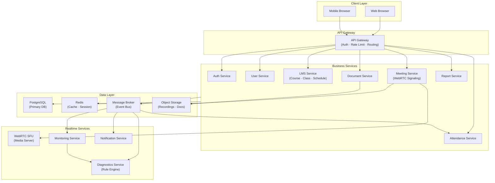

# 01. System Overview

> **Mục đích:** Cung cấp cái nhìn tổng quan về hệ thống — lý do tồn tại, phạm vi, mục tiêu phi chức năng, và kiến trúc cấp cao.
> **Tham chiếu:** BRD 01_Muc_Tieu_Du_An.md · SRS 01_Functional_Requirements.md

---

## 1.1 Purpose

Hệ thống được xây dựng nhằm cung cấp một **nền tảng đào tạo trực tuyến tích hợp** toàn diện, kết hợp giữa:

- **Learning Management System (LMS)** — quản lý khóa học, lớp học, lịch học
- **Video Conference Platform** — phòng học WebRTC SFU thời gian thực
- **Realtime Monitoring Platform** — giám sát chất lượng kết nối và điểm danh
- **Learning Analytics Platform** — phân tích dữ liệu học tập và vận hành

Hệ thống cho phép các tổ chức giáo dục, trung tâm đào tạo, và doanh nghiệp **quản lý tập trung** toàn bộ quá trình đào tạo trực tuyến trên một nền tảng thống nhất.

---

## 1.2 Problem Statement

Các nền tảng hiện nay thường tồn tại các vấn đề:

| Vấn đề | Hệ quả |
|:--|:--|
| LMS và Video Conference tách biệt | Người dùng phải chuyển đổi giữa nhiều hệ thống |
| Không theo dõi chất lượng lớp học theo thời gian thực | Không phát hiện sự cố mạng kịp thời |
| Điểm danh thủ công | Sai sót, tốn thời gian, không chính xác |
| Không xác định được nguyên nhân sự cố | Không phân biệt lỗi host, participant, hay hạ tầng |
| Thiếu dữ liệu phân tích vận hành | Không cải thiện được chất lượng đào tạo theo dữ liệu |

Hệ thống được đề xuất giải quyết toàn bộ các vấn đề trên thông qua một nền tảng tích hợp duy nhất.

---

## 1.3 Business Goals

| ID | Mục tiêu |
|:--|:--|
| GOAL-001 | Quản lý tập trung toàn bộ hoạt động đào tạo |
| GOAL-002 | Hỗ trợ tổ chức lớp học trực tuyến quy mô lớn (≥ 100 người/phòng) |
| GOAL-003 | Tự động hóa quy trình điểm danh dựa trên sự kiện WebRTC |
| GOAL-004 | Giám sát chất lượng lớp học theo thời gian thực với cảnh báo tự động |
| GOAL-005 | Chẩn đoán nguyên nhân sự cố mạng thông qua Rule Engine |
| GOAL-006 | Cung cấp khả năng mở rộng và tích hợp trong tương lai |

---

## 1.4 System Scope

**Trong phạm vi (In Scope):**

| Domain | Chức năng chính |
|:--|:--|
| Authentication & Authorization | Đăng nhập, JWT, RBAC, quản lý session |
| User Management | Tạo/sửa/xóa tài khoản, phân quyền vai trò |
| Course & Class Management (LMS) | Khóa học, lớp học, lịch học, phân công giáo viên |
| Online Meeting (WebRTC) | Phòng học SFU, ghi hình, chia sẻ màn hình, chat |
| Auto Attendance | Tracking JOIN/DISCONNECT/RECONNECT/LEAVE |
| Document Management | Upload, lưu trữ, tải về tài liệu bảo mật |
| Realtime Monitoring | Telemetry WebRTC, cảnh báo ngưỡng, dashboard |
| Network Diagnostics | Rule Engine 3 quy tắc + fallback |
| Report & Export | Báo cáo điểm danh Excel/PDF, analytics |
| Notification | Email, push notification, in-app |

**Ngoài phạm vi (Out of Scope):**
- Payment Gateway / Billing
- HR Management
- Kế toán / Tài chính
- Tuyển sinh
- Quản lý lớp học vật lý (offline)

---

## 1.5 Core Features

| ID | Tên tính năng | Priority |
|:--|:--|:--|
| FTR-001 | Authentication & Authorization | Must Have |
| FTR-002 | User Management | Must Have |
| FTR-003 | Course Management | Must Have |
| FTR-004 | Class Management | Must Have |
| FTR-005 | Online Meeting (WebRTC SFU) | Must Have |
| FTR-006 | Auto Attendance Tracking | Must Have |
| FTR-007 | Realtime Monitoring & Alerting | Must Have |
| FTR-008 | Network Diagnostics (Rule Engine) | Should Have |
| FTR-009 | Recording Management | Should Have |
| FTR-010 | Learning Analytics & Reports | Should Have |
| FTR-011 | Document Management | Should Have |
| FTR-012 | Notification Center | Must Have |

---

## 1.6 Stakeholders

| Actor | Vai trò | Trách nhiệm chính |
|:--|:--|:--|
| **Administrator** | Quản trị hệ thống | Tạo tài khoản, cấu hình hệ thống, giám sát vận hành |
| **Training Manager** | Quản lý đào tạo | Tạo khóa học, lớp học, lên lịch, phân công GV |
| **Teacher (Instructor)** | Giảng viên | Dạy học, ghi hình, quản lý lớp, xem báo cáo lớp mình |
| **Student** | Học viên | Tham gia phòng học, xem tài liệu, xem lịch sử điểm danh |
| **Operations Team** | Vận hành | Giám sát Monitoring dashboard, xử lý sự cố |

---

## 1.7 Non-Functional Objectives

| Thuộc tính | Mục tiêu | Ghi chú |
|:--|:--|:--|
| **Availability** | ≥ 99.9% uptime | Downtime < 8.7 giờ/năm |
| **Scalability** | ≥ 10,000 concurrent users | ≥ 100 phòng học đồng thời |
| **Performance** | API response ≤ 500ms (p95) | Telemetry API ≤ 200ms |
| **Security** | JWT + RBAC + TLS 1.2+ | bcrypt cost ≥ 12 |
| **Reliability** | No Single Point of Failure | Hàng đợi replication factor ≥ 3 |
| **Data Retention** | Recording ≤ 180 ngày | Telemetry raw 90 ngày, aggregate 1 năm |

---

## 1.8 High-Level Architecture

---

## 1.9 Success Criteria

| Tiêu chí | Đo lường |
|:--|:--|
| Hỗ trợ học trực tuyến thời gian thực | ≥ 100 người/phòng, latency ≤ 300ms |
| Điểm danh tự động chính xác | Sai số ≤ 1 phút so với thời gian thật |
| Giám sát và cảnh báo | Alert hiển thị ≤ 10 giây sau khi metric vượt ngưỡng |
| Chẩn đoán sự cố | Rule Engine xử lý trong ≤ 5 giây sau khi alert |
| Xuất báo cáo | Báo cáo ≤ 10k records trong ≤ 30 giây |
| Bảo mật | Không có lỗ hổng OWASP Top 10 |
