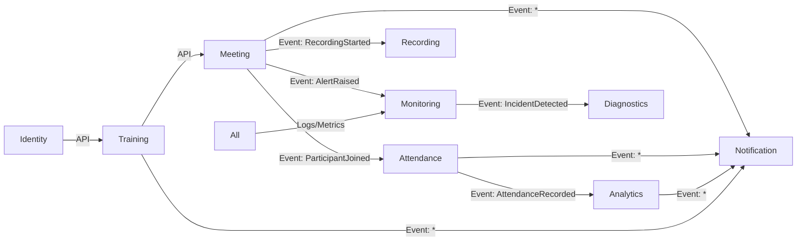

# 02. Domain Decomposition (Phân rã Miền nghiệp vụ)

> **Mục đích:** Xác định các domain nghiệp vụ của hệ thống, ranh giới trách nhiệm, và sự phụ thuộc giữa các domain.
> **Tham chiếu:** BRD (12 files) · SAD 03_Domain_Architecture.md · TDD 03-bounded-context-design.md

---

## 2.1 Domain Classification

Hệ thống được phân rã thành **2 nhóm domain** theo DDD (Domain-Driven Design):

| Nhóm | Domain | Lý do phân loại |
|:--|:--|:--|
| **Core Domain** | Training, Meeting, Attendance, Analytics | Tạo ra giá trị kinh doanh trực tiếp — cạnh tranh |
| **Supporting Domain** | Identity, Notification, Recording, Monitoring | Hỗ trợ core hoạt động — có thể dùng thư viện ngoài |

---

## 2.2 Domain Map

```mermaid
graph TD
    subgraph Core["🔷 Core Domains"]
        TRN["DOM-002\nTraining\n(Course · Class · Schedule)"]
        MTG["DOM-003\nMeeting\n(Room · WebRTC · Chat)"]
        ATT["DOM-004\nAttendance\n(Track · Calculate)"]
        ANA["DOM-005\nAnalytics\n(Metrics · Dashboard)"]
    end

    subgraph Supporting["🔶 Supporting Domains"]
        IDN["DOM-001\nIdentity\n(Auth · User · Role)"]
        REC["DOM-008\nRecording\n(Capture · Store · Playback)"]
        NTF["DOM-007\nNotification\n(Email · Push · In-App)"]
        MON["DOM-006\nMonitoring\n(Logs · Alerts · Health)"]
    end

    IDN --> TRN --> MTG --> ATT --> ANA
    MTG --> REC
    MON -.->|observes| Core
    NTF -.->|notifies from| Core
```

---

## 2.3 Domain Definitions

### DOM-001: Identity Domain

| Trường | Giá trị |
|:--|:--|
| **Trách nhiệm** | Authentication, Authorization, User Profile, Role & Permission Management |
| **Aggregates** | User, Role, Permission, Session |
| **Owned Tables** | `users`, `roles`, `permissions`, `user_roles`, `sessions` |
| **Events phát ra** | `UserCreated`, `UserUpdated`, `UserDeactivated`, `SessionCreated` |
| **Service** | SRV-001 Auth Service, SRV-002 User Service |

---

### DOM-002: Training Domain

| Trường | Giá trị |
|:--|:--|
| **Trách nhiệm** | Quản lý khóa học, lớp học, lịch học, phân công giáo viên, danh sách học viên, tài liệu |
| **Aggregates** | Course, Class, Schedule, Material, Enrollment |
| **Owned Tables** | `courses`, `classes`, `schedules`, `enrollments`, `materials` |
| **Events phát ra** | `CourseCreated`, `ClassCreated`, `ScheduleCreated`, `StudentEnrolled` |
| **Service** | SRV-003 LMS Service, SRV-004 Document Service |

---

### DOM-003: Meeting Domain

| Trường | Giá trị |
|:--|:--|
| **Trách nhiệm** | Quản lý phòng học WebRTC, signaling, participant management, chat, screen sharing, consent prompt |
| **Aggregates** | Meeting, Participant, MediaSession, ChatMessage |
| **Owned Tables** | `meetings`, `participants` |
| **Events phát ra** | `MeetingStarted`, `MeetingEnded`, `ParticipantJoined`, `ParticipantLeft`, `RecordingStarted`, `RecordingStopped` |
| **Service** | SRV-005 Meeting Service |

---

### DOM-004: Attendance Domain

| Trường | Giá trị |
|:--|:--|
| **Trách nhiệm** | Tracking sự kiện JOIN/DISCONNECT/RECONNECT/LEAVE, tính tỷ lệ tham dự, export báo cáo điểm danh |
| **Aggregates** | AttendanceSession, AttendanceRecord, ConnectionInterval |
| **Owned Tables** | `attendance_sessions`, `attendance_records` |
| **Events phát ra** | `AttendanceRecorded`, `AttendanceReportGenerated` |
| **Service** | SRV-006 Attendance Service |
| **Công thức** | `attendance_rate = Σ connected_intervals / meeting_duration × 100` |

---

### DOM-005: Analytics Domain

| Trường | Giá trị |
|:--|:--|
| **Trách nhiệm** | Thu thập telemetry WebRTC (Packet Loss, Latency, Jitter), tính quality score, báo cáo |
| **Aggregates** | ConnectionMetric, LearningMetric, AnalyticsReport |
| **Owned Tables** | `connection_metrics`, `analytics_reports` |
| **Events phát ra** | `MetricCollected`, `AlertRaised`, `ReportGenerated` |
| **Service** | SRV-007 Analytics Service, SRV-008 Monitoring Service |

---

### DOM-006: Monitoring Domain

| Trường | Giá trị |
|:--|:--|
| **Trách nhiệm** | Aggregation logs từ tất cả service, health check, alerting, Rule Engine chẩn đoán |
| **Aggregates** | LogEntry, Alert, SystemMetric, IncidentLog |
| **Owned Tables** | `incident_logs`, `alerts` |
| **Events phát ra** | `AlertAcknowledged`, `IncidentResolved` |
| **Service** | SRV-008 Monitoring Service, SRV-009 Diagnostics Service |

---

### DOM-007: Notification Domain

| Trường | Giá trị |
|:--|:--|
| **Trách nhiệm** | Gửi email, push notification, in-app notification. Retry khi lỗi. |
| **Aggregates** | Notification, NotificationTemplate, DeliveryLog |
| **Owned Tables** | `notifications`, `notification_templates` |
| **Events phát ra** | `NotificationSent`, `NotificationFailed` |
| **Service** | SRV-010 Notification Service |

---

### DOM-008: Recording Domain

| Trường | Giá trị |
|:--|:--|
| **Trách nhiệm** | Capture audio/video từ SFU, transcode MP4/H.264, quản lý vòng đời Hot/Cold Storage, presigned URL |
| **Aggregates** | Recording, MediaFile, PlaybackSession |
| **Owned Tables** | `recordings` |
| **Events phát ra** | `RecordingCompleted`, `RecordingTranscoded`, `RecordingDeleted` |
| **Service** | SRV-011 Recording Service |
| **Storage lifecycle** | Hot (0–30 ngày) → Cold (31–180 ngày) → Delete (> 180 ngày) |

---

## 2.4 Domain Dependency Matrix

| Domain | Phụ thuộc vào | Hướng tích hợp |
|:--|:--|:--|
| Training | Identity | API (đồng bộ) |
| Meeting | Training, Identity | API (đồng bộ) |
| Attendance | Meeting | Event (bất đồng bộ) |
| Analytics | Attendance, Meeting | Event (bất đồng bộ) |
| Recording | Meeting | Event (bất đồng bộ) |
| Notification | Tất cả domain | Event (bất đồng bộ) |
| Monitoring | Tất cả domain | Event (bất đồng bộ) |

**Quy tắc:** Core domain **KHÔNG được** phụ thuộc vào Supporting domain theo chiều ngược lại.

---

## 2.5 Context Relationship Diagram

