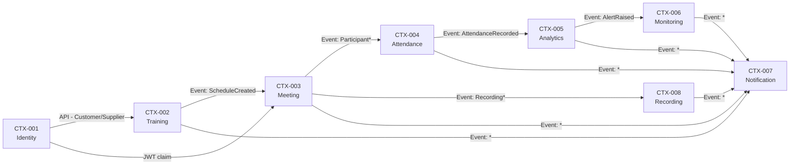

# 03. Bounded Context Design (Thiết kế ngữ cảnh giới hạn)

> **Mục đích:** Xác định ranh giới mô hình nghiệp vụ và ngăn chặn việc chia sẻ logic nghiệp vụ không kiểm soát giữa các domain. Mỗi Bounded Context sở hữu dữ liệu của mình và chỉ giao tiếp qua API hoặc Event.
> **Tham chiếu:** TDD 02-domain-decomposition.md · SAD 03_Domain_Architecture.md · TDD 08-event-design.md

---

## 3.1 Context Ownership Rule

> **Nguyên tắc bất biến:** Mỗi Aggregate chỉ có **một** Bounded Context sở hữu. Không có Context nào được ghi trực tiếp vào dữ liệu của Context khác.

| Aggregate | Context sở hữu | Lý do |
|:--|:--|:--|
| User, Role, Permission | Identity | Source of truth về danh tính |
| Course, Class, Enrollment | Training | Source of truth về đào tạo |
| Meeting, Participant | Meeting | Source of truth về phòng học |
| AttendanceSession, AttendanceRecord | Attendance | Source of truth về điểm danh |
| ConnectionMetric | Analytics | Source of truth về telemetry |
| Recording, MediaFile | Recording | Source of truth về lưu trữ media |
| Notification | Notification | Source of truth về thông báo |
| Alert, IncidentLog | Monitoring | Source of truth về sự cố |

---

## 3.2 Bounded Context Catalog

### CTX-001: Identity Context

```
Aggregates: User · Role · Permission · Session
───────────────────────────────────────────────
Tables:     users · roles · permissions
            user_roles · sessions
APIs:       POST /auth/login
            POST /auth/refresh
            POST /auth/logout
            GET|PUT|DELETE /users/{id}
Events IN:  (none — Identity là upstream)
Events OUT: UserCreated · UserDeactivated
            SessionCreated · SessionRevoked
```

**Context Map với downstream:** Training, Meeting (Customer–Supplier — Identity cung cấp token/user info cho mọi context downstream qua JWT claim)

---

### CTX-002: Training Context

```
Aggregates: Course · Class · Schedule · Material · Enrollment
──────────────────────────────────────────────────────────────
Tables:     courses · classes · schedules
            materials · enrollments
APIs:       POST|GET|PUT|DELETE /courses
            POST|GET /classes
            POST /classes/{id}/students
            POST /classes/{id}/instructors
Events IN:  UserCreated (để validate enrollment)
Events OUT: CourseCreated · ClassCreated
            StudentEnrolled · ScheduleCreated
```

---

### CTX-003: Meeting Context

```
Aggregates: Meeting · Participant · MediaSession
─────────────────────────────────────────────────
Tables:     meetings · participants
APIs:       POST /meetings
            POST /meetings/{id}/join
            POST /meetings/{id}/leave
            POST /meetings/{id}/end
            GET  /meetings/{id}/participants
Events IN:  ScheduleCreated (tạo meeting room)
Events OUT: MeetingStarted · MeetingEnded
            ParticipantJoined · ParticipantLeft
            ParticipantDisconnected · ParticipantRejoined
            RecordingStarted · RecordingStopped
```

**Lưu ý WebRTC:** Meeting Context quản lý Signaling (offer/answer/ICE candidate) nhưng **không** quản lý media stream — đó là trách nhiệm của WebRTC SFU (external system).

---

### CTX-004: Attendance Context

```
Aggregates: AttendanceSession · AttendanceRecord
─────────────────────────────────────────────────
Tables:     attendance_sessions · attendance_records
APIs:       POST /attendance/checkin
            POST /attendance/checkout
            GET  /attendance/reports/{classId}
            GET  /attendance/students/{studentId}
Events IN:  ParticipantJoined → ghi sự kiện JOIN
            ParticipantDisconnected → ghi sự kiện DISCONNECT
            ParticipantRejoined → ghi sự kiện RECONNECT
            MeetingEnded → chốt tỷ lệ tham dự, tạo AttendanceRecord
Events OUT: AttendanceRecorded · AttendanceReportGenerated
```

**Công thức điểm danh:**
```
attendance_rate = (Σ connected_intervals) / meeting_duration × 100
```

---

### CTX-005: Analytics Context

```
Aggregates: ConnectionMetric · LearningMetric · AnalyticsReport
────────────────────────────────────────────────────────────────
Tables:     connection_metrics · analytics_reports
APIs:       GET /analytics/dashboard
            GET /analytics/metrics
            GET /analytics/classes/{classId}
            POST /telemetry (nhận dữ liệu từ client)
Events IN:  AttendanceRecorded (tính learning metrics)
Events OUT: MetricCollected · AlertRaised · ReportGenerated
```

**Ingestion pipeline:** Client → REST POST /telemetry (mỗi 5 giây) → Analytics Service → Message Broker → Monitoring Service

---

### CTX-006: Monitoring Context

```
Aggregates: SystemMetric · Alert · IncidentLog
──────────────────────────────────────────────
Tables:     alerts · incident_logs
APIs:       GET /monitoring/health
            GET /monitoring/metrics
            GET /diagnostics/{sessionId}
Events IN:  AlertRaised (từ Analytics)
            Tất cả *Failed / *Error events từ các context khác
Events OUT: AlertAcknowledged · IncidentResolved
```

**Rule Engine (chẩn đoán sự cố):**

| Rule | Điều kiện | Kết luận |
|:--|:--|:--|
| Rule 01 | Host Packet Loss > 5% VÀ > 50% users bị ảnh hưởng | Host Issue |
| Rule 02 | Chỉ 1 user có Packet Loss > 5% | Participant Issue |
| Rule 03 | > 30% phòng học alert đồng thời | Infrastructure Issue |
| Fallback | Không rule nào khớp | Unidentified — tạo ManualInvestigation task |

---

### CTX-007: Notification Context

```
Aggregates: Notification · NotificationTemplate · DeliveryLog
──────────────────────────────────────────────────────────────
Tables:     notifications · notification_templates
APIs:       POST /notifications
            GET  /notifications (in-app list)
Events IN:  StudentEnrolled · MeetingStarted · AlertRaised
            RecordingCompleted · UserDeactivated · ...
Events OUT: NotificationSent · NotificationFailed
```

**Delivery channels:** In-App (SignalR) → Email (SMTP) → Retry queue (nếu lỗi, retry ≤ 3 lần)

---

### CTX-008: Recording Context

```
Aggregates: Recording · MediaFile · PlaybackSession
────────────────────────────────────────────────────
Tables:     recordings
APIs:       POST /recordings/start
            POST /recordings/stop
            GET  /recordings/{id}          ← trả Presigned URL (TTL 15 phút)
Events IN:  RecordingStarted · RecordingStopped (từ Meeting Context)
Events OUT: RecordingCompleted · RecordingTranscoded · RecordingDeleted
```

**Storage Lifecycle:**

```
Raw upload → Transcode (MP4/H.264) → Hot Storage (0–30 ngày)
                                    → Cold Storage (31–180 ngày)
                                    → Auto-delete (> 180 ngày)
```

---

## 3.3 Integration Pattern Summary

| Tích hợp | Pattern | Lý do |
|:--|:--|:--|
| Identity → Training | REST API (đồng bộ) | Cần validate user ngay lập tức |
| Training → Meeting | REST API (đồng bộ) | Cần meeting info khi join |
| Meeting → Attendance | Domain Event (async) | Không blocking luồng meeting |
| Meeting → Recording | Domain Event (async) | Recording là side effect |
| Analytics → Monitoring | Domain Event (async) | Alert không cần response |
| All → Notification | Domain Event (async) | Fire-and-forget |

---

## 3.4 Anti-Corruption Layer (ACL)

Các context **bắt buộc** có ACL khi nhận dữ liệu từ context ngoài:

| Context nhận | Context gửi | ACL xử lý |
|:--|:--|:--|
| Attendance | Meeting (ParticipantJoined) | Map `meeting_id` + `user_id` → tạo `AttendanceRecord` mới |
| Analytics | Meeting (client telemetry) | Validate metrics, reject nếu `participant_id` không tồn tại |
| Notification | Meeting (MeetingEnded) | Map sang template `meeting_ended`, chèn tên lớp/học viên |
| Recording | Meeting (RecordingStarted) | Validate quota 10 GB, reject nếu vượt |

---

## 3.5 Context Map (tổng thể)


