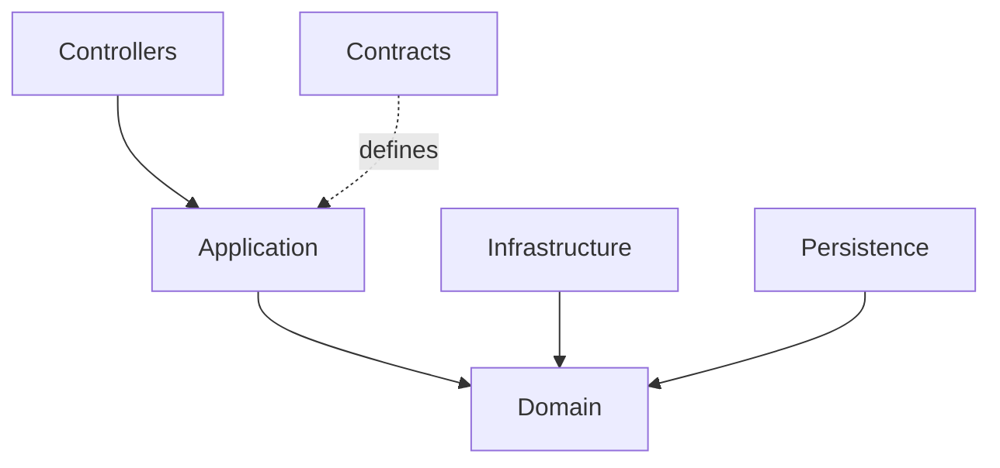

# 05. Module Design (Thiết kế cấu trúc nội bộ service)

> **Mục đích:** Mô tả cấu trúc nội bộ của từng service theo Clean Architecture — layer structure, dependency rules, folder organization và communication pattern.
> **Tham chiếu:** TDD 04-service-design.md · TDD 03-bounded-context-design.md · TDD 06-api-design.md

---

## 5.1 Purpose

Tài liệu này định nghĩa:

- **Layer Structure** — 6 layer trong mỗi service
- **Dependency Rules** — chiều phụ thuộc hợp lệ và không hợp lệ
- **Module Responsibilities** — trách nhiệm từng layer
- **Folder Organization** — cấu trúc thư mục chuẩn
- **Communication Pattern** — cách các layer giao tiếp

**Mục tiêu:** Giảm coupling, tăng khả năng bảo trì, hỗ trợ kiểm thử và mở rộng trong tương lai.

---

## 5.2 Standard Service Architecture

### 5.2.1 Layer Stack

Mỗi service phải tuân theo 6 layer theo thứ tự từ ngoài vào trong:

```
Controllers → Application → Domain
Infrastructure → Domain
Persistence → Domain
Contracts (shared DTOs / event schemas)
```

### 5.2.2 Dependency Flow



### 5.2.3 Nguyên tắc bất biến

| Nguyên tắc | Mô tả |
|:--|:--|
| Domain không phụ thuộc bất kỳ layer nào | Domain là trung tâm — không import gì ngoài standard library |
| Application phụ thuộc Domain | Application orchestrate use cases, gọi Domain services |
| Infrastructure phụ thuộc Domain | Infrastructure implement interfaces của Domain |
| Controllers phụ thuộc Application | Controller chỉ gọi Application layer |
| Persistence phụ thuộc Domain | Repository implement interfaces định nghĩa trong Domain |

---

## 5.3 Layer Responsibilities

### Controllers Layer

| Trường | Nội dung |
|:--|:--|
| **Purpose** | Expose API endpoint ra bên ngoài |
| **Responsibilities** | HTTP Endpoint, Authentication check, Input Validation, Response Mapping |
| **NOT Responsible For** | Business Logic, Database Access, External Service calls |

### Application Layer

| Trường | Nội dung |
|:--|:--|
| **Purpose** | Điều phối Use Cases (Orchestration) |
| **Responsibilities** | Commands, Queries, Application Services, Transaction boundary, Authorization Policies |
| **NOT Responsible For** | Persistence Details, Infrastructure Details, HTTP concerns |

### Domain Layer

| Trường | Nội dung |
|:--|:--|
| **Purpose** | Chứa nghiệp vụ cốt lõi — trái tim của service |
| **Responsibilities** | Entities, Value Objects, Aggregates, Domain Services, Domain Events, Business Rules |
| **NOT Responsible For** | Database, HTTP, External Systems, Logging infrastructure |

### Infrastructure Layer

| Trường | Nội dung |
|:--|:--|
| **Purpose** | Kết nối hệ thống bên ngoài |
| **Responsibilities** | Email (SMTP), Cache (Redis), File Storage (S3), Message Queue (RabbitMQ), WebRTC Integration, Third-party Services |
| **NOT Responsible For** | Business Logic, Direct database query |

### Persistence Layer

| Trường | Nội dung |
|:--|:--|
| **Purpose** | Lưu trữ và truy xuất dữ liệu |
| **Responsibilities** | ORM (EF Core), Repository pattern, Database Mapping, Migrations, Query Optimization |
| **NOT Responsible For** | Business Logic, HTTP, External integrations |

### Contracts Layer

| Trường | Nội dung |
|:--|:--|
| **Purpose** | Định nghĩa giao tiếp giữa service và thế giới bên ngoài |
| **Responsibilities** | DTOs (Request/Response), API Contracts, Event Contracts, Message Schemas |
| **NOT Responsible For** | Business Logic, Database, Implementation detail |

---

## 5.4 Module Dependency Rules

### Phụ thuộc hợp lệ

```
Controller  → Application → Domain
Infrastructure → Domain
Persistence → Domain
```

### Phụ thuộc KHÔNG hợp lệ

| Vi phạm | Lý do |
|:--|:--|
| Domain → Infrastructure | Domain không được biết đến external systems |
| Domain → Persistence | Domain không được biết đến database |
| Controller → Persistence | Bỏ qua Application và Domain layer |
| Application → Infrastructure | Application chỉ gọi interface, không gọi implementation trực tiếp |

---

## 5.5 Standard Folder Structure

```
service-name/
│
├── Controllers/
│
├── Application/
│   ├── Commands/
│   ├── Queries/
│   ├── Handlers/
│   ├── Services/
│   └── Interfaces/
│
├── Domain/
│   ├── Entities/
│   ├── Aggregates/
│   ├── ValueObjects/
│   ├── Enums/
│   ├── Events/
│   ├── Specifications/
│   └── Services/
│
├── Infrastructure/
│   ├── Cache/
│   ├── Messaging/
│   ├── Storage/
│   ├── Email/
│   └── ExternalServices/
│
├── Persistence/
│   ├── Context/
│   ├── Configurations/
│   ├── Repositories/
│   └── Migrations/
│
└── Contracts/
    ├── Requests/
    ├── Responses/
    ├── DTOs/
    └── Events/
```

---

## 5.6 Example: Meeting Service

```
meeting-service/
│
├── Controllers/
│   ├── MeetingsController
│   └── ParticipantsController
│
├── Application/
│   ├── Commands/
│   │   ├── CreateMeeting/
│   │   ├── JoinMeeting/
│   │   └── EndMeeting/
│   ├── Queries/
│   │   ├── GetMeeting/
│   │   └── GetParticipants/
│   └── Services/
│
├── Domain/
│   ├── Aggregates/
│   │   └── MeetingAggregate
│   ├── Entities/
│   │   ├── Meeting
│   │   └── Participant
│   ├── ValueObjects/
│   │   └── MeetingId
│   └── Events/
│       ├── MeetingStarted
│       ├── ParticipantJoined
│       └── MeetingEnded
│
├── Infrastructure/
│   ├── WebRTC/
│   ├── SignalR/
│   └── Redis/
│
├── Persistence/
│   ├── MeetingRepository
│   └── DbContext
│
└── Contracts/
    ├── CreateMeetingRequest
    ├── JoinMeetingRequest
    └── MeetingResponse
```

---

## 5.7 Example: Attendance Service

```
attendance-service/
│
├── Controllers/
├── Application/
├── Domain/
│   ├── AttendanceSession
│   ├── AttendanceRecord
│   └── Events/
│       ├── AttendanceRecorded
│       └── AttendanceReportGenerated
├── Infrastructure/
├── Persistence/
└── Contracts/
```

**Đặc điểm:** Attendance Service không có HTTP endpoint public — hoạt động chủ yếu qua event consumer (RabbitMQ), lắng nghe `ParticipantJoined`, `ParticipantDisconnected`, `MeetingEnded`.

---

## 5.8 Traceability

```
DOM-003 Meeting Domain
    ↓
CTX-003 Meeting Bounded Context
    ↓
SRV-005 Meeting Service
    ↓
MOD-001 Controllers Layer
MOD-002 Application Layer
MOD-003 Domain Layer
MOD-004 Infrastructure Layer
MOD-005 Persistence Layer
MOD-006 Contracts Layer
```

---

## 5.9 Design Principles

| Nguyên tắc | Áp dụng |
|:--|:--|
| **Clean Architecture** | Layer dependency hướng vào Domain |
| **Dependency Inversion** | Application gọi interface, Infra implement |
| **Domain-Driven Design** | Aggregate, Entity, Value Object, Domain Event |
| **CQRS** | Tách Command (write) và Query (read) trong Application layer |
| **Database per Service** | Mỗi service sở hữu schema riêng, không share table |
| **Event-Driven Integration** | Service giao tiếp qua Domain Events — không gọi trực tiếp |
| **High Cohesion / Low Coupling** | Mỗi module chỉ làm một việc, giảm phụ thuộc lẫn nhau |
