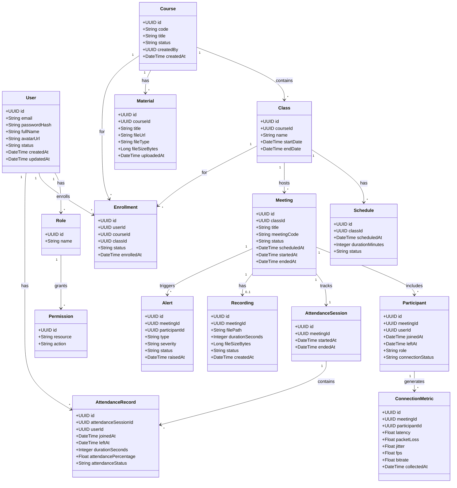

07. Entity Design
7.1 Purpose
Tài liệu này định nghĩa các Business Entity của hệ thống, mối quan hệ giữa chúng và quyền sở hữu dữ liệu của từng Service.
Mục tiêu:
Xây dựng Domain Model.
Là cơ sở cho Database Design.
Là cơ sở cho API Design.
Là cơ sở cho Event Design.

7.2 Entity Classification
Identity
├── User
├── Role
├── Permission
└── Session

Training
├── Course
├── Class
├── Enrollment
├── Schedule
└── Material

Meeting
├── Meeting
├── Participant
├── ChatMessage
└── BreakoutRoom

Attendance
├── AttendanceSession
└── AttendanceRecord

Analytics
├── ConnectionMetric
├── LearningMetric
└── DashboardMetric

Recording
├── Recording
└── MediaFile

Notification
├── Notification
└── NotificationDelivery

Monitoring
├── SystemMetric
├── LogEntry
└── Alert

7.3 Entity Catalog

ENT-001 User
Description
Đại diện cho người sử dụng hệ thống.
Owner Service
SRV-002 User Service
Attributes
Id
Email
PasswordHash
FullName
Avatar
Status
CreatedAt
UpdatedAt
Relationships
User
 ├── Role
 ├── Enrollment
 ├── Participant
 └── AttendanceRecord

ENT-002 Role
Owner Service
SRV-002 User Service
Relationships
Role
 └── Permission

ENT-003 Course
Description
Khóa học.
Owner Service
SRV-003 Course Service
Relationships
Course
 ├── Class
 ├── Material
 └── Enrollment

ENT-004 Class
Description
Lớp học của một khóa học.
Owner Service
SRV-004 Class Service
Relationships
Class
 ├── Schedule
 ├── Meeting
 └── Enrollment

ENT-005 Enrollment
Description
Quan hệ giữa User và Course/Class.
Owner Service
SRV-003 Course Service

ENT-006 Material
Description
Tài liệu học tập.
Owner Service
SRV-003 Course Service

ENT-007 Schedule
Description
Lịch học.
Owner Service
SRV-004 Class Service

ENT-008 Meeting
Description
Phiên học trực tuyến.
Owner Service
SRV-005 Meeting Service
Relationships
Meeting
 ├── Participant
 ├── Recording
 ├── ChatMessage
 └── AttendanceSession

ENT-009 Participant
Description
Người tham gia cuộc họp.
Owner Service
SRV-005 Meeting Service

ENT-010 ChatMessage
Owner Service
SRV-005 Meeting Service

ENT-011 AttendanceSession
Description
Phiên điểm danh.
Owner Service
SRV-006 Attendance Service

ENT-012 AttendanceRecord
Description
Thông tin điểm danh của học viên.
Owner Service
SRV-006 Attendance Service
Relationships
AttendanceRecord
 ├── User
 └── AttendanceSession

ENT-013 ConnectionMetric
Description
Thông số chất lượng kết nối.
Owner Service
SRV-007 Analytics Service
Attributes
Latency
PacketLoss
Jitter
RTT
FPS
Bitrate

ENT-014 LearningMetric
Description
Thống kê học tập.
Owner Service
SRV-007 Analytics Service

ENT-015 DashboardMetric
Description
Dữ liệu Dashboard.
Owner Service
SRV-007 Analytics Service

ENT-016 Recording
Description
Bản ghi của lớp học.
Owner Service
SRV-009 Recording Service

ENT-017 MediaFile
Owner Service
SRV-009 Recording Service

ENT-018 Notification
Owner Service
SRV-008 Notification Service

ENT-019 NotificationDelivery
Owner Service
SRV-008 Notification Service

ENT-020 SystemMetric
Owner Service
SRV-010 Monitoring Service

ENT-021 LogEntry
Owner Service
SRV-010 Monitoring Service

ENT-022 Alert
Owner Service
SRV-010 Monitoring Service

7.4 Aggregate Design
User Aggregate
├── User
├── Role
└── Permission

Course Aggregate
├── Course
├── Material
└── Enrollment

Class Aggregate
├── Class
└── Schedule

Meeting Aggregate
├── Meeting
├── Participant
└── ChatMessage

Attendance Aggregate
├── AttendanceSession
└── AttendanceRecord

Analytics Aggregate
├── ConnectionMetric
├── LearningMetric
└── DashboardMetric

Recording Aggregate
├── Recording
└── MediaFile

7.5 Entity Relationships

**Text summary:**
User → Enrollment → Course → Class → Meeting → AttendanceSession → AttendanceRecord → ConnectionMetric

7.6 Entity Ownership Rules
Một Entity chỉ có một Owner Service.
Chỉ Owner Service được phép ghi dữ liệu.
Service khác chỉ được truy cập qua:
API
Event
Read Model.

7.7 Traceability
DOM-001
 ↓
CTX-001
 ↓
SRV-002
 ↓
ENT-001 User

DOM-003
 ↓
CTX-003
 ↓
SRV-005
 ↓
ENT-008 Meeting

DOM-004
 ↓
CTX-004
 ↓
SRV-006
 ↓
ENT-012 AttendanceRecord

DOM-005
 ↓
CTX-005
 ↓
SRV-007
 ↓
ENT-013 ConnectionMetric

07.1 Table Design
1. Purpose
Tài liệu này định nghĩa thiết kế vật lý của cơ sở dữ liệu:
Database Schema
Tables
Columns
Constraints
Indexes
Relationships
Partitioning Strategy
Mục tiêu:
Đảm bảo tính toàn vẹn dữ liệu.
Hỗ trợ hiệu năng.
Hỗ trợ khả năng mở rộng.
Hỗ trợ bảo trì và migration.

2. Database Conventions
Naming Convention
Table
snake_case
plural

Ví dụ:
users
courses
meetings
attendance_records

Column
snake_case

Ví dụ:
created_at
updated_at
meeting_id

Primary Key
id UUID

Foreign Key
{table}_id

Ví dụ:
user_id
course_id
meeting_id

3. Table Catalog

DB-001 users
Owner Service
SRV-002 User Service
DDL
CREATE TABLE users (
    id UUID PRIMARY KEY,
    email VARCHAR(255) NOT NULL,
    password_hash VARCHAR(500) NOT NULL,
    full_name VARCHAR(255) NOT NULL,
    avatar_url TEXT,
    status VARCHAR(50) NOT NULL,
    created_at TIMESTAMP NOT NULL,
    updated_at TIMESTAMP NOT NULL
);

Indexes
CREATE UNIQUE INDEX ux_users_email
ON users(email);

CREATE INDEX ix_users_status
ON users(status);

Constraints
email UNIQUE
email NOT NULL
status NOT NULL

DB-010 courses
Owner Service
SRV-003 Course Service
DDL
CREATE TABLE courses (
    id UUID PRIMARY KEY,
    code VARCHAR(50) NOT NULL,
    title VARCHAR(255) NOT NULL,
    description TEXT,
    status VARCHAR(50),
    created_by UUID NOT NULL,
    created_at TIMESTAMP NOT NULL,
    updated_at TIMESTAMP NOT NULL
);

Indexes
CREATE UNIQUE INDEX ux_courses_code
ON courses(code);

CREATE INDEX ix_courses_status
ON courses(status);

DB-020 classes
Owner Service
SRV-004 Class Service
DDL
CREATE TABLE classes (
    id UUID PRIMARY KEY,
    course_id UUID NOT NULL,
    name VARCHAR(255) NOT NULL,
    start_date TIMESTAMP,
    end_date TIMESTAMP,
    created_at TIMESTAMP NOT NULL,
    updated_at TIMESTAMP NOT NULL
);

Constraints
ALTER TABLE classes
ADD CONSTRAINT fk_class_course
FOREIGN KEY (course_id)
REFERENCES courses(id);

Indexes
CREATE INDEX ix_classes_course_id
ON classes(course_id);

DB-030 meetings
Owner Service
SRV-005 Meeting Service
DDL
CREATE TABLE meetings (
    id UUID PRIMARY KEY,
    class_id UUID NOT NULL,
    title VARCHAR(255),
    meeting_code VARCHAR(50) NOT NULL,
    status VARCHAR(50),
    scheduled_at TIMESTAMP,
    started_at TIMESTAMP,
    ended_at TIMESTAMP,
    created_at TIMESTAMP NOT NULL
);

Indexes
CREATE UNIQUE INDEX ux_meetings_code
ON meetings(meeting_code);

CREATE INDEX ix_meetings_class_id
ON meetings(class_id);

CREATE INDEX ix_meetings_status
ON meetings(status);

DB-031 participants
DDL
CREATE TABLE participants (
    id UUID PRIMARY KEY,
    meeting_id UUID NOT NULL,
    user_id UUID NOT NULL,
    joined_at TIMESTAMP,
    left_at TIMESTAMP,
    role VARCHAR(50),
    connection_status VARCHAR(50)
);

Indexes
CREATE INDEX ix_participants_meeting_id
ON participants(meeting_id);

CREATE INDEX ix_participants_user_id
ON participants(user_id);

DB-040 attendance_sessions
DDL
CREATE TABLE attendance_sessions (
    id UUID PRIMARY KEY,
    meeting_id UUID NOT NULL,
    started_at TIMESTAMP,
    ended_at TIMESTAMP
);

DB-041 attendance_records
DDL
CREATE TABLE attendance_records (
    id UUID PRIMARY KEY,
    attendance_session_id UUID NOT NULL,
    user_id UUID NOT NULL,
    joined_at TIMESTAMP,
    left_at TIMESTAMP,
    duration_seconds INTEGER,
    attendance_status VARCHAR(50),
    created_at TIMESTAMP
);

Indexes
CREATE INDEX ix_attendance_user
ON attendance_records(user_id);

CREATE INDEX ix_attendance_session
ON attendance_records(attendance_session_id);

DB-050 connection_metrics
DDL
CREATE TABLE connection_metrics (
    id UUID PRIMARY KEY,
    meeting_id UUID NOT NULL,
    participant_id UUID NOT NULL,
    latency NUMERIC,
    packet_loss NUMERIC,
    jitter NUMERIC,
    rtt NUMERIC,
    fps NUMERIC,
    bitrate NUMERIC,
    collected_at TIMESTAMP NOT NULL
);

Indexes
CREATE INDEX ix_metrics_meeting
ON connection_metrics(meeting_id);

CREATE INDEX ix_metrics_participant
ON connection_metrics(participant_id);

CREATE INDEX ix_metrics_collected_at
ON connection_metrics(collected_at);

DB-060 recordings
DDL
CREATE TABLE recordings (
    id UUID PRIMARY KEY,
    meeting_id UUID NOT NULL,
    file_path TEXT NOT NULL,
    duration_seconds INTEGER,
    file_size BIGINT,
    created_at TIMESTAMP NOT NULL
);

DB-070 notifications
DDL
CREATE TABLE notifications (
    id UUID PRIMARY KEY,
    user_id UUID NOT NULL,
    title VARCHAR(255),
    content TEXT,
    status VARCHAR(50),
    created_at TIMESTAMP NOT NULL
);

4. Common Columns
Mọi bảng nghiệp vụ nên có:
id
created_at
updated_at
created_by
updated_by

Nếu hỗ trợ soft delete:
deleted_at
deleted_by
is_deleted

5. Index Strategy
Primary Index
PRIMARY KEY(id)

Unique Index
email
course_code
meeting_code

Search Index
status
created_at
meeting_id
user_id

Composite Index
CREATE INDEX ix_attendance_user_session
ON attendance_records(
    user_id,
    attendance_session_id
);

6. Constraints
NOT NULL
Dữ liệu bắt buộc.

UNIQUE
Ngăn dữ liệu trùng.

FOREIGN KEY
Đảm bảo quan hệ.

CHECK
CHECK(duration_seconds >= 0)

DEFAULT
DEFAULT NOW()

7. Migration Strategy
V001__Create_Users.sql
V002__Create_Courses.sql
V003__Create_Classes.sql
V004__Create_Meetings.sql
V005__Create_Attendance.sql

8. Traceability
ENT-001 User
        ↓
DB-001 users

ENT-003 Course
        ↓
DB-010 courses

ENT-008 Meeting
        ↓
DB-030 meetings

ENT-012 AttendanceRecord
        ↓
DB-041 attendance_records

ENT-013 ConnectionMetric
        ↓
DB-050 connection_metrics

07.2 Data Lifecycle Management
1. Purpose
Tài liệu này định nghĩa vòng đời dữ liệu của hệ thống, bao gồm:
Data Classification
Retention Policy
Archive Policy
Purge Policy
Backup Policy
Recovery Policy
Mục tiêu:
Kiểm soát tăng trưởng dữ liệu.
Giảm chi phí lưu trữ.
Đảm bảo hiệu năng hệ thống.
Hỗ trợ tuân thủ quy định lưu trữ dữ liệu.

2. Data Lifecycle
Create
   ↓
Active
   ↓
Inactive
   ↓
Archive
   ↓
Purge

3. Data Classification
Business Data
Ví dụ:
Users
Courses
Classes
Enrollments

Operational Data
Ví dụ:
Meetings
Attendance
Notifications

Analytical Data
Ví dụ:
Connection Metrics
Dashboard Metrics
Learning Metrics

System Data
Ví dụ:
Logs
Traces
Alerts

Media Data
Ví dụ:
Recordings
Uploaded Materials

4. Retention Policy
Business Data
Data
Retention
Users
Permanent
Courses
Permanent
Classes
Permanent
Enrollments
Permanent

Operational Data
Data
Retention
Meetings
3 Years
Participants
3 Years
Attendance
5 Years
Notifications
1 Year

Analytical Data
Data
Retention
Connection Metrics
6 Months
Dashboard Metrics
1 Year
Learning Metrics
3 Years

System Data
Data
Retention
Logs
90 Days
Metrics
180 Days
Alerts
1 Year
Traces
30 Days

Media Data
Data
Retention
Recordings
1 Year
Learning Materials
Permanent

5. Archive Policy
Archive Criteria
Dữ liệu được archive khi:
Không còn được truy cập thường xuyên.
Hết thời gian Active.
Không tham gia giao dịch nghiệp vụ.

Archive Strategy
Meetings
After 12 months
      ↓
Archive Database

Attendance
After 24 months
      ↓
Archive Database

Recordings
After 6 months
      ↓
Cold Storage

Logs
After 30 days
      ↓
Compressed Storage

6. Archive Storage
Hot Storage
Frequently accessed data.

Warm Storage
Occasionally accessed data.

Cold Storage
Rarely accessed data.

Deep Archive
Compliance purposes only.

7. Purge Policy
Purge Principles
Chỉ purge dữ liệu đã archive.
Không purge dữ liệu nghiệp vụ còn hiệu lực.
Purge phải được ghi audit log.

Purge Schedule
Data
Purge After
Logs
90 Days
Traces
30 Days
Connection Metrics
12 Months
Notifications
2 Years
Recordings
3 Years
Dashboard Metrics
2 Years

Purge Process
Archive
      ↓
Verification
      ↓
Backup
      ↓
Purge
      ↓
Audit Log

8. Backup Policy
Database
Type
Frequency
Full Backup
Daily
Incremental Backup
Hourly
Transaction Log
Every 15 Minutes

Object Storage
Type
Frequency
Snapshot
Daily
Replication
Realtime

9. Recovery Targets
Recovery Point Objective (RPO)
15 Minutes

Recovery Time Objective (RTO)
1 Hour

10. Partition Strategy
connection_metrics
Partition By:
Month(collected_at)

logs
Partition By:
Day(created_at)

attendance_records
Partition By:
Year(created_at)

11. Data Ownership
Data
Owner Service
Users
User Service
Courses
Course Service
Classes
Class Service
Meetings
Meeting Service
Attendance
Attendance Service
Metrics
Analytics Service
Recordings
Recording Service
Logs
Monitoring Service

12. Lifecycle Events
DataCreated
      ↓
DataArchived
      ↓
DataPurged

13. Traceability
ENT-008 Meeting
        ↓
DB-030 meetings
        ↓
Retention Policy

ENT-013 ConnectionMetric
        ↓
DB-050 connection_metrics
        ↓
Archive Policy

ENT-016 Recording
        ↓
DB-060 recordings
        ↓
Purge Policy

14. Governance Rules
Mọi bảng phải có Retention Policy.
Mọi dữ liệu archive phải có Backup.
Mọi purge phải có Audit Log.
Mọi thay đổi chính sách phải được phê duyệt.
Không được xóa dữ liệu trực tiếp khỏi Production Database.

