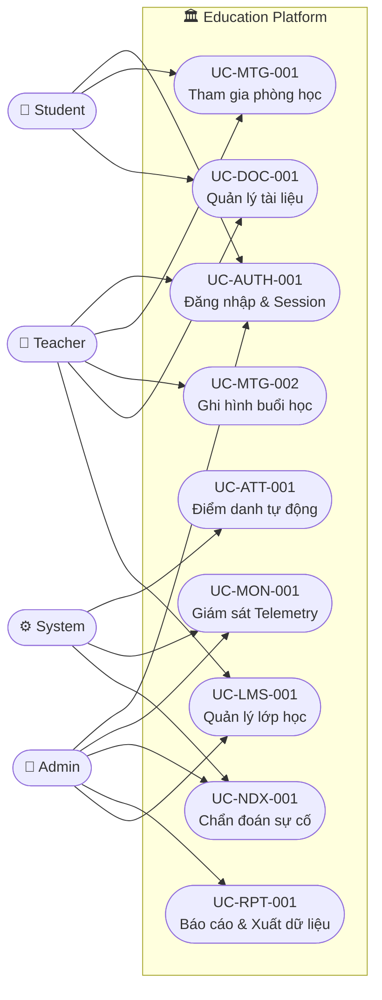
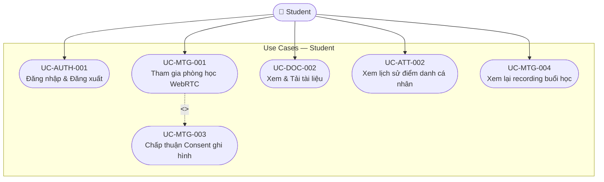
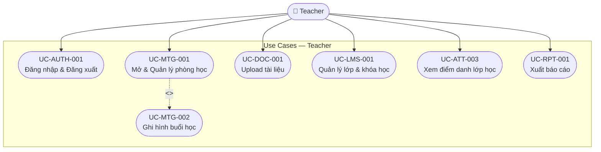
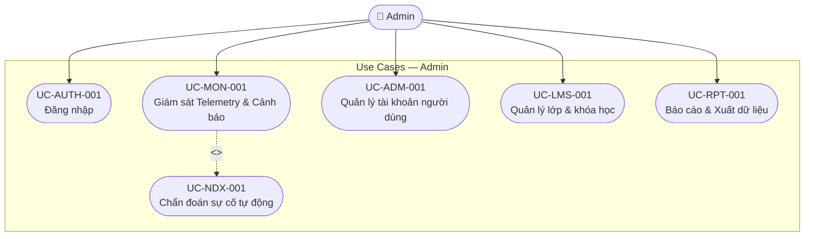

# 01. Use Case Diagrams (Sơ đồ ca sử dụng)

> **Mục đích:** Xác lập ranh giới hệ thống (System Boundary), danh sách actor và quan hệ giữa các Use Case một lần duy nhất — là nền tảng để viết UC Specifications và User Stories.
> **Tham chiếu:** BRD (12 files) · SRS · SAD

---

## 1. Danh sách tác nhân (Actors)

| Actor | Loại | Vai trò | Trách nhiệm chính |
|:--|:--|:--|:--|
| **Student (Học viên)** | Primary | Người tham gia học tập | Tham gia phòng học, xem tài liệu, điểm danh, xem lại recording |
| **Teacher (Giáo viên)** | Primary | Người chủ trì lớp học (Host) | Mở/quản lý phòng, ghi hình, upload tài liệu, theo dõi điểm danh |
| **Admin (Quản trị viên)** | Primary | Quản trị & vận hành hệ thống | Quản lý tài khoản, giám sát telemetry, cấu hình hệ thống, xử lý sự cố |
| **System (Hệ thống)** | Secondary | Tác nhân tự động | Điểm danh tự động, thu thập telemetry, chẩn đoán sự cố, gửi cảnh báo |
| **WebRTC SFU** | External | Media server bên ngoài hệ thống | Định tuyến luồng audio/video giữa các client |
| **Storage Service** | External | Lưu trữ file bên ngoài | Lưu recording, tài liệu — Hot/Cold storage |
| **Notification Service** | External | Dịch vụ thông báo bên ngoài | Gửi email/push notification |

---

## 2. Ranh giới hệ thống (System Boundary)

**Trong scope (inside boundary):**
- Authentication & Session Management
- LMS — Quản lý khóa học, lớp học
- Online Meeting — WebRTC Session, Recording
- Document Management
- Auto Attendance
- Real-Time Monitoring & Telemetry
- Network Diagnostics
- Report & Export

**Ngoài scope (outside boundary):**
- WebRTC SFU / Media Server (external infrastructure)
- Cloud Storage (external — S3-compatible)
- Email / Push Notification Service (external)
- Payment / Billing (ngoài phạm vi dự án)
- Third-party SSO provider (external)

---

## 3. Sơ đồ Use Case tổng quan hệ thống

---

## 4. Use Case theo Actor

### 4.1. Use Case của Student (Học viên)

### 4.2. Use Case của Teacher (Giáo viên)

### 4.3. Use Case của Admin (Quản trị viên)

---

## 5. Quan hệ giữa các Use Case

### 5.1. <<include>> — UC bắt buộc gọi UC khác

| UC Gốc | <<include>> | UC Được gọi | Lý do |
|:--|:--|:--|:--|
| UC-MTG-001 Tham gia phòng | → | UC-AUTH-001 Đăng nhập | Phải auth trước khi vào phòng |
| UC-MTG-001 Tham gia phòng | → | UC-MTG-003 Consent Prompt | Yêu cầu đồng ý ghi hình trước khi vào |
| UC-ATT-001 Điểm danh | → | UC-MTG-001 Tham gia phòng | Điểm danh chỉ xảy ra khi có session |
| UC-NDX-001 Chẩn đoán | → | UC-MON-001 Giám sát | Chẩn đoán cần dữ liệu telemetry |

### 5.2. <<extend>> — UC tùy chọn mở rộng UC khác

| UC Mở rộng | <<extend>> | UC Gốc | Điều kiện kích hoạt |
|:--|:--|:--|:--|
| UC-MTG-002 Ghi hình | → | UC-MTG-001 Tham gia phòng | Teacher chủ động bật ghi hình |
| UC-NDX-001 Chẩn đoán | → | UC-MON-001 Giám sát | Alert được trigger bởi ngưỡng metric |
| UC-RPT-001 Xuất báo cáo | → | UC-ATT-001 Điểm danh | Admin/Teacher chủ động export |

### 5.3. UC dùng chung nhiều actor (Generalization)

| Use Case | Student | Teacher | Admin |
|:--|:--:|:--:|:--:|
| UC-AUTH-001 Đăng nhập | ✓ | ✓ | ✓ |
| UC-MTG-001 Tham gia phòng | ✓ | ✓ (với role Host) | — |
| UC-DOC-001 Tài liệu | Xem/Tải | Upload/Quản lý | — |
| UC-RPT-001 Báo cáo | — | Xem lớp mình | Xem toàn hệ thống |

---

## 6. Các Use Case bổ sung (từ BRD)

Ngoài 6 core UC, BRD xác định thêm các UC sau cần đặc tả:

| UC-ID | Tên | Actor chính | BRD tham chiếu |
|:--|:--|:--|:--|
| UC-DOC-001 | Upload & Quản lý tài liệu | Teacher | 05_Tai_Lieu.md |
| UC-DOC-002 | Xem & Tải tài liệu bảo mật | Student | 05_Tai_Lieu.md |
| UC-MTG-003 | Consent Prompt ghi hình | Student, Teacher | 04_Hoc_Truc_Tuyen.md |
| UC-MTG-004 | Xem lại recording | Student, Teacher | 04_Hoc_Truc_Tuyen.md |
| UC-LMS-001 | Quản lý lớp & khóa học | Teacher, Admin | 03_LMS.md |
| UC-RPT-001 | Báo cáo & Xuất dữ liệu | Teacher, Admin | 11_Bao_Cao_Xuat_Du_Lieu.md |
| UC-ATT-002 | Xem lịch sử điểm danh | Student, Teacher | 06_Diem_Danh.md |
| UC-ADM-001 | Quản lý tài khoản người dùng | Admin | 02_Phan_Loai_Nguoi_Dung.md |

---

## 7. Mapping UC → BRD

| UC-ID | Tên Use Case | File BRD tương ứng | Section |
|:--|:--|:--|:--|
| UC-AUTH-001 | Đăng nhập & Session Management | 02_Phan_Loai_Nguoi_Dung.md | § Phân loại vai trò |
| UC-MTG-001 | Tham gia phòng học WebRTC | 04_Hoc_Truc_Tuyen.md | §4.2 Quản lý phòng học |
| UC-MTG-002 | Ghi hình buổi học | 04_Hoc_Truc_Tuyen.md | §4.8 Ghi hình và lưu trữ |
| UC-MTG-003 | Consent Prompt ghi hình | 04_Hoc_Truc_Tuyen.md | §4.8 |
| UC-MTG-004 | Xem lại recording | 04_Hoc_Truc_Tuyen.md | §4.8 |
| UC-ATT-001 | Điểm danh tự động | 06_Diem_Danh.md | §6.2–6.7 |
| UC-ATT-002 | Xem lịch sử điểm danh | 06_Diem_Danh.md | §6.8–6.9 |
| UC-MON-001 | Giám sát Telemetry & Cảnh báo | 07_Giam_Sat_Thoi_Gian_Thuc.md | §7.2–7.7 |
| UC-NDX-001 | Chẩn đoán sự cố tự động | 10_Chan_Doan_Su_Co.md | §10.3–10.5 |
| UC-DOC-001 | Upload & Quản lý tài liệu | 05_Tai_Lieu.md | Toàn bộ |
| UC-DOC-002 | Xem & Tải tài liệu bảo mật | 05_Tai_Lieu.md | Toàn bộ |
| UC-LMS-001 | Quản lý lớp & khóa học | 03_LMS.md | Toàn bộ |
| UC-RPT-001 | Báo cáo & Xuất dữ liệu | 11_Bao_Cao_Xuat_Du_Lieu.md | Toàn bộ |
| UC-ADM-001 | Quản lý tài khoản người dùng | 02_Phan_Loai_Nguoi_Dung.md | Toàn bộ |
