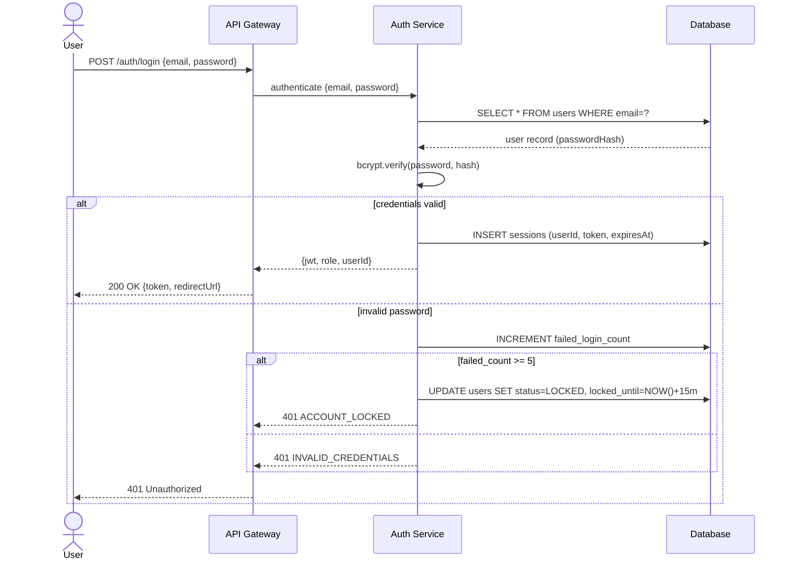
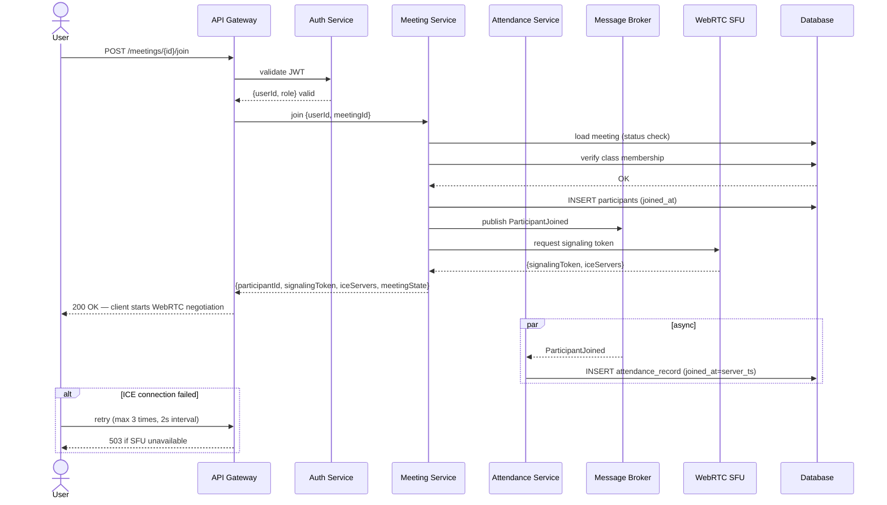
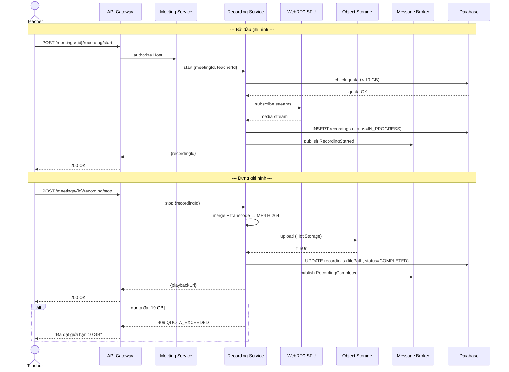
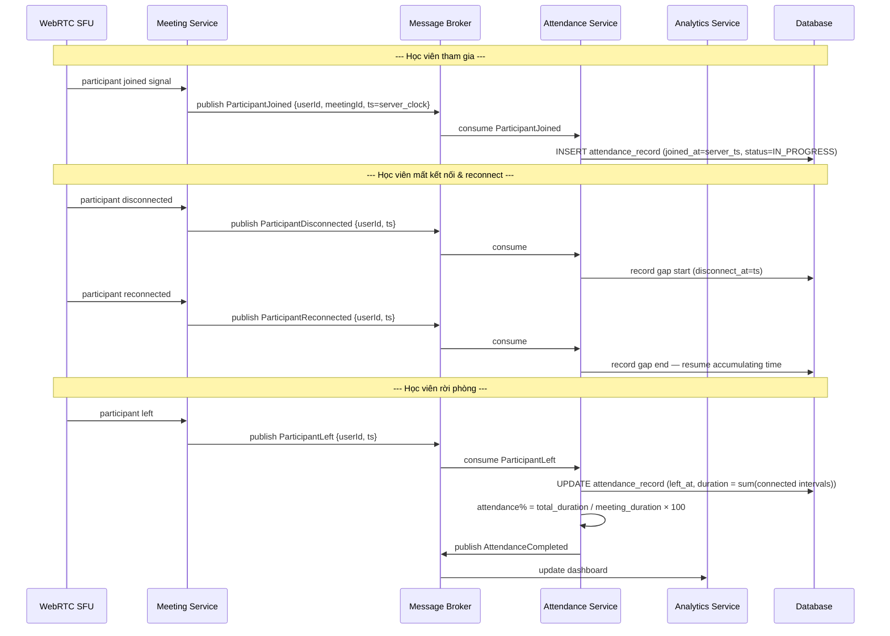
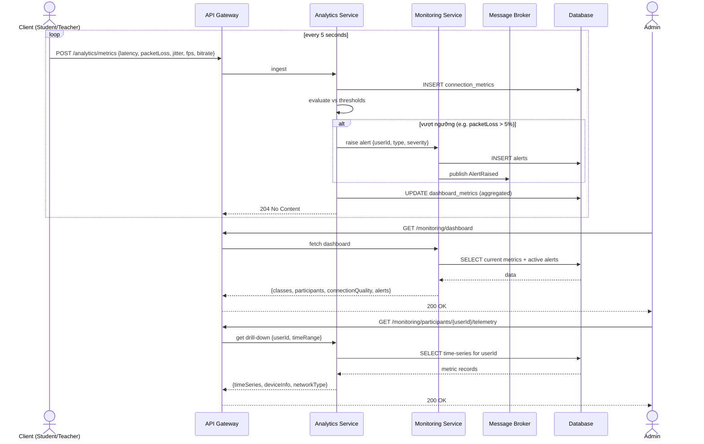
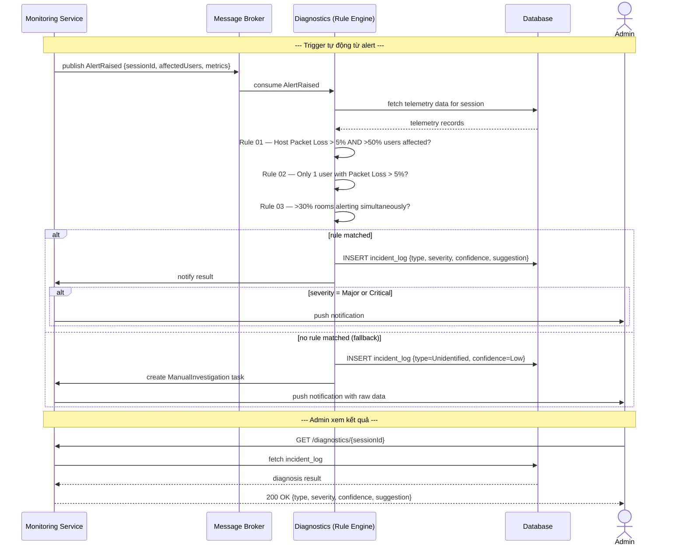

# 02. Use Case Specifications (Đặc tả chi tiết ca sử dụng)

> **Mục đích:** Đặc tả chi tiết từng UC — đủ để DEV và QA hiểu và implement mà không cần hỏi thêm BA.
> **Tham chiếu:** BRD · SRS · 01_Use_Case_Diagrams.md · 04_Acceptance_Criteria_Format_Standard.md

---

## Danh sách Use Cases trong tài liệu này

| UC-ID | Tên | Actor chính | Section |
|:--|:--|:--|:--|
| UC-AUTH-001 | Đăng nhập & Giám sát phiên làm việc | Student, Teacher, Admin | §1 |
| UC-MTG-001 | Tham gia phòng học WebRTC | Student, Teacher | §2 |
| UC-MTG-002 | Ghi hình buổi học | Teacher | §3 |
| UC-ATT-001 | Điểm danh tự động | System, Student | §4 |
| UC-MON-001 | Giám sát Telemetry & Cảnh báo | Admin, System | §5 |
| UC-NDX-001 | Chẩn đoán sự cố tự động | System, Admin | §6 |
| UC-DOC-001 | Upload & Quản lý tài liệu | Teacher | §7 |
| UC-RPT-001 | Báo cáo & Xuất dữ liệu điểm danh | Teacher, Admin | §8 |

---

## 1. UC-AUTH-001: Đăng nhập & Giám sát phiên làm việc

| Trường | Nội dung |
|:--|:--|
| **UC-ID** | UC-AUTH-001 |
| **Tên** | Đăng nhập & Giám sát phiên làm việc |
| **Actors** | Student, Teacher, Admin (Primary) |
| **Trigger** | Người dùng truy cập hệ thống và nhập thông tin đăng nhập |
| **Tham chiếu BRD** | 02_Phan_Loai_Nguoi_Dung.md |
| **FR liên quan** | FR-AUTH-001 → FR-AUTH-005 |

**Mô tả ngắn:**
Cho phép người dùng xác thực danh tính để truy cập hệ thống. Sau khi đăng nhập, hệ thống duy trì phiên làm việc và phát hiện đăng nhập đồng thời trên nhiều thiết bị.

**Tiền điều kiện:**
- Tài khoản người dùng đã được tạo và kích hoạt trong hệ thống.
- Người dùng đang ở trang đăng nhập.

**Hậu điều kiện — Thành công:**
- JWT token hợp lệ được tạo và gắn với phiên làm việc.
- Người dùng được chuyển hướng đến Dashboard tương ứng với vai trò.
- Thời điểm đăng nhập được ghi vào audit log.

**Hậu điều kiện — Thất bại:**
- Không có token nào được tạo.
- Số lần đăng nhập sai tăng thêm 1.
- Nếu đạt ngưỡng 5 lần sai: tài khoản bị khóa tạm thời 15 phút.

**Luồng chính:**
1. Người dùng nhập email và mật khẩu, nhấn "Đăng nhập".
2. Hệ thống validate định dạng đầu vào (không rỗng, email hợp lệ).
3. Hệ thống xác thực thông tin đăng nhập với database.
4. Hệ thống tạo JWT token và lưu session.
5. Hệ thống ghi audit log với timestamp và IP.
6. Hệ thống chuyển hướng người dùng về Dashboard theo vai trò.

**Luồng thay thế:**

*AF-1: Phát hiện đăng nhập đồng thời trên nhiều thiết bị*
- Bắt đầu sau bước 4.
- Hệ thống phát hiện đã có session active trên thiết bị khác.
- Hệ thống hiển thị cảnh báo: "Tài khoản đang đăng nhập trên thiết bị khác. Tiếp tục sẽ đăng xuất thiết bị kia."
- Người dùng xác nhận → session trên thiết bị cũ bị thu hồi, đăng nhập thiết bị mới thành công.

*AF-2: Session hết hạn (session expired)*
- Xảy ra khi người dùng không hoạt động quá thời gian timeout.
- Hệ thống vô hiệu hóa token.
- Hệ thống chuyển người dùng về trang đăng nhập với thông báo "Phiên làm việc đã hết hạn."

**Luồng ngoại lệ:**

*EF-1: Sai mật khẩu*
- Hệ thống hiển thị: "Email hoặc mật khẩu không đúng." (không tiết lộ trường nào sai).
- Số lần sai tăng thêm 1.

*EF-2: Tài khoản bị khóa (locked)*
- Điều kiện: đã sai mật khẩu ≥ 5 lần liên tiếp.
- Hệ thống hiển thị: "Tài khoản tạm khóa. Thử lại sau 15 phút."
- Gửi email cảnh báo đến địa chỉ đã đăng ký.

*EF-3: Tài khoản chưa được kích hoạt*
- Hệ thống hiển thị: "Tài khoản chưa được kích hoạt. Vui lòng kiểm tra email."

**Sequence Diagram:**

**Yêu cầu đặc biệt:**
- Mật khẩu phải được hash (bcrypt, cost factor ≥ 12) — không lưu plaintext.
- Phản hồi đăng nhập < 500ms (p95).
- Tham chiếu: NFR-SEC-001, NFR-PERF-001.

---

## 2. UC-MTG-001: Tham gia phòng học WebRTC

| Trường | Nội dung |
|:--|:--|
| **UC-ID** | UC-MTG-001 |
| **Tên** | Tham gia phòng học trực tuyến WebRTC |
| **Actors** | Student (Primary), Teacher (Primary — với role Host) |
| **Trigger** | Người dùng nhấn nút "Tham gia lớp học" từ trang lịch học |
| **Tham chiếu BRD** | 04_Hoc_Truc_Tuyen.md §4.2 |
| **FR liên quan** | FR-MTG-001 → FR-MTG-006 |

**Mô tả ngắn:**
Cho phép giáo viên và học viên tham gia phòng học WebRTC. Trước khi vào phòng, hệ thống hiển thị Consent Prompt về việc ghi hình. Sau khi vào, điểm danh tự động được kích hoạt.

**Tiền điều kiện:**
- Người dùng đã đăng nhập (UC-AUTH-001 hoàn thành).
- Phòng học đang ở trạng thái "In Progress" (Teacher đã mở phòng).
- Người dùng có trong danh sách lớp học.
- Thiết bị đã cấp quyền camera/microphone.

**Hậu điều kiện — Thành công:**
- Người dùng kết nối WebRTC thành công qua SFU.
- Sự kiện JOIN được ghi vào attendance log với server-side timestamp.
- Danh sách người tham gia trên Dashboard cập nhật real-time.

**Hậu điều kiện — Thất bại:**
- Không có kết nối WebRTC nào được thiết lập.
- Không có sự kiện JOIN nào được ghi.
- Hệ thống hiển thị thông báo lỗi rõ ràng.

**Luồng chính:**
1. Người dùng nhấn "Tham gia lớp học".
2. Hệ thống kiểm tra điều kiện: phòng đang hoạt động, người dùng có trong danh sách.
3. Hệ thống hiển thị **Consent Prompt**: "Buổi học này có thể được ghi hình. Bạn có đồng ý tham gia không?"
4. Người dùng chọn "Đồng ý".
5. Hệ thống thực hiện WebRTC negotiation (SDP offer/answer + ICE candidates) với SFU.
6. Kết nối WebRTC được thiết lập thành công.
7. Hệ thống ghi sự kiện JOIN vào attendance log (server-side timestamp).
8. Hệ thống cập nhật danh sách người tham gia real-time.

**Luồng thay thế:**

*AF-1: Người dùng từ chối Consent Prompt*
- Bắt đầu từ bước 4.
- Người dùng chọn "Không đồng ý".
- Hệ thống không cho phép vào phòng.
- Hiển thị thông báo: "Bạn cần đồng ý với điều khoản để tham gia lớp học."

*AF-2: Teacher tham gia với role Host*
- Bắt đầu từ bước 5.
- Ngoài kết nối WebRTC thông thường, Teacher được cấp quyền Host: mute học viên, lock phòng, bắt đầu recording.

*AF-3: Học viên tham gia khi phòng đang được lock*
- Bắt đầu từ bước 2.
- Phòng đang ở trạng thái "Locked" bởi Teacher.
- Hệ thống hiển thị: "Phòng học đang bị khóa. Vui lòng chờ giáo viên mở phòng."

**Luồng ngoại lệ:**

*EF-1: WebRTC ICE connection failed*
- Hệ thống tự động retry tối đa 3 lần (mỗi lần cách nhau 2 giây).
- Nếu vẫn thất bại: hiển thị "Không thể kết nối. Vui lòng kiểm tra mạng và thử lại."
- Gợi ý: kiểm tra tường lửa, thử mạng khác.

*EF-2: Phòng học không tồn tại hoặc đã kết thúc*
- Hệ thống hiển thị: "Phòng học không còn hoạt động."
- Chuyển hướng về trang lịch học.

**Sequence Diagram:**

**Yêu cầu đặc biệt:**
- WebRTC kết nối thành công trong vòng 5 giây (p95).
- SFU routing: ưu tiên server gần nhất theo địa lý.
- Tham chiếu: NFR-PERF-002, NFR-REL-001.

---

## 3. UC-MTG-002: Ghi hình buổi học

| Trường | Nội dung |
|:--|:--|
| **UC-ID** | UC-MTG-002 |
| **Tên** | Ghi hình buổi học (Meeting Recording) |
| **Actors** | Teacher (Primary — Host) |
| **Trigger** | Teacher nhấn nút "Bắt đầu ghi hình" trong phòng học |
| **Tham chiếu BRD** | 04_Hoc_Truc_Tuyen.md §4.8 |
| **FR liên quan** | FR-MTG-007 → FR-MTG-012 |

**Mô tả ngắn:**
Cho phép Teacher ghi lại toàn bộ nội dung buổi học. Bản ghi được transcode sang MP4 H.264 và lưu trữ với vòng đời Hot (0–30 ngày) → Cold (31–180 ngày). Quota 10 GB per teacher/room.

**Tiền điều kiện:**
- Teacher đã tham gia phòng học với role Host (UC-MTG-001 hoàn thành).
- Phòng học đang ở trạng thái "In Progress".
- Dung lượng recording của Teacher chưa đạt quota 10 GB.

**Hậu điều kiện — Thành công:**
- Recording được lưu, transcode sang MP4 H.264.
- File recording available để xem lại trong vòng 24 giờ sau khi kết thúc.
- Metadata (tên lớp, thời gian, người ghi) được lưu kèm.

**Hậu điều kiện — Thất bại:**
- Không có file recording nào được lưu.
- Hệ thống ghi log lỗi để Admin xử lý.

**Luồng chính:**
1. Teacher nhấn "Bắt đầu ghi hình" trong phòng học.
2. Hệ thống kiểm tra quota storage của Teacher.
3. Hệ thống hiển thị thông báo cho toàn bộ người tham gia: "Buổi học đang được ghi hình."
4. Hệ thống bắt đầu capture luồng audio/video từ SFU.
5. Teacher nhấn "Dừng ghi hình" (hoặc phòng kết thúc).
6. Hệ thống kết thúc capture và đưa file vào transcode pipeline.
7. File được transcode sang MP4 H.264, lưu vào Hot Storage.
8. Recording available để xem lại trong vòng 24 giờ.

**Luồng thay thế:**

*AF-1: Quota sắp đạt ngưỡng (>80%)*
- Bắt đầu sau bước 2.
- Hệ thống hiển thị cảnh báo: "Bạn đã sử dụng X GB / 10 GB. Cân nhắc xóa recording cũ."
- Teacher có thể tiếp tục ghi hình.

*AF-2: Phòng kết thúc trong khi đang ghi hình*
- Hệ thống tự động dừng recording.
- Tiếp tục từ bước 6 của luồng chính.

**Luồng ngoại lệ:**

*EF-1: Đạt quota 10 GB*
- Hệ thống không cho phép bắt đầu ghi hình.
- Hiển thị: "Đã đạt giới hạn lưu trữ 10 GB. Vui lòng xóa recording cũ trước khi ghi hình mới."

*EF-2: Storage service không khả dụng*
- Hệ thống thử lại 3 lần.
- Nếu vẫn thất bại: ghi log lỗi, thông báo Admin, hiển thị cho Teacher: "Không thể lưu recording. Vui lòng liên hệ hỗ trợ."

**Sequence Diagram:**

**Yêu cầu đặc biệt:**
- Transcode pipeline: hoàn thành trong vòng 2× thời lượng recording.
- Vòng đời lưu trữ: Hot Storage (0–30 ngày) → tự động chuyển Cold Storage (31–180 ngày) → tự động xóa sau 180 ngày.
- Tham chiếu: NFR-STOR-001, NFR-STOR-002.

---

## 4. UC-ATT-001: Điểm danh tự động

| Trường | Nội dung |
|:--|:--|
| **UC-ID** | UC-ATT-001 |
| **Tên** | Điểm danh tự động (Auto Attendance) |
| **Actors** | System (Primary — automated), Student (Secondary) |
| **Trigger** | Sự kiện JOIN hoặc LEAVE/DISCONNECT nhận được từ WebRTC session |
| **Tham chiếu BRD** | 06_Diem_Danh.md §6.2–6.7 |
| **FR liên quan** | FR-ATT-001 → FR-ATT-005 |

**Mô tả ngắn:**
Hệ thống tự động ghi nhận toàn bộ sự kiện kết nối (JOIN, LEAVE, DISCONNECT, RECONNECT) của học viên trong session, tính tổng thời gian tham gia thực tế và tỷ lệ điểm danh. Không yêu cầu giáo viên điểm danh thủ công.

**Tiền điều kiện:**
- Học viên đã đăng nhập (UC-AUTH-001 hoàn thành).
- Session đang diễn ra (Teacher đã mở phòng).
- Học viên có trong danh sách lớp học.

**Hậu điều kiện — Thành công:**
- Sự kiện được ghi vào attendance log với server-side timestamp.
- Tỷ lệ tham dự = (Tổng thời gian kết nối hợp lệ / Tổng thời lượng buổi học) × 100%.
- Dashboard giáo viên cập nhật real-time.

**Hậu điều kiện — Thất bại:**
- Nếu không ghi được: hệ thống retry tối đa 3 lần, sau đó ghi vào error log để Admin xử lý thủ công.

**Luồng chính:**
1. Học viên kết nối WebRTC thành công (UC-MTG-001).
2. Hệ thống nhận sự kiện JOIN từ WebRTC layer.
3. Hệ thống ghi sự kiện JOIN với timestamp **server-side** vào attendance log trong vòng 100ms.
4. Khi học viên rời phòng (LEAVE), hệ thống ghi sự kiện LEAVE.
5. Hệ thống tính tổng thời gian = tổng các khoảng [JOIN₁–LEAVE₁] + [JOIN₂–LEAVE₂] + ...
6. Hệ thống tính tỷ lệ tham dự và cập nhật dashboard giáo viên.

**Luồng thay thế:**

*AF-1: Học viên mất kết nối và reconnect*
- Bắt đầu từ bước 4.
- Hệ thống nhận sự kiện DISCONNECT (thay vì LEAVE).
- Ghi DISCONNECT với timestamp.
- Khi học viên kết nối lại: nhận sự kiện RECONNECT, ghi timestamp.
- Tính toán: khoảng thời gian DISCONNECT–RECONNECT **không** được tính vào thời gian tham dự.
- Tiếp tục tích lũy thời gian kể từ RECONNECT.

*AF-2: Buổi học kết thúc trong khi học viên đang kết nối*
- Bắt đầu tại thời điểm buổi học kết thúc.
- Hệ thống tự động ghi LEAVE với timestamp kết thúc buổi học cho tất cả học viên còn kết nối.

**Luồng ngoại lệ:**

*EF-1: Server-side event ordering bị đảo*
- Điều kiện: sự kiện RECONNECT nhận trước DISCONNECT do latency mạng.
- Hệ thống áp dụng server-side ordering dựa trên sequence number, không phải client timestamp.
- Sau khi sắp xếp lại, xử lý bình thường.

*EF-2: Không ghi được attendance log sau 3 lần retry*
- Ghi vào error log với thông tin: học viên, session, thời điểm sự kiện.
- Tự động tạo task cho Admin xử lý thủ công.
- Không làm gián đoạn session đang diễn ra.

**Sequence Diagram:**

**Yêu cầu đặc biệt:**
- Ghi attendance log < 100ms sau khi nhận sự kiện.
- Sử dụng server clock, không dùng client clock (tránh clock skew).
- Tham chiếu: NFR-PERF-003, NFR-REL-002.

---

## 5. UC-MON-001: Giám sát Telemetry & Cảnh báo

| Trường | Nội dung |
|:--|:--|
| **UC-ID** | UC-MON-001 |
| **Tên** | Giám sát Telemetry & Cảnh báo chất lượng kết nối |
| **Actors** | System (Primary — thu thập tự động), Admin (Secondary — xem dashboard) |
| **Trigger** | Tự động: client gửi telemetry metrics định kỳ. Manual: Admin mở Monitoring Dashboard |
| **Tham chiếu BRD** | 07_Giam_Sat_Thoi_Gian_Thuc.md §7.2–7.7 |
| **FR liên quan** | FR-MON-001 → FR-MON-008 |

**Mô tả ngắn:**
Hệ thống thu thập metric WebRTC (Latency, Packet Loss, Jitter, Bitrate, FPS) từ tất cả client trong session, hiển thị real-time trên Admin Dashboard, và tự động phát cảnh báo khi metric vượt ngưỡng cấu hình.

**Tiền điều kiện:**
- Session WebRTC đang diễn ra.
- Client đã khởi tạo telemetry collector.
- Admin đã đăng nhập (cho luồng xem dashboard).

**Hậu điều kiện — Thành công:**
- Metric được lưu vào time-series store.
- Dashboard cập nhật real-time mỗi 5 giây.
- Alert được gửi đến Admin khi vượt ngưỡng.

**Hậu điều kiện — Thất bại:**
- Nếu mất kết nối telemetry: ghi alert "Telemetry Lost" vào log.
- Dữ liệu bị mất trong khoảng thời gian mất kết nối được đánh dấu là gap.

**Luồng chính — Thu thập Telemetry (System automated):**
1. Client (Student/Teacher) gửi telemetry metrics mỗi **5 giây** qua REST API.
2. Hệ thống nhận metrics: Latency (ms), Packet Loss (%), Jitter (ms), Bitrate (Kbps), FPS.
3. Hệ thống lưu vào time-series store với session ID và user ID.
4. Hệ thống đánh giá metric so với ngưỡng cấu hình.
5. Nếu vượt ngưỡng: tạo alert và cập nhật trạng thái kết nối của user.
6. Hệ thống cập nhật Admin Dashboard real-time.

**Luồng chính — Xem Dashboard (Admin):**
1. Admin đăng nhập và mở Monitoring Dashboard.
2. Hệ thống hiển thị tổng quan: số lớp đang diễn ra, số user online, số cảnh báo đang active.
3. Admin chọn một lớp học để xem chi tiết.
4. Hệ thống hiển thị danh sách người tham gia với trạng thái kết nối và metric real-time.
5. Admin chọn một user để xem telemetry chi tiết (drill-down).

**Luồng thay thế:**

*AF-1: Drill-down xem telemetry của 1 user cụ thể*
- Bắt đầu từ bước 5 (luồng xem dashboard).
- Hệ thống hiển thị time-series chart: Latency, Packet Loss, Jitter theo thời gian.
- Hiển thị thông tin thiết bị: loại thiết bị, OS, trình duyệt, loại kết nối mạng.

**Luồng ngoại lệ:**

*EF-1: Metric vượt ngưỡng Packet Loss > 5%*
- Hệ thống chuyển trạng thái kết nối user sang "Poor".
- Hiển thị icon cảnh báo màu cam trên dashboard.
- Trigger UC-NDX-001 nếu số lượng user Poor vượt ngưỡng.

*EF-2: Client không gửi telemetry trong > 15 giây*
- Hệ thống tạo alert "Telemetry Lost" cho user đó.
- Không xóa user khỏi danh sách cho đến khi nhận sự kiện DISCONNECT chính thức.

**Ngưỡng cảnh báo (cấu hình mặc định):**

| Metric | Ngưỡng Warning | Ngưỡng Critical |
|:--|:--|:--|
| Latency | > 200ms | > 300ms |
| Packet Loss | > 3% | > 5% |
| Jitter | > 20ms | > 30ms |
| Bitrate (video) | < 300 Kbps | < 150 Kbps |

**Mức chất lượng kết nối:**

| Mức | Màu | Điều kiện |
|:--|:--|:--|
| Excellent | Xanh lá | Tất cả metric dưới ngưỡng Warning |
| Good | Xanh dương | Tối đa 1 metric vượt ngưỡng Warning |
| Poor | Cam | ≥ 2 metric vượt ngưỡng Warning, hoặc 1 vượt ngưỡng Critical |
| Critical | Đỏ | Packet Loss > 10% hoặc Latency > 500ms |

**Sequence Diagram:**

**Yêu cầu đặc biệt:**
- Transport telemetry: REST API (không dùng SignalR cho telemetry — tránh overhead).
- Dashboard cập nhật < 5 giây sau khi nhận metric mới.
- Tham chiếu: NFR-PERF-004, NFR-MON-001.

---

## 6. UC-NDX-001: Chẩn đoán sự cố tự động

| Trường | Nội dung |
|:--|:--|
| **UC-ID** | UC-NDX-001 |
| **Tên** | Chẩn đoán sự cố tự động (Network Diagnostics) |
| **Actors** | System (Primary — automated), Admin (Secondary — xem kết quả) |
| **Trigger** | Alert từ UC-MON-001 vượt ngưỡng cấu hình, hoặc Admin chủ động trigger |
| **Tham chiếu BRD** | 10_Chan_Doan_Su_Co.md §10.3–10.5 |
| **FR liên quan** | FR-NDX-001 → FR-NDX-005 |

**Mô tả ngắn:**
Khi phát hiện sự cố kết nối, hệ thống tự động chạy Rule Engine với 3 quy tắc chẩn đoán để xác định nguồn gốc sự cố: phía Host, phía Participant, hoặc hạ tầng hệ thống. Kết quả bao gồm loại sự cố, mức độ ảnh hưởng, và gợi ý xử lý.

**Tiền điều kiện:**
- Session đang diễn ra hoặc vừa kết thúc.
- Dữ liệu telemetry từ UC-MON-001 đã có trong store.
- Alert đã được tạo (từ UC-MON-001) hoặc Admin chủ động trigger.

**Hậu điều kiện — Thành công:**
- Kết quả chẩn đoán gồm: loại sự cố, phạm vi ảnh hưởng, mức độ tin cậy, gợi ý xử lý.
- Kết quả được lưu vào incident log.
- Admin nhận thông báo nếu mức độ là Major hoặc Critical.

**Hậu điều kiện — Không rule nào match (fallback):**
- Hệ thống trả kết quả: "Không xác định được nguyên nhân. Cần điều tra thêm."
- Tạo manual investigation task cho Admin.

**Luồng chính:**
1. Alert từ UC-MON-001 trigger chẩn đoán (hoặc Admin nhấn "Chẩn đoán").
2. Hệ thống thu thập dữ liệu telemetry của session trong khoảng thời gian xảy ra sự cố.
3. Hệ thống chạy tuần tự 3 Rule:
   - **Rule 01:** Host Connection Issue
   - **Rule 02:** Participant Connection Issue
   - **Rule 03:** Infrastructure Issue
4. Rule đầu tiên match → hệ thống kết luận nguyên nhân.
5. Hệ thống tính mức độ ảnh hưởng: Minor / Moderate / Major / Critical.
6. Hệ thống tạo gợi ý xử lý tương ứng.
7. Lưu kết quả vào incident log và hiển thị cho Admin.

**Rule Engine chi tiết:**

| Rule | Điều kiện | Kết luận | Mức tin cậy |
|:--|:--|:--|:--|
| Rule 01 | Host Packet Loss > 5% VÀ > 50% học viên bị ảnh hưởng | Host Connection Issue | Cao |
| Rule 02 | Chỉ 1 người (hoặc < 10% tham gia) có Packet Loss > 5%, các thành viên còn lại bình thường | Participant Connection Issue | Cao |
| Rule 03 | > 30% lớp học đang hoạt động gặp cảnh báo trong cùng thời điểm | Infrastructure Issue | Cao |

**Luồng thay thế:**

*AF-1: Admin xem kết quả chẩn đoán sau buổi học*
- Admin chọn session đã kết thúc và nhấn "Xem phân tích sự cố".
- Hệ thống chạy chẩn đoán dựa trên dữ liệu telemetry đã lưu.
- Trả kết quả tương tự luồng chính.

*AF-2: Admin override kết quả chẩn đoán*
- Admin không đồng ý với kết quả tự động.
- Admin chọn "Ghi đè kết quả" và nhập nguyên nhân thực.
- Hệ thống lưu cả kết quả tự động và kết quả override, ghi audit log.

**Luồng ngoại lệ:**

*EF-1: Không rule nào match (fallback)*
- Hệ thống trả kết quả: Type = "Unidentified", Confidence = "Low".
- Tạo manual investigation task cho Admin với đầy đủ raw data.
- Admin nhận notification.

*EF-2: Thiếu dữ liệu telemetry (gap trong time-series)*
- Hệ thống ghi chú: "Phân tích không đầy đủ do thiếu dữ liệu trong khoảng X–Y."
- Chạy chẩn đoán với dữ liệu có sẵn và ghi nhận độ tin cậy thấp hơn.

**Gợi ý xử lý theo loại sự cố:**

| Loại sự cố | Gợi ý cho | Hành động gợi ý |
|:--|:--|:--|
| Host Connection Issue | Teacher | Kiểm tra đường truyền Internet, giảm chất lượng video, dùng mạng dây |
| Participant Connection Issue | Student | Kiểm tra mạng, tắt ứng dụng chiếm băng thông, đổi sang mạng khác |
| Infrastructure Issue | Admin | Kiểm tra Media Server, hạ tầng mạng, tài nguyên hệ thống |

**Sequence Diagram:**

**Yêu cầu đặc biệt:**
- Kết quả chẩn đoán phải trả về trong vòng 10 giây.
- Tham chiếu: NFR-PERF-005, NFR-REL-003.

---

## 7. UC-DOC-001: Upload & Quản lý tài liệu

| Trường | Nội dung |
|:--|:--|
| **UC-ID** | UC-DOC-001 |
| **Tên** | Upload & Quản lý tài liệu giảng dạy |
| **Actors** | Teacher (Primary) |
| **Trigger** | Teacher nhấn "Upload tài liệu" trong trang quản lý lớp học |
| **Tham chiếu BRD** | 05_Tai_Lieu.md |
| **FR liên quan** | FR-DOC-001 → FR-DOC-004 |

**Mô tả ngắn:**
Cho phép Teacher upload tài liệu giảng dạy gắn với lớp học. Học viên truy cập tài liệu qua Presigned URL giới hạn thời gian (≤ 15 phút) để đảm bảo bảo mật.

**Tiền điều kiện:**
- Teacher đã đăng nhập và có quyền quản lý lớp học.
- File cần upload trong danh sách định dạng được phép.

**Luồng chính:**
1. Teacher chọn file và nhấn "Upload".
2. Hệ thống validate: định dạng file (PDF, DOCX, PPTX, MP4, ≤ 500 MB).
3. Hệ thống upload file lên Storage Service.
4. Hệ thống lưu metadata: tên file, kích thước, ngày upload, lớp học liên kết.
5. File xuất hiện trong danh sách tài liệu của lớp học.

**Luồng ngoại lệ:**

*EF-1: Định dạng file không được phép*
- Hệ thống hiển thị: "Định dạng file không được hỗ trợ. Chỉ chấp nhận: PDF, DOCX, PPTX, MP4."

*EF-2: File vượt giới hạn kích thước*
- Hệ thống hiển thị: "File vượt giới hạn 500 MB."

**Yêu cầu đặc biệt:**
- Học viên tải tài liệu qua Presigned URL giới hạn 15 phút — không truy cập trực tiếp path lưu trữ.
- URL hết hạn sau 15 phút: học viên phải request URL mới.

---

## 8. UC-RPT-001: Báo cáo & Xuất dữ liệu điểm danh

| Trường | Nội dung |
|:--|:--|
| **UC-ID** | UC-RPT-001 |
| **Tên** | Báo cáo & Xuất dữ liệu điểm danh |
| **Actors** | Teacher (Primary — xem lớp mình), Admin (Primary — xem toàn hệ thống) |
| **Trigger** | Người dùng vào trang Báo cáo và chọn bộ lọc |
| **Tham chiếu BRD** | 11_Bao_Cao_Xuat_Du_Lieu.md |
| **FR liên quan** | FR-RPT-001 → FR-RPT-005 |

**Mô tả ngắn:**
Cho phép Teacher/Admin xem và xuất báo cáo điểm danh theo buổi học, lớp học, hoặc học viên cụ thể. Định dạng xuất: Excel, CSV, PDF.

**Tiền điều kiện:**
- Người dùng đã đăng nhập với vai trò Teacher hoặc Admin.
- Đã có dữ liệu điểm danh từ UC-ATT-001.

**Luồng chính:**
1. Người dùng chọn bộ lọc: lớp học, khoảng thời gian, học viên (tùy chọn).
2. Hệ thống truy vấn dữ liệu và hiển thị bảng báo cáo.
3. Người dùng nhấn "Xuất" và chọn định dạng (Excel / CSV / PDF).
4. Hệ thống tạo file và trả về download link.

**Luồng ngoại lệ:**

*EF-1: Không có dữ liệu trong khoảng thời gian chọn*
- Hệ thống hiển thị: "Không có dữ liệu điểm danh trong khoảng thời gian này."
- Không hiển thị bảng trống hoặc export file rỗng.

**Yêu cầu đặc biệt:**
- Teacher chỉ xem được dữ liệu của các lớp do mình phụ trách.
- Admin xem được toàn bộ hệ thống.
- Tham chiếu: NFR-SEC-002 (phân quyền dữ liệu).
