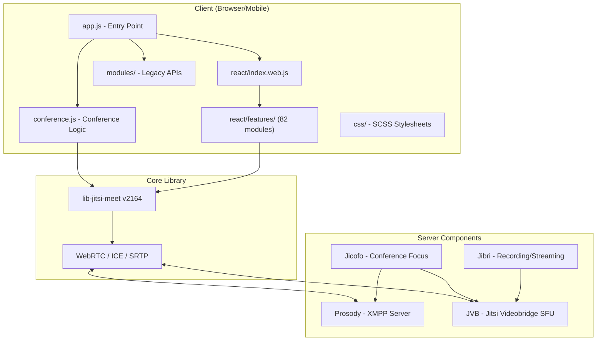
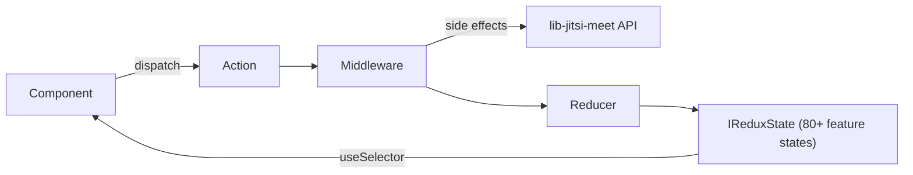

# Phân tích Hệ thống Jitsi Meet — Tổng quan Kiến trúc

## 1. Tổng quan quy mô

| Chỉ số | Giá trị |
|:--|:--|
| **Feature modules** | 82 thư mục trong `react/features/` |
| **Source files** | ~1,867 files (.ts/.tsx/.js/.jsx) |
| **Base modules** | 41 core modules trong `react/features/base/` |
| **SCSS files** | ~46 files trong `css/` |
| **Legacy modules** | 7 thư mục trong `modules/` |
| **Webpack bundles** | 8 bundles (app, external_api, alwaysontop, workers...) |
| **Platforms** | Web + React Native (iOS + Android) |
| **Dependencies** | ~115 runtime + ~60 dev |
| **React version** | 19.2.3 |
| **TypeScript** | 5.7.2 (strict mode, ES2024 target) |

---

## 2. Kiến trúc Hệ thống Tổng thể



---

## 3. Luồng Khởi động Ứng dụng

```
1. app.js (Web Entry Point)
   ├── Import jQuery, Olm (E2EE)
   ├── Import conference.js → window.APP.conference
   ├── Import modules/API → window.APP.API
   ├── Import modules/UI → window.APP.UI
   └── Import react/index.web.js
       ├── Import App.web component
       ├── Setup global error handlers
       ├── Register entry points: APP, PREJOIN, DIALIN, WHITEBOARD
       └── globalNS.renderEntryPoint() → React 18 createRoot()

2. Khi user vào phòng:
   conference.init({ roomName })
   ├── _initDeviceList()
   ├── createInitialLocalTracks() → JitsiMeetJS.createLocalTracks()
   ├── dispatch(connect()) → JitsiConnection
   ├── startConference(tracks)
   │   ├── _createRoom() → connection.initJitsiConference()
   │   ├── room.join()
   │   └── ConferenceConnector handles CONFERENCE_JOINED/FAILED
   └── Event listeners: TRACK_ADDED, USER_JOINED, USER_LEFT...
```

---

## 4. Kiến trúc Feature Modules (`react/features/`)

### 4.1 Chuẩn cấu trúc mỗi feature:
```
react/features/[feature-name]/
├── actionTypes.ts        # Redux action type constants
├── actions.ts            # Action creators (.any.ts, .web.ts, .native.ts)
├── reducer.ts            # Redux reducer
├── middleware.ts          # Redux middleware (side effects)
├── functions.ts           # Utility functions & selectors
├── constants.ts           # Feature constants
├── types.ts               # TypeScript interfaces
├── logger.ts              # Feature-specific logger
└── components/            # React components
    ├── web/               # Web-specific components
    ├── native/            # React Native components
    └── AbstractXxx.tsx    # Abstract cross-platform base
```

### 4.2 Phân nhóm 82 Feature Modules:

#### 🏗️ Base Infrastructure (41 modules trong `base/`)
| Module | Vai trò |
|:--|:--|
| `base/app` | Application lifecycle management |
| `base/conference` | Core conference logic |
| `base/connection` | XMPP connection management |
| `base/tracks` | Media track management (audio/video) |
| `base/participants` | Participant state management |
| `base/media` | Media settings (mute, audio/video type) |
| `base/config` | Configuration management |
| `base/redux` | Redux infrastructure (ReducerRegistry, MiddlewareRegistry) |
| `base/lib-jitsi-meet` | Wrapper cho lib-jitsi-meet |
| `base/devices` | Device enumeration & selection |
| `base/jwt` | JWT authentication |
| `base/i18n` | Internationalization |
| `base/icons` | SVG icon system |
| `base/ui` | UI design system (theme, colors) |
| `base/dialog` | Modal dialog system |
| `base/sounds` | Audio notification system |
| `base/settings` | User settings persistence |
| `base/avatar` | Avatar rendering |
| ... | + 23 modules khác |

#### 📹 Video & Media (11 modules)
| Module | Vai trò |
|:--|:--|
| `conference` | Conference page UI |
| `filmstrip` | Participant video thumbnails strip |
| `large-video` | Main/pinned video display |
| `video-layout` | Video grid layout engine |
| `video-quality` | Video quality settings |
| `video-menu` | Participant video context menu |
| `screen-share` | Screen sharing |
| `virtual-background` | Virtual background effects |
| `stream-effects` | Audio/video stream effects (blur, noise suppression) |
| `noise-suppression` | AI noise suppression (RNNoise) |
| `face-landmarks` | Face detection & landmarks |

#### 💬 Communication (6 modules)
| Module | Vai trò |
|:--|:--|
| `chat` | In-meeting text chat |
| `polls` | Live polls |
| `polls-history` | Poll history |
| `reactions` | Emoji reactions |
| `subtitles` | Live subtitles/captions |
| `transcribing` | Transcription service |

#### 🔒 Security & Auth (5 modules)
| Module | Vai trò |
|:--|:--|
| `authentication` | User authentication flows |
| `e2ee` | End-to-end encryption |
| `lobby` | Lobby/waiting room |
| `room-lock` | Room password protection |
| `security` | Security settings panel |

#### 🎛️ Controls & UI (12 modules)
| Module | Vai trò |
|:--|:--|
| `toolbox` | Main toolbar (bottom controls) |
| `prejoin` | Pre-join screen (preview before entering) |
| `welcome` | Welcome/landing page |
| `settings` | Settings dialog |
| `keyboard-shortcuts` | Keyboard shortcut handler |
| `notifications` | Toast notification system |
| `display-name` | Display name editing |
| `feedback` | Post-meeting feedback dialog |
| `invite` | Invite participants |
| `participants-pane` | Participants list panel |
| `speaker-stats` | Speaker statistics |
| `connection-indicator` | Connection quality indicator |

#### 🔧 Integration & Platform (11 modules)
| Module | Vai trò |
|:--|:--|
| `external-api` | External/iFrame API |
| `analytics` | Analytics events (Amplitude) |
| `calendar-sync` | Calendar integration (Google, MS) |
| `google-api` | Google API integration |
| `dropbox` | Dropbox cloud storage |
| `recording` | Meeting recording (Jibri) |
| `rtcstats` | WebRTC statistics reporting |
| `shared-video` | Share YouTube/video |
| `etherpad` | Collaborative document editing |
| `whiteboard` | Excalidraw whiteboard |
| `deep-linking` | Mobile app deep linking |

#### 📱 Mobile-specific (1 module)
| Module | Vai trò |
|:--|:--|
| `mobile/` | React Native specific features |

---

## 5. Redux Architecture



### Registry Pattern (Decoupled):
- **ReducerRegistry** — Features tự đăng ký reducer, không cần import tập trung
- **MiddlewareRegistry** — Features tự đăng ký middleware
- **IReduxState** — Global state strongly typed với 80+ feature states

### State structure:
```typescript
interface IReduxState {
    'features/base/conference': IConferenceState;
    'features/base/connection': IConnectionState;
    'features/base/tracks': ITrack[];
    'features/base/participants': IParticipantsState;
    'features/base/media': IMediaState;
    'features/base/config': IConfig;
    'features/base/settings': ISettingsState;
    'features/chat': IChatState;
    'features/filmstrip': IFilmstripState;
    'features/toolbox': IToolboxState;
    // ... 70+ more feature states
}
```

---

## 6. Multi-Platform Strategy

```
File Naming Convention:
├── Component.tsx          # Shared (nếu không có platform variant)
├── Component.web.tsx      # Web-only implementation
├── Component.native.tsx   # React Native implementation
├── Component.any.tsx      # Shared cross-platform logic
├── Component.android.tsx  # Android-specific
└── Component.ios.tsx      # iOS-specific

Build Resolution:
• Web: tsconfig.web.json → excludes **/native/*, *.native.ts
• Native: tsconfig.native.json → excludes **/web/*, *.web.ts
• Webpack resolve: .web.js → .web.ts → .tsx → .ts → .js
```

---

## 7. Server Components (Backend)

```
┌──────────────────────────────────────────────────────┐
│                  Jitsi Server Stack                    │
│                                                       │
│  ┌─────────────────────────────────────────────────┐  │
│  │  Prosody (XMPP Server)                          │  │
│  │  • Signaling & presence                          │  │
│  │  • Room management                               │  │
│  │  • Authentication (JWT, LDAP, internal)           │  │
│  │  • Lobby/waiting room logic                      │  │
│  └─────────────────────────────────────────────────┘  │
│           ↕                                           │
│  ┌─────────────────────────────────────────────────┐  │
│  │  Jicofo (JItsi COnference FOcus)               │  │
│  │  • Conference management                         │  │
│  │  • Bridge selection & load balancing              │  │
│  │  • Participant allocation                        │  │
│  └─────────────────────────────────────────────────┘  │
│           ↕                                           │
│  ┌─────────────────────────────────────────────────┐  │
│  │  JVB (Jitsi Videobridge)                        │  │
│  │  • SFU (Selective Forwarding Unit)               │  │
│  │  • Media routing (WebRTC)                        │  │
│  │  • Bandwidth estimation                          │  │
│  │  • Simulcast handling                            │  │
│  │  • P2P ↔ JVB automatic switching (2 vs 3+ users)│  │
│  └─────────────────────────────────────────────────┘  │
│           ↕                                           │
│  ┌─────────────────────────────────────────────────┐  │
│  │  Jibri (Optional)                               │  │
│  │  • Recording (save as video file)                │  │
│  │  • Livestreaming (YouTube, RTMP)                 │  │
│  └─────────────────────────────────────────────────┘  │
└──────────────────────────────────────────────────────┘
```

---

## 8. Webpack Bundle System (8 bundles)

| Bundle | Entry | Size limit | Vai trò |
|:--|:--|:--|:--|
| `app.bundle.js` | `./app.js` | 3.5MB | Main application |
| `external_api.js` | `./modules/API/external/` | 100KB | IFrame embedding API |
| `alwaysontop.js` | `./react/features/always-on-top/` | 800KB | Always-on-top window |
| `close3.js` | `./static/close3.js` | 128KB | Close functionality |
| `face-landmarks-worker.js` | Face landmarks | 2MB | Face detection Web Worker |
| `vb-inference-worker.js` | Virtual background | 2MB | Background blur Web Worker |
| `noise-suppressor-worklet.js` | Noise suppression | 2MB | Audio Worklet (RNNoise) |
| `screenshot-capture-worker.js` | Screenshot capture | 30KB | Screenshot Web Worker |

---

## 9. Key Config Files

| File | Vai trò | Lines |
|:--|:--|:--|
| [config.js](file:///c:/Git%20cua%20tui/education-platform/jitsi-meet/config.js) | Client-side config (features, auth, limits) | ~2,300 |
| [interface_config.js](file:///c:/Git%20cua%20tui/education-platform/jitsi-meet/interface_config.js) | UI config (branding, toolbar, theme) | ~220 |
| [conference.js](file:///c:/Git%20cua%20tui/education-platform/jitsi-meet/conference.js) | Core conference logic (2,353 lines!) | 2,353 |
| [webpack.config.js](file:///c:/Git%20cua%20tui/education-platform/jitsi-meet/webpack.config.js) | Build configuration | 439 |
| [package.json](file:///c:/Git%20cua%20tui/education-platform/jitsi-meet/package.json) | Dependencies & scripts | 246 |

---

## 10. lib-jitsi-meet API (Core WebRTC Engine)

Đây là "trái tim" của hệ thống — thư viện WebRTC low-level:

### Core Objects:
```typescript
// 1. Init
JitsiMeetJS.init(options)

// 2. Connection → XMPP server
const connection = new JitsiMeetJS.JitsiConnection(appId, token, options)
connection.addEventListener(CONNECTION_ESTABLISHED, onConnected)
connection.connect()

// 3. Conference → Room
const room = connection.initJitsiConference(roomName, confOptions)
room.join()

// 4. Local Tracks → Camera/Mic
JitsiMeetJS.createLocalTracks({ devices: ['audio', 'video'] })
  → track.attach(videoElement)  // Attach to <video> DOM element

// 5. Remote Tracks → Other participants
room.on(TRACK_ADDED, (track) => {
    track.attach(remoteVideoElement)
})
```

### Key Events (từ type definitions — 16,353 lines):
| Event | Khi nào |
|:--|:--|
| `CONFERENCE_JOINED` | Local user đã join room |
| `USER_JOINED` | Remote user join |
| `USER_LEFT` | Remote user leave |
| `TRACK_ADDED` | New video/audio track (remote) |
| `TRACK_REMOVED` | Track removed |
| `TRACK_MUTE_CHANGED` | Mute/unmute |
| `DOMINANT_SPEAKER_CHANGED` | Speaker detection |
| `CONNECTION_INTERRUPTED` | Network issue |
| `CONNECTION_RESTORED` | Network recovered |
| `MESSAGE_RECEIVED` | Chat message |
| `PARTICIPANT_KICKED` | User kicked |
| `DISPLAY_NAME_CHANGED` | Name change |
| `RECORDER_STATE_CHANGED` | Recording status |

---

## 11. Đánh giá Mức độ Phức tạp

### ✅ Điểm mạnh:
- Kiến trúc **Feature-driven** rõ ràng, dễ mở rộng
- **Registry pattern** cho phép thêm feature mà không sửa core
- **Multi-platform** (web + mobile) từ cùng codebase
- **lib-jitsi-meet** có thể dùng độc lập (tách UI)
- Type definitions đầy đủ (16K+ lines `.d.ts`)

### ⚠️ Thách thức nếu custom:
- **conference.js** là file monolith (2,353 lines) — khó maintain
- **82 feature modules** — learning curve cao
- **Legacy modules/** — code jQuery cũ vẫn tồn tại
- **React Native dependencies** chiếm nhiều trong package.json (không cần cho web)
- **Webpack config phức tạp** — 8 bundles, nhiều workers

### 🎯 Nếu lấy lib-jitsi-meet để build UI mới:
- Chỉ cần `lib-jitsi-meet` (1 dependency duy nhất cho WebRTC)
- Không cần 82 feature modules, conference.js, jQuery...
- Tự do hoàn toàn về UI framework (Vite + React modern)
- Kết nối tới Jitsi server (Prosody + Jicofo + JVB) vẫn giữ nguyên
