# Tài liệu Bàn giao — Hệ thống Giao diện Lớp học & Cổng LMS Cao cấp (Mock UI)

Tôi đã hoàn thành việc xây dựng **tất cả các trang chức năng chính** của hệ thống (Đăng nhập, Dashboard, Quản lý Khóa học, Báo cáo Chuyên cần, và Phòng học Trực tuyến) trong cấu trúc giao diện LMS Shell. 

---

## 1. Các trang chức năng đã xây dựng

### 1.0. Trang Đăng Nhập (Login Page)
- Thiết kế **Glassmorphism** với viền phát sáng và orbs chuyển động ở nền.
- Khung nhập tài khoản và mật khẩu bảo mật (hỗ trợ nút ẩn/hiện mật khẩu trực quan).
- Tích hợp **Đăng nhập nhanh (Quick Login)** dành riêng cho Giáo viên & Học viên giúp kiểm thử phân quyền ngay lập tức.

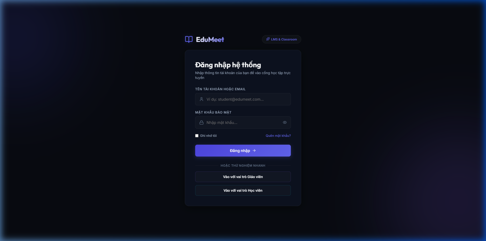

---

### 1.1. Bảng điều khiển (Dashboard)
- Hiển thị các thẻ chỉ số KPI tổng quan (tỷ lệ chuyên cần, tiến độ học tập, chất lượng kết nối trung bình) với thiết kế viền phát sáng và icon sinh động.
- Danh sách lớp học đang và sắp diễn ra trong ngày kèm nút "Vào lớp ngay" nổi bật.
- Cột thông báo & tin tức cập nhật trong lớp học.

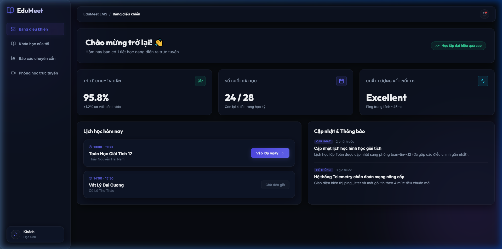

---

### 1.2. Khóa học của tôi (My Courses & Materials)
- Danh sách các môn học dưới dạng lưới card (Lớp Toán, Lý, Hóa).
- Khi chọn một môn học sẽ mở ra **Chi tiết bài giảng & Tài liệu**:
  - Đối với Giáo viên: Hiển thị thêm công cụ **Tải lên tài liệu giảng dạy**.
  - Cho phép tải xuống tài liệu bài giảng (slide, PDF, video ghi lại bài học).

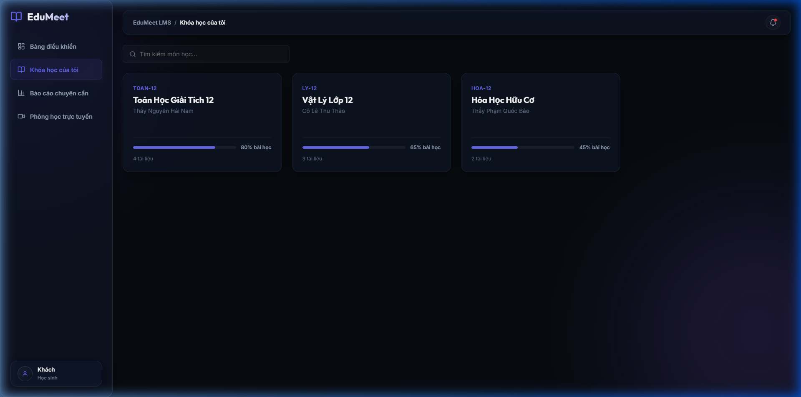
<!-- slide -->
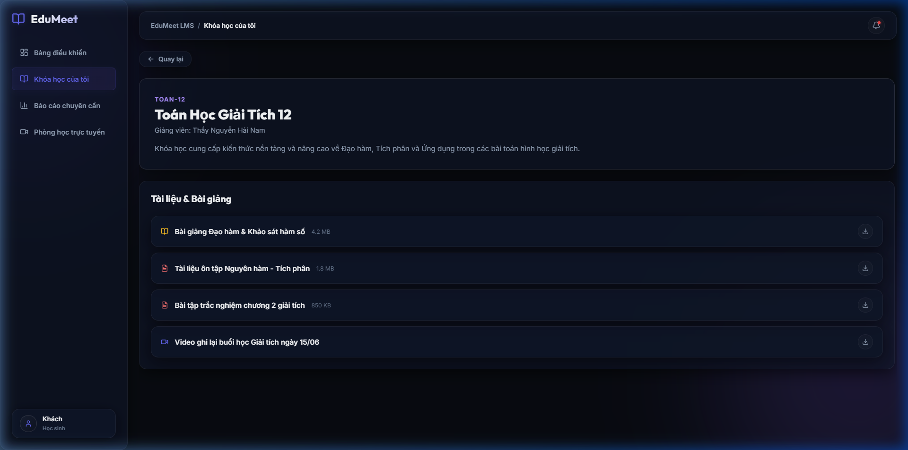

---

### 1.3. Báo cáo chuyên cần & Telemetry (Attendance & Telemetry reports)
- Quản lý lịch sử các buổi học đã diễn ra.
- Chi tiết bảng điểm danh của từng buổi học:
  - Thời lượng có mặt của học viên và tỷ lệ đạt chuyên cần chuyên nghiệp.
  - **Chỉ số Telemetry Mạng chi tiết** (Ping, Jitter, Packet Loss) được phân tích theo 4 cấp độ đúng chuẩn BRD (Excellent, Good, Poor, Critical).
  - Nút xuất báo cáo Excel cho Giáo viên.

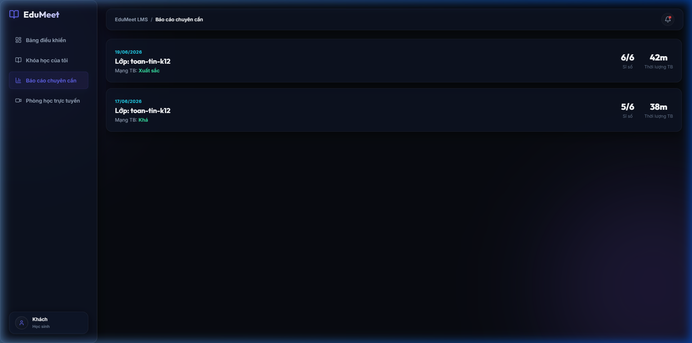
<!-- slide -->
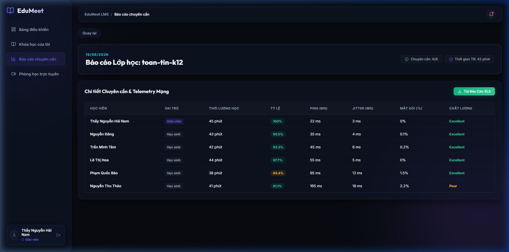

> [!NOTE]
> Toàn bộ dữ liệu giả lập (Mock Data) của tất cả các trang (Dashboard, Khóa học, Báo cáo chuyên cần) đã được tách rời hoàn toàn và lưu trữ tập trung tại [mockData.ts](file:///c:/Git%20cua%20tui/education-platform/app/src/lib/mockData.ts). Trang `ReportsPage.tsx` đã được cập nhật để sử dụng dữ liệu import từ file này giúp dễ dàng sửa đổi hoặc thay thế bằng các API call sau này.

---

### 1.4. Phòng học ảo & Video Call
- Tích hợp Lobby (màn hình chờ xem trước camera) như một phân hệ của cổng LMS.
- Chuyển tiếp mượt mà vào phòng học video toàn màn hình (Classroom View) với lưới học viên co giãn và thanh công cụ bottom.

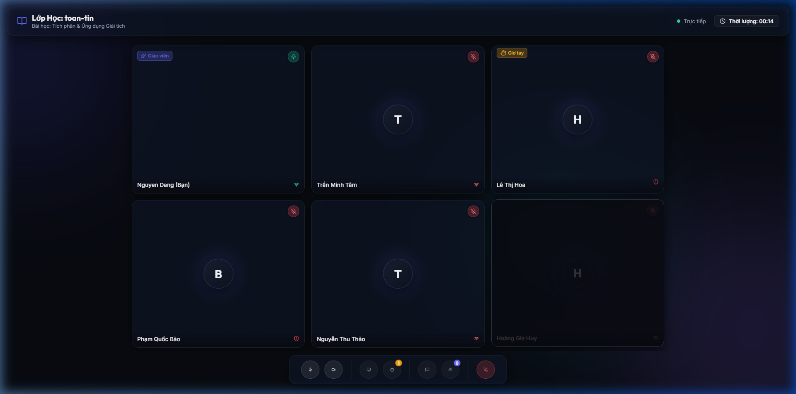

---

### 1.5. Chế độ Sáng/Tối (Light & Dark Theme)
- Tích hợp nút chuyển đổi giao diện (Mặt trời / Mặt trăng) trực quan ở thanh tiêu đề (Header) kế bên nút thông báo.
- Giao diện sáng (Light Theme) được thiết kế hiện đại, tinh tế với phong cách **Light Glassmorphism** (kính mờ trên nền sáng).
- Hệ thống màu sắc được cấu trúc hóa chặt chẽ qua CSS Variables tại [variables.css](file:///c:/Git%20cua%20tui/education-platform/app/src/styles/variables.css).
- Sử dụng chuyển cảnh (CSS Transition) cực kỳ mượt mà trên toàn bộ giao diện: màu nền, màu chữ, viền thẻ phát sáng và các hiệu ứng bóng mờ (glassmorphism) tại [global.css](file:///c:/Git%20cua%20tui/education-platform/app/src/styles/global.css).
- Trạng thái Theme được lưu trữ và tự động đồng bộ qua `localStorage` giúp duy trì lựa chọn của người dùng.

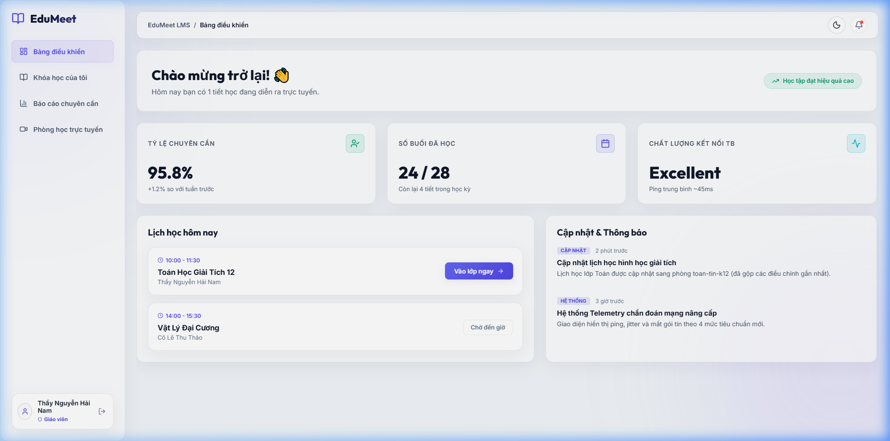
<!-- slide -->
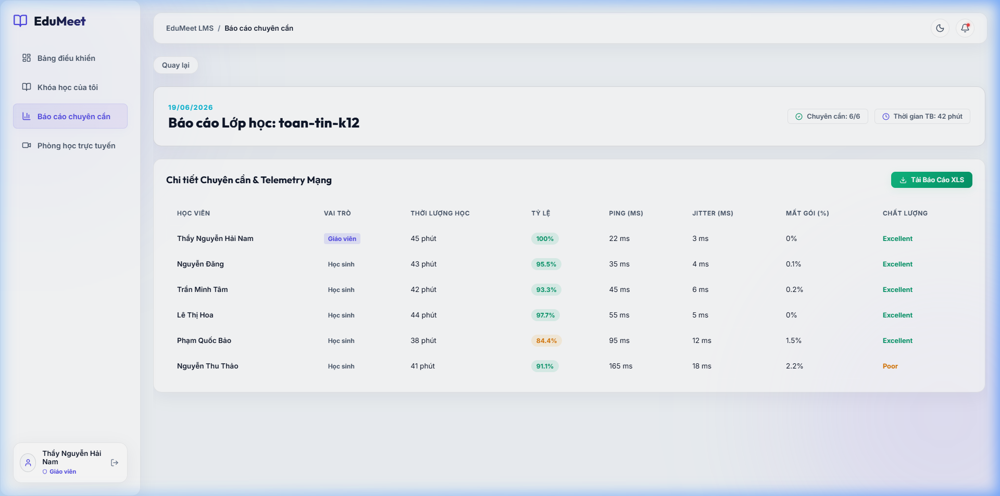

---

### 1.6. Kết nối WebRTC & Tích hợp Jitsi Meet (Phase 0.3)
- **Shims toàn cục:** Khởi tạo jQuery, global và process shims trong `main.tsx` để hỗ trợ môi trường bundler ESM của Vite.
- **Jitsi Client Service:** Xây dựng dịch vụ Jitsi tập trung tại [jitsiService.ts](file:///c:/Git%20cua%20tui/education-platform/app/src/lib/jitsiService.ts) quản lý kết nối XMPP kết hợp với các bộ phát sự kiện (callbacks) lên React Context.
- **Đầu vào Media & Tracks:** Tự động bắt webcam/mic khi join room, liên kết trực tiếp các track audio/video vào các phần tử DOM `<video>` và `<audio>` thông qua component `JitsiTrack`.
- **Telemetry đo đạc:** Sự kiện `CONNECTION_STATS` được liên kết để tự động cập nhật dải trễ mạng (rtt), packet loss, jitter và xếp hạng chất lượng kết nối thời gian thực theo đúng chuẩn ma trận BRD.
- **Lớp học ảo Fallback:** Hỗ trợ tính năng tự động chuyển về Mock Environment nếu mạng ngắt hoặc kết nối Jitsi server gặp sự cố, giúp việc kiểm thử và chạy demo luôn trơn tru.

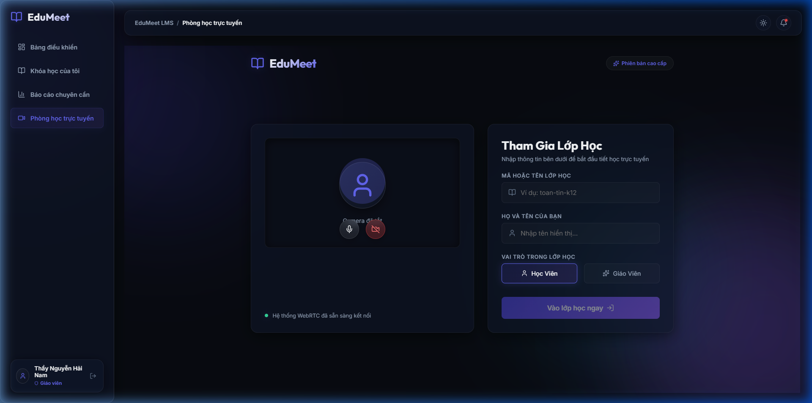
<!-- slide -->
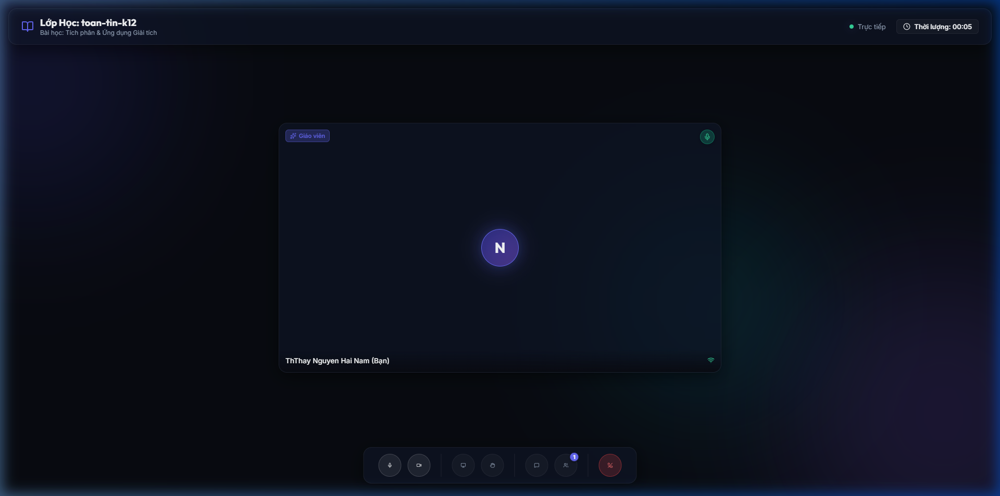

---

## 2. Video Ghi hình Quy trình Kiểm thử
Dưới đây là video ghi lại các quy trình kiểm thử tự động được thực hiện bởi Browser Subagent.

### Kiểm thử toàn bộ các trang & Phòng học ảo
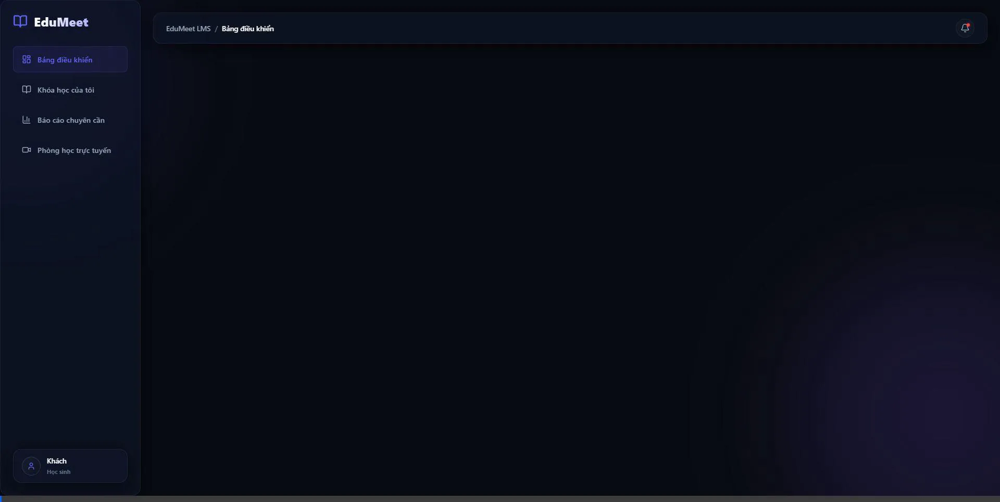

### Kiểm thử chuyển đổi Theme sáng/tối
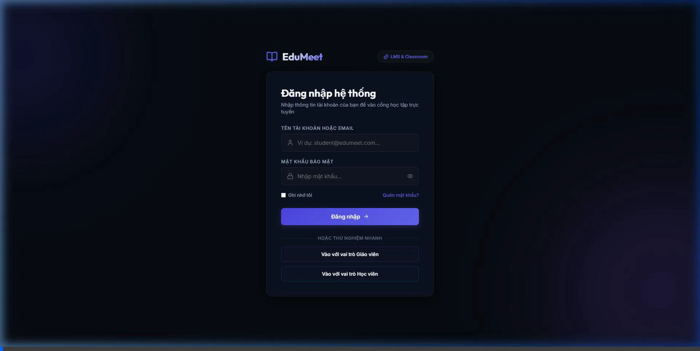

### Kiểm thử kết nối phòng học ảo & Jitsi Meet (WebRTC)
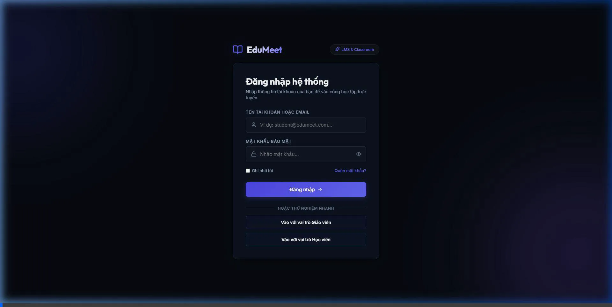

### Kiểm thử tỷ lệ giao diện màn hình chờ (Lobby Preview)

---

## 2. Hệ thống Xác thực JWT & Database Seeding (JWT Authentication & Database Seeding)

### Kết Luận Nghiệm Thu (Implementation Acceptance)
Hệ thống JWT Authentication và Database Seeding đã hoàn tất implementation theo kế hoạch 7 phase và vượt qua build verification thành công. Các thành phần cốt lõi (Environment configuration, Shared contracts, Register/Login flow, JWT strategy & route protection, Database seeding) đều đã hoạt động ở mức **MVP (Minimum Viable Product)**. 

Để đạt được tiêu chuẩn **Production-ready authentication system**, hệ thống vẫn cần giải quyết các nợ kỹ thuật và kiểm thử tích hợp mở rộng được chi tiết dưới đây.

### Các Tính Năng Đã Thực Hiện
*   **Hạ tầng & Cấu hình môi trường (Phase 0)**:
    *   Tích hợp `@nestjs/config` toàn cục và nạp file `.env` động từ thư mục `apps/api/.env` khi khởi chạy từ root.
    *   Tự động phát hiện và ngắt khởi động ứng dụng nếu thiếu cấu hình `JWT_SECRET` ở môi trường production.
*   **Hợp đồng dữ liệu & Validation nghiêm ngặt (Phase 1)**:
    *   Định nghĩa các interface dùng chung `RegisterRequest`, `LoginRequest`, `AuthUserDto`, `AuthResponse` tại package `@edumeet/shared-types`.
    *   Bật cấu hình `forbidNonWhitelisted: true` trên `ValidationPipe` toàn cục để từ chối các request gửi lên các thuộc tính rác.
*   **Khung Module & DTOs an toàn (Phase 2)**:
    *   Khởi tạo `AuthModule`, `AuthController`, `AuthService`.
    *   Cấu hình `JwtModule.registerAsync()` dùng khóa bí mật động và thời gian hết hạn của token là `7d`.
    *   Tạo lớp `RegisterDto` và `LoginDto` kế thừa kiểu dữ liệu shared-types.
*   **Luồng Đăng ký và Đăng nhập (Phase 3 & Phase 5)**:
    *   Mật khẩu được mã hóa an toàn qua bcrypt với số vòng băm `10`.
    *   Ngăn chặn Role Escalation: Đăng ký qua endpoint công khai luôn bị ép buộc vai trò là `student`.
    *   Đăng ký trùng email trả về mã lỗi `409 Conflict`.
    *   Xác thực thông tin đăng nhập, sinh token JWT chứa payload: `sub` (id), `email`, `role`, `name`.
*   **Tải thông tin cá nhân `/auth/me` (Phase 6)**:
    *   Triển khai `JwtStrategy` và `JwtAuthGuard` để bảo vệ các tuyến đường riêng tư.
    *   Endpoint `/auth/me` thực hiện truy vấn trực tiếp vào PostgreSQL qua Prisma dựa trên `sub` để đảm bảo response phản ánh dữ liệu user mới nhất trong database thay vì chỉ dựa trên stale JWT payload.
*   **Database Seeding thông minh (Phase 4)**:
    *   Thiết lập script `seed.ts` sử dụng `Promise.all` băm song song 4 mật khẩu để tăng tốc độ.
    *   Dùng `prisma.user.upsert` trên trường `@unique` email đảm bảo kịch bản seed có thể chạy lại nhiều lần mà không crash.
    *   Khởi tạo 4 tài khoản thử nghiệm tương ứng với 4 vai trò chính: admin, manager, teacher, student.

### Hạn chế & Nợ kỹ thuật (Technical Debt)
> [!WARNING]
> *   **Chưa thực thi phân quyền (Authorization)**: Vai trò (`UserRole`) hiện tại mới được lưu trong CSDL và giải mã vào JWT payload, chưa được thực thi chặn các route hành vi (thiếu `RolesGuard` hoặc `@Roles()` decorator).
> *   **Thời hạn Access Token dài**: Token đang sống `7d` (phục vụ local MVP). Production sẽ yêu cầu chia tách Access Token (15m - 1h) và Refresh Token (7d - 30d).
> *   **Thiếu cơ chế thu hồi/đăng xuất (Token Revocation / Logout)**: Chưa cấu hình danh sách đen (Blacklist/Redis blocklist) để vô hiệu hóa JWT khi người dùng bấm Đăng xuất.
> *   **Mật khẩu Seed mặc định công khai**: Tài khoản seed có mật khẩu đơn giản (`admin123`, `teacher123`, v.v.) chỉ được dùng cho môi trường development/testing. Phải tắt hoặc đổi thông tin này trước khi deploy production.
> *   **Thiếu tính năng bổ trợ**: Các phân hệ Password Reset (Quên mật khẩu) và Email Verification (Xác thực email đăng ký) chưa được triển khai.

### Kết Quả Xác Minh (Build & Verification)
*   **Database Seeding (`npm run prisma:seed`)**:
    *   Chạy thành công từ root workspace thông qua NPM Workspaces.
    *   Tạo thành công 4 tài khoản mẫu: `admin@edumeet.vn`, `manager@edumeet.vn`, `teacher@edumeet.vn`, `student@edumeet.vn` với mật khẩu đã băm.
    *   Chạy lại lần thứ 2, lệnh seed vẫn thành công trơn tru nhờ tính năng `upsert`.
*   **Backend Server Startup (`npm run dev:api`)**:
    *   Khởi động thành công, nhận diện tệp cấu hình `.env` cục bộ.
    *   Tạo kết nối database PostgreSQL cổng 5432 thành công thông qua driver adapter `PrismaPg` (Prisma v7).
    *   Khớp nối toàn bộ các API `/auth/register`, `/auth/login`, và `/auth/me` chạy trơn tru.

---

## 3. Hướng dẫn trải nghiệm nhanh
Bạn hãy mở trình duyệt và click lại vào link:
🔗 **[http://localhost:5173/](http://localhost:5173/)**

1. Bạn sẽ thấy **Bảng điều khiển** của cổng học tập hiển thị đầu tiên.
2. Sử dụng menu bên trái để di chuyển qua lại giữa các trang: **Bảng điều khiển** ➔ **Khóa học của tôi** ➔ **Báo cáo chuyên cần** ➔ **Phòng học trực tuyến**.
3. Bạn có thể nhấn vào các thẻ Khóa học/Báo cáo để xem thông tin chi tiết và kiểm chứng hiệu ứng hoạt động.
