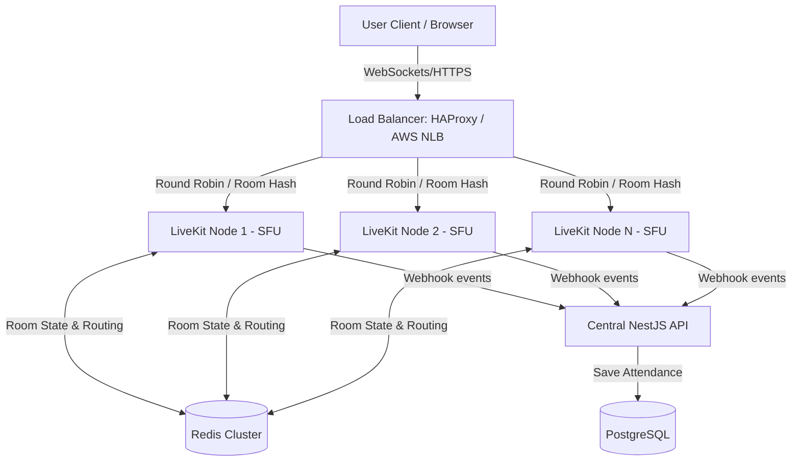

# Kiến Trúc Mở Rộng Hệ Thống LiveKit Cluster (Phase 2 Design)

Tài liệu này phác thảo thiết kế kiến trúc phân tán (Distributed Media System) cho LiveKit Server trong giai đoạn nâng cấp tiếp theo (Phase 2), nhằm đáp ứng từ **500 đến 5000+ người dùng đồng thời (CCU)**.

---

## 1. Sơ đồ Kiến trúc Tổng quan (Multi-Node SFU Cluster)



---

## 2. Các Thành phần Kiến trúc Chi tiết

### A. Định tuyến phòng học dựa trên Redis (Redis Room Routing)
- **Cơ chế hoạt động**: Khi một phòng học mới được tạo, LiveKit node xử lý yêu cầu sẽ ghi nhận trạng thái phòng học lên **Redis** (dưới dạng hash-map khóa ngoại). 
- **Sticky Session per Room**: LiveKit tự động điều phối để toàn bộ học viên và giảng viên của cùng một lớp học (`roomName`) kết nối vào **cùng một LiveKit SFU Node**. Điều này loại bỏ nhu cầu truyền tải chéo (cross-traffic) media tracks giữa các máy chủ, tiết kiệm băng thông nội bộ và giảm độ trễ (latency).
- **Cấu hình `livekit.yaml` Cluster**:
  ```yaml
  redis:
    addresses:
      - "redis-master.internal:6379"
    username: ""
    password: "yoursecure-redis-password"
  ```

### B. High Availability (HA) & Định tuyến Tải (Load Balancing)
- **Network Load Balancer (NLB)**: Sử dụng một bộ cân bằng tải hoạt động ở Layer 4 (TCP/UDP) như **HAProxy** hoặc **AWS Network Load Balancer** nằm phía trước cluster.
- **Port Mapping**:
  - Cổng `443/tcp`: Proxy HTTPS/WSS cho API signaling.
  - Cổng `3478/udp & tcp`: Phân phối STUN/TURN traffic sang coturn nodes.
  - Dải cổng `50000-50200/udp`: Được ánh xạ trực tiếp (1-to-1 port forwarding) từ internet vào từng node cụ thể thông qua cấu hình candidate IP để media stream truyền thẳng tới node đích không qua bottleneck của LB.

### C. Đảm bảo tính nhất quán chuyên cần (Attendance Consistency)
- **Centralized Webhooks**: Mọi LiveKit node trong cluster được cấu hình để gửi Webhook events về cùng một URL của API NestJS:
  ```yaml
  webhook:
    api_key: "nestjs_webhook_key"
    urls:
      - "https://api.edumeet.vn/meeting/webhooks"
  ```
- **Xử lý sự kiện tại Backend**:
  - `room_started` & `room_finished`: Ghi nhận thời gian bắt đầu/kết thúc thực tế của buổi học.
  - `participant_joined` & `participant_left`: Ghi nhận thời gian ra vào của từng sinh viên. Cho dù sinh viên bị rớt mạng và kết nối lại vào một node khác trong cluster, backend NestJS vẫn theo dõi qua ID sinh viên để tổng hợp chính xác tổng thời lượng học tập (`activeTimeSeconds`) lưu trong cơ sở dữ liệu PostgreSQL.

### D. Cơ chế Tự phục hồi & Dự phòng lỗi (Failover Design)
- **Heartbeat Check**: Mỗi LiveKit node gửi gói tin kiểm tra hoạt động (heartbeat) lên Redis cứ sau 5 giây.
- **Xử lý khi Node sập (Node Down)**:
  - Nếu Redis không nhận được heartbeat từ Node A trong 15 giây, Node A sẽ bị đánh dấu là Offline trong bảng điều phối (routing table).
  - Toàn bộ các kết nối WebRTC của người dùng đến Node A sẽ bị đứt.
  - Nhờ cơ chế **WebRTC Runtime-Hardening (Milestone C)** ở client: Frontend của học sinh và giáo viên sẽ phát hiện mất mạng, lập tức chuyển trạng thái sang `reconnecting`, và thực hiện bắt tay lại (re-negotiate) với Load Balancer.
  - Load Balancer và Redis phát hiện Node A đã chết, sẽ tự động định tuyến toàn bộ yêu cầu Reconnect sang Node B (đang hoạt động).
  - Lớp học được khôi phục trên Node B trong vòng dưới 10 giây mà không cần can thiệp thủ công từ giáo viên hay học sinh.

### E. Telemetry Aggregation (Giám sát tập trung)
- **Prometheus Scraping**: Prometheus Server trung tâm thực hiện cào dữ liệu định kỳ từ tất cả các máy chủ LiveKit nodes bằng cách định nghĩa động danh sách targets:
  ```yaml
  scrape_configs:
    - job_name: 'livekit-cluster'
      static_configs:
        - targets: ['lk-node-1.internal:7880', 'lk-node-2.internal:7880', 'lk-node-n.internal:7880']
  ```
- **Grafana Dashboard**: Gom nhóm các đồ thị để người vận hành có thể giám sát đồng thời:
  - Tổng CCU toàn hệ thống (Sum of participants).
  - Biểu đồ phân bổ CCU trên từng node (để phát hiện lệch tải).
  - Tỷ lệ CPU/RAM của Egress workers.
